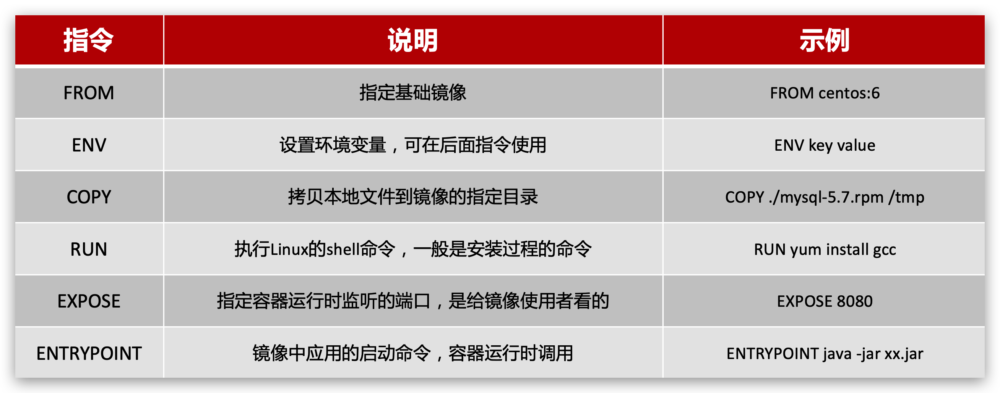

[返回目录](/blog/docker/index)

# 四、Dockerfile自定义镜像

- 镜像结构
- Dockerfile语法
- 构建Java项目

## 1、镜像结构

镜像就是在系统函数库、运行环境基础上，添加应用程序文件、配置文件、依赖文件等组合，然后编写好启动脚本打包在一起形成的文件。


## 2、Dockerfile语法

`Dockerfile` 就是一个文本文件，其中包含一个个的`指令(Instruction)`，用指令来说明要执行什么操作来构建镜像。每一个指令都会形成一层Layer。



官网文档： https://docs.docker.com/engine/reference/builder

## 3、构建Java项目

### 3.1、基于centos构建Java项目

https://hub.docker.com/_/centos

需求：基于centos镜像构建一个新镜像，运行一个java项目

步骤：

```bash
Dockerfile			                 # 构建文件
jdk-8u351-linux-x64.tar.gz       # Java1.8
docker-demo.jar                  # Java项目
```

Dockerfile

```bash
# 指定基础镜像
FROM centos:7
# 配置环境变量，JDK的安装目录
ENV JAVA_DIR=/usr/local

# 拷贝jdk和java项目的包
COPY ./jdk-8u351-linux-x64.tar.gz $JAVA_DIR/
COPY ./docker-demo.jar /tmp/app.jar

# 安装JDK
RUN cd $JAVA_DIR \
 && tar -zxf ./jdk-8u351-linux-x64.tar.gz

# 配置环境变量
ENV JAVA_HOME=$JAVA_DIR/jdk1.8.0_351
ENV PATH=$PATH:$JAVA_HOME/bin

# 暴露端口
EXPOSE 8090
# 入口，java项目的启动命令
ENTRYPOINT java -jar /tmp/app.jar
```

构建打包

```bash
docker build -t javaweb:1.0 .
```

启动容器

```bash
docker run --name javaweb -p 8090:8090 -d javaweb:1.0
```

访问地址：http://127.0.0.1:8090/hello/count


### 3.2、基于java8构建Java项目

https://hub.docker.com/_/java

需求：基于java:8-alpine镜像，将一个Java项目构建为镜像

实现：

文件

```bash
Dockerfile			                 # 构建文件
docker-demo.jar                  # Java项目
```

Dockerfile

```bash
# 指定基础镜像
FROM java:8-alpine

# 拷贝应用程序
COPY ./docker-demo.jar /tmp/app.jar

# 暴露端口
EXPOSE 8090
# 入口，java项目的启动命令
ENTRYPOINT java -jar /tmp/app.jar
```

构建镜像

```bash
docker build -t javaweb:2.0 .
```

创建容器并运行

```bash
docker run --name javaweb -p 8090:8090 -d javaweb:2.0
```

访问地址：http://127.0.0.1:8090/hello/count


### 3.3、小结

小结：

1. Dockerfile的本质是一个文件，通过指令描述镜像的构建过程

2. Dockerfile的第一行必须是FROM，从一个基础镜像来构建

3. 基础镜像可以是基本操作系统，如Ubuntu。也可以是其他人制作好的镜像，例如：java:8-alpine


