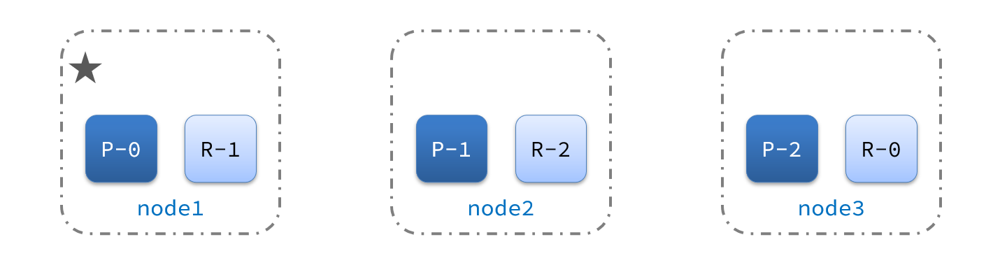

[返回目录](/blog/elasticsearch/springcloud-elasticsearch/index)

# 集群（cluster）


单机的elasticsearch做数据存储，必然面临两个问题：海量数据存储问题、单点故障问题。

- 海量数据存储问题：将索引库从逻辑上拆分为N个分片（shard），存储到多个节点
- 单点故障问题：将分片数据在不同节点备份（replica ）

**ES集群相关概念**:

* 集群（cluster）：一组拥有共同的 cluster name 的 节点。

* <font color="red">节点（node)</font>   ：集群中的一个 Elasticearch 实例

* <font color="red">分片（shard）</font>：索引可以被拆分为不同的部分进行存储，称为分片。在集群环境下，一个索引的不同分片可以拆分到不同的节点中

  解决问题：数据量太大，单点存储量有限的问题。

  

  > 此处，我们把数据分成3片：shard0、shard1、shard2

* 主分片（Primary shard）：相对于副本分片的定义。

* 副本分片（Replica shard）每个主分片可以有一个或者多个副本，数据和主分片一样。

  ​	

数据备份可以保证高可用，但是每个分片备份一份，所需要的节点数量就会翻一倍，成本实在是太高了！

为了在高可用和成本间寻求平衡，我们可以这样做：

- 首先对数据分片，存储到不同节点
- 然后对每个分片进行备份，放到对方节点，完成互相备份

这样可以大大减少所需要的服务节点数量，如图，我们以3分片，每个分片备份一份为例：


现在，每个分片都有1个备份，存储在3个节点：

- node0：保存了分片0和1
- node1：保存了分片0和2
- node2：保存了分片1和2


## 1、搭建ES集群

我们会在单机上利用docker容器运行多个es实例来模拟es集群。不过生产环境推荐大家每一台服务节点仅部署一个es的实例。

部署es集群可以直接使用docker-compose来完成，但这要求你的Linux虚拟机至少有**4G**的内存空间

首先编写一个`docker-compose.yml` 文件，内容如下：

```bash
version: '2.2'
services:
  es01:
    image: elasticsearch:7.12.1
    container_name: es01
    environment:
      - node.name=es01
      - cluster.name=es-docker-cluster
      - discovery.seed_hosts=es02,es03
      - cluster.initial_master_nodes=es01,es02,es03
      - "ES_JAVA_OPTS=-Xms512m -Xmx512m"
    volumes:
      - data01:/usr/share/elasticsearch/data
    ports:
      - 9200:9200
    networks:
      - elastic
  es02:
    image: elasticsearch:7.12.1
    container_name: es02
    environment:
      - node.name=es02
      - cluster.name=es-docker-cluster
      - discovery.seed_hosts=es01,es03
      - cluster.initial_master_nodes=es01,es02,es03
      - "ES_JAVA_OPTS=-Xms512m -Xmx512m"
    volumes:
      - data02:/usr/share/elasticsearch/data
    ports:
      - 9201:9200
    networks:
      - elastic
  es03:
    image: elasticsearch:7.12.1
    container_name: es03
    environment:
      - node.name=es03
      - cluster.name=es-docker-cluster
      - discovery.seed_hosts=es01,es02
      - cluster.initial_master_nodes=es01,es02,es03
      - "ES_JAVA_OPTS=-Xms512m -Xmx512m"
    volumes:
      - data03:/usr/share/elasticsearch/data
    networks:
      - elastic
    ports:
      - 9202:9200
volumes:
  data01:
    driver: local
  data02:
    driver: local
  data03:
    driver: local

networks:
  elastic:
    driver: bridge
```

es运行需要修改一些linux系统权限，修改`/etc/sysctl.conf`文件

```sh
vi /etc/sysctl.conf
```

添加下面的内容：

```sh
vm.max_map_count=262144
```

然后执行命令，让配置生效：

```sh
sysctl -p
```


通过docker-compose启动集群：

```sh
docker-compose up -d
```


## 2、集群状态监控

kibana可以监控es集群，不过新版本需要依赖es的x-pack 功能，配置比较复杂。

这里推荐使用cerebro来监控es集群状态，

官方网址：https://github.com/lmenezes/cerebro

下载解压即可使用，非常方便。

启动服务

```
bash ./bin/cerebro
```

访问http://localhost:9000 即可进入管理界面：

输入你的elasticsearch的任意节点的地址和端口，点击connect即可：

绿色的条，代表集群处于绿色（健康状态）。


## 3、创建索引库

### 1）利用kibana创建索引库

在DevTools中输入指令：

```json
PUT /blog
{
  "settings": {
    "number_of_shards": 3, // 分片数量
    "number_of_replicas": 1 // 副本数量
  },
  "mappings": {
    "properties": {
      // mapping映射定义 ...
      "title": {
        "type": "text",
        "analyzer": "ik_smart"
      }
    }
  }
}
```


### 2）利用cerebro创建索引库

利用cerebro还可以创建索引库

1、填写索引库信息

2、点击右下角的create按钮

回到首页，即可查看索引库分片效果：


## 4、集群脑裂问题

### 4.1、集群职责划分

elasticsearch中集群节点有不同的职责划分：


默认情况下，集群中的任何一个节点都同时具备上述四种角色。


但是真实的集群一定要将集群职责分离：

- master节点：对CPU要求高，但是内存要求第
- data节点：对CPU和内存要求都高
- coordinating节点：对网络带宽、CPU要求高

职责分离可以让我们根据不同节点的需求分配不同的硬件去部署。而且避免业务之间的互相干扰。

一个典型的es集群职责划分如图：


### 4.2、脑裂问题

脑裂是因为集群中的节点失联导致的。

例如一个集群中，主节点与其它节点失联：


此时，node2和node3认为node1宕机，就会重新选主：


当node3当选后，集群继续对外提供服务，node2和node3自成集群，node1自成集群，两个集群数据不同步，出现数据差异。

当网络恢复后，因为集群中有两个master节点，集群状态的不一致，出现脑裂的情况：


解决脑裂的方案是，要求选票超过 ( eligible节点数量 + 1 ）/ 2 才能当选为主，因此eligible节点数量最好是奇数。对应配置项是discovery.zen.minimum_master_nodes，在es7.0以后，已经成为默认配置，因此一般不会发生脑裂问题


例如：3个节点形成的集群，选票必须超过 （3 + 1） / 2 ，也就是2票。node3得到node2和node3的选票，当选为主。node1只有自己1票，没有当选。集群中依然只有1个主节点，没有出现脑裂。


### 4.3、小结

master eligible节点的作用是什么？

- 参与集群选主
- 主节点可以管理集群状态、管理分片信息、处理创建和删除索引库的请求

data节点的作用是什么？

- 数据的CRUD

coordinator节点的作用是什么？

- 路由请求到其它节点

- 合并查询到的结果，返回给用户


## 5、集群分布式存储

当新增文档时，应该保存到不同分片，保证数据均衡，那么coordinating node如何确定数据该存储到哪个分片呢？


### 5.1、分片存储测试

插入三条数据：

```json
# 新建索引库
PUT http://127.0.0.1:9201/blog
Content-Type: application/json

{
  "settings": {
    "number_of_shards": 3,
    "number_of_replicas": 1
  },
  "mappings": {
    "properties": {
      "title": {
        "type": "text"
      }
    }
  }
}

### 

POST http://127.0.0.1:9201/blog/_doc/1
Content-Type: application/json

{
    "title": "第1条数据"
}

### 

POST http://127.0.0.1:9201/blog/_doc/2
Content-Type: application/json

{
    "title": "第2条数据"
}

### 

POST http://127.0.0.1:9201/blog/_doc/3
Content-Type: application/json

{
    "title": "第3条数据"
}
```

测试可以看到，三条数据分别在不同分片：

```json
POST http://127.0.0.1:9201/blog/_search
Content-Type: application/json

{
    "explain": true,
    "query": {
        "match_all": {}
    }
}
```

结果：

```json
{
    "took": 570,
    "timed_out": false,
    "_shards": {
        "total": 3,
        "successful": 3,
        "skipped": 0,
        "failed": 0
    },
    "hits": {
        "total": {
            "value": 3,
            "relation": "eq"
        },
        "max_score": 1.0,
        "hits": [
            {
                "_shard": "[blog][1]",
                "_node": "5iaSJX--Tc2wtVfarY6R2A",
                "_index": "blog",
                "_type": "_doc",
                "_id": "2",
                "_score": 1.0,
                "_source": {
                    "title": "第2条数据"
                },
                "_explanation": {
                    "value": 1.0,
                    "description": "*:*",
                    "details": []
                }
            },
            {
                "_shard": "[blog][1]",
                "_node": "5iaSJX--Tc2wtVfarY6R2A",
                "_index": "blog",
                "_type": "_doc",
                "_id": "3",
                "_score": 1.0,
                "_source": {
                    "title": "第3条数据"
                },
                "_explanation": {
                    "value": 1.0,
                    "description": "*:*",
                    "details": []
                }
            },
            {
                "_shard": "[blog][2]",
                "_node": "aQi2CpOTSBGoNq2xpFMhvw",
                "_index": "blog",
                "_type": "_doc",
                "_id": "1",
                "_score": 1.0,
                "_source": {
                    "title": "第1条数据"
                },
                "_explanation": {
                    "value": 1.0,
                    "description": "*:*",
                    "details": []
                }
            }
        ]
    }
}
```


### 5.2、分片存储原理

elasticsearch会通过hash算法来计算文档应该存储到哪个分片：

```
shard = hash(_routing) % number_of_shards
```


说明：

- _routing默认是文档的id
- 算法与分片数量有关，因此索引库一旦创建，分片数量不能修改！


新增文档的流程如下：


解读：

- 1）新增一个id=1的文档
- 2）对id做hash运算，假如得到的是2，则应该存储到shard-2
- 3）shard-2的主分片在node3节点，将数据路由到node3
- 4）保存文档
- 5）同步给shard-2的副本replica-2，在node2节点
- 6）返回结果给coordinating-node节点


## 6、集群分布式查询

elasticsearch的查询分成两个阶段：

- scatter phase：分散阶段，coordinating node会把请求分发到每一个分片

- gather phase：聚集阶段，coordinating node汇总data node的搜索结果，并处理为最终结果集返回给用户


## 7、集群故障转移

集群的master节点会监控集群中的节点状态，如果发现有节点宕机，会立即将宕机节点的分片数据迁移到其它节点，确保数据安全，这个叫做故障转移。


1）例如一个集群结构如图：



现在，node1是主节点，其它两个节点是从节点。


2）突然，node1发生了故障：


宕机后的第一件事，需要重新选主，例如选中了node2：


node2成为主节点后，会检测集群监控状态，发现：shard-1、shard-0没有副本节点。因此需要将node1上的数据迁移到node2、node3：


故障测试

```bash
# 停止es01 节点
docker-compose stop es01

# 启动es01 节点
docker-compose start es01
```


