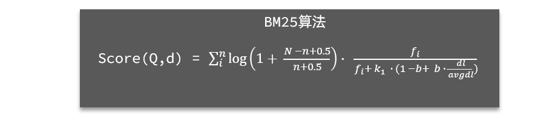

[返回目录](/blog/elasticsearch/springcloud-elasticsearch/index)

# DSL 查询文档

## 1、DSL 查询分类

Elasticsearch 提供了基于 JSON 的 DSL（[Domain Specific Language](https://www.elastic.co/guide/en/elasticsearch/reference/current/query-dsl.html)）来定义查询。常见的查询类型包括：

- **查询所有**：查询出所有数据，一般测试用。例如：match_all

- **全文检索（full text）查询**：利用分词器对用户输入内容分词，然后去倒排索引库中匹配。例如：

  - match_query
  - multi_match_query

- **精确查询**：根据精确词条值查找数据，一般是查找 keyword、数值、日期、boolean 等类型字段。例如：

  - ids
  - range
  - term

- **地理（geo）查询**：根据经纬度查询。例如：

  - geo_distance
  - geo_bounding_box

- **复合（compound）查询**：复合查询可以将上述各种查询条件组合起来，合并查询条件。例如：
  - bool
  - function_score

查询的语法基本一致：

```json
GET /indexName/_search
{
  "query": {
    "查询类型": {
      "查询条件": "条件值"
    }
  }
}
```

我们以查询所有为例，其中：

- 查询类型为 match_all
- 没有查询条件

```json
// 查询所有
GET /indexName/_search
{
  "query": {
    "match_all": {
    }
  }
}
```

其它查询无非就是**查询类型**、**查询条件**的变化。

## 2、全文检索查询

### 2.1、使用场景

全文检索查询的基本流程如下：

- 对用户搜索的内容做分词，得到词条
- 根据词条去倒排索引库中匹配，得到文档 id
- 根据文档 id 找到文档，返回给用户

比较常用的场景包括：

- 商城的输入框搜索
- 百度输入框搜索

因为是拿着词条去匹配，因此参与搜索的字段也必须是可分词的 text 类型的字段。

### 2.2、基本语法

常见的全文检索查询包括：

- match 查询：单字段查询
- multi_match 查询：多字段查询，任意一个字段符合条件就算符合查询条件

match 查询语法如下：

```json
GET /indexName/_search
{
  "query": {
    "match": {
      "FIELD": "TEXT"
    }
  }
}
```

mulit_match 语法如下：

```json
GET /indexName/_search
{
  "query": {
    "multi_match": {
      "query": "TEXT",
      "fields": ["FIELD1", " FIELD12"]
    }
  }
}
```

### 2.3、示例

match 查询示例：

```json
GET /hotel/_search
{
  "query": {
    "match": {
      "all": "如家上海"
    }
  }
}
```

multi_match 查询示例：

```json
GET /hotel/_search
{
  "query": {
   "multi_match": {
     "query": "如家上海",
     "fields": ["name", "brand", "city"]
   }
  }
}
```

可以看到，两种查询结果是一样的，为什么？

因为我们将 brand、name、city 值都利用 copy_to 复制到了 all 字段中。因此你根据三个字段搜索，和根据 all 字段搜索效果当然一样了。

但是，搜索字段越多，对查询性能影响越大，因此建议采用 copy_to，然后单字段查询的方式。

### 2.4、总结

match 和 multi_match 的区别是什么？

- match：根据一个字段查询
- multi_match：根据多个字段查询，参与查询字段越多，查询性能越差

## 3、精准查询

精确查询一般是查找 keyword、数值、日期、boolean 等类型字段。所以**不会**对搜索条件分词。常见的有：

- term：根据词条精确值查询
- range：根据值的范围查询

### 3.1、term 查询

因为精确查询的字段搜是不分词的字段，因此查询的条件也必须是**不分词**的词条。查询时，用户输入的内容跟自动值完全匹配时才认为符合条件。如果用户输入的内容过多，反而搜索不到数据。

语法说明：

```json
// term查询
GET /indexName/_search
{
  "query": {
    "term": {
      "FIELD": {
        "value": "VALUE"
      }
    }
  }
}
```

示例：

当我搜索的是精确词条时，能正确查询出结果：

```json
GET /hotel/_search
{
  "query": {
    "term": {
      "city": {
        "value": "上海"
      }
    }
  }
}
```

但是，当我搜索的内容不是词条，而是多个词语形成的短语时，反而搜索不到

```json
GET /hotel/_search
{
  "query": {
    "term": {
      "city": {
        "value": "杭州上海"
      }
    }
  }
}
```

### 3.2、range 查询

范围查询，一般应用在对数值类型做范围过滤的时候。比如做价格范围过滤。

基本语法：

```json
// range查询
GET /indexName/_search
{
  "query": {
    "range": {
      "FIELD": {
        "gte": 10, // 这里的gte代表大于等于，gt则代表大于
        "lte": 20  // lte代表小于等于，lt则代表小于
      }
    }
  }
}
```

示例：

```json
GET /hotel/_search
{
  "query": {
    "range": {
      "price": {
        "gte": 100,
        "lte": 300
      }
    }
  }
}
```

### 3.3、总结

精确查询常见的有哪些？

- term 查询：根据词条精确匹配，一般搜索 keyword 类型、数值类型、布尔类型、日期类型字段
- range 查询：根据数值范围查询，可以是数值、日期的范围

## 4、地理坐标查询

所谓的地理坐标查询，其实就是根据经纬度查询，

官方文档：https://www.elastic.co/guide/en/elasticsearch/reference/current/geo-queries.html

常见的使用场景包括：

- 携程：搜索我附近的酒店
- 滴滴：搜索我附近的出租车
- 微信：搜索我附近的人

### 4.1、矩形范围查询

矩形范围查询，也就是 geo_bounding_box 查询，查询坐标落在某个矩形范围的所有文档：


查询时，需要指定矩形的**左上**、**右下**两个点的坐标，然后画出一个矩形，落在该矩形内的都是符合条件的点。

语法如下：

```json
// geo_bounding_box查询
GET /indexName/_search
{
  "query": {
    "geo_bounding_box": {
      "FIELD": {
        "top_left": { // 左上点
          "lat": 31.1,
          "lon": 121.5
        },
        "bottom_right": { // 右下点
          "lat": 30.9,
          "lon": 121.7
        }
      }
    }
  }
}
```

这种并不符合“附近的人”这样的需求，所以我们就不做了。

### 4.2、附近查询

附近查询，也叫做距离查询（geo_distance）：查询到指定中心点小于某个距离值的所有文档。

换句话来说，在地图上找一个点作为圆心，以指定距离为半径，画一个圆，落在圆内的坐标都算符合条件：


语法说明：

```json
// geo_distance 查询
GET /indexName/_search
{
  "query": {
    "geo_distance": {
      "distance": "15km", // 半径
      "FIELD": "31.21,121.5" // 圆心
    }
  }
}
```

示例：

我们先搜索陆家嘴附近 15km 的酒店：

```json
GET /hotel/_search
{
  "query": {
    "geo_distance": {
      "distance": "15km",
      "location": "31.21,121.5"
    }
  }
}
```

发现共有 47 家酒店。

然后把半径缩短到 3 公里

可以发现，搜索到的酒店数量减少到了 5 家。

## 5、复合查询

复合（compound）查询：复合查询可以将其它简单查询组合起来，实现更复杂的搜索逻辑。常见的有两种：

- fuction score：算分函数查询，可以控制文档相关性算分，控制文档排名
- bool query：布尔查询，利用逻辑关系组合多个其它的查询，实现复杂搜索

### 5.1、相关性算分

当我们利用 match 查询时，文档结果会根据与搜索词条的关联度打分（\_score），返回结果时按照分值降序排列。

例如，我们搜索 "虹桥如家"，结果如下：

```json
[
  {
    "_score": 17.850193,
    "_source": {
      "name": "虹桥如家酒店真不错"
    }
  },
  {
    "_score": 12.259849,
    "_source": {
      "name": "外滩如家酒店真不错"
    }
  },
  {
    "_score": 11.91091,
    "_source": {
      "name": "迪士尼如家酒店真不错"
    }
  }
]
```

在 elasticsearch 中，早期使用的打分算法是 TF-IDF 算法，公式如下：


在后来的 5.1 版本升级中，elasticsearch 将算法改进为 BM25 算法，公式如下：



TF-IDF 算法有一各缺陷，就是词条频率越高，文档得分也会越高，单个词条对文档影响较大。而 BM25 则会让单个词条的算分有一个上限，曲线更加平滑：


小结：elasticsearch 会根据词条和文档的相关度做打分，算法由两种：

- TF-IDF 算法
- BM25 算法，elasticsearch5.1 版本后采用的算法

### 5.2、算分函数查询

根据相关度打分是比较合理的需求，但**合理的不一定是产品经理需要**的。

以百度为例，你搜索的结果中，并不是相关度越高排名越靠前，而是谁掏的钱多排名就越靠前。

要想认为控制相关性算分，就需要利用 elasticsearch 中的 function score 查询了。

#### 1）语法说明


function score 查询中包含四部分内容：

- **原始查询**条件：query 部分，基于这个条件搜索文档，并且基于 BM25 算法给文档打分，**原始算分**（query score)
- **过滤条件**：filter 部分，符合该条件的文档才会重新算分
- **算分函数**：符合 filter 条件的文档要根据这个函数做运算，得到的**函数算分**（function score），有四种函数
  - weight：函数结果是常量
  - field_value_factor：以文档中的某个字段值作为函数结果
  - random_score：以随机数作为函数结果
  - script_score：自定义算分函数算法
- **运算模式**：算分函数的结果、原始查询的相关性算分，两者之间的运算方式，包括：
  - multiply：相乘
  - replace：用 function score 替换 query score
  - 其它，例如：sum、avg、max、min

function score 的运行流程如下：

- 1）根据**原始条件**查询搜索文档，并且计算相关性算分，称为**原始算分**（query score）
- 2）根据**过滤条件**，过滤文档
- 3）符合**过滤条件**的文档，基于**算分函数**运算，得到**函数算分**（function score）
- 4）将**原始算分**（query score）和**函数算分**（function score）基于**运算模式**做运算，得到最终结果，作为相关性算分。

因此，其中的关键点是：

- 过滤条件：决定哪些文档的算分被修改
- 算分函数：决定函数算分的算法
- 运算模式：决定最终算分结果

#### 2）示例

需求：给“如家”这个品牌的酒店排名靠前一些

翻译一下这个需求，转换为之前说的四个要点：

- 原始条件：不确定，可以任意变化
- 过滤条件：brand = "如家"
- 算分函数：可以简单粗暴，直接给固定的算分结果，weight
- 运算模式：比如求和

因此最终的 DSL 语句如下：

```json
GET /hotel/_search
{
  "query": {
    "function_score": {
      "query": {  .... }, // 原始查询，可以是任意条件
      "functions": [ // 算分函数
        {
          "filter": { // 满足的条件，品牌必须是如家
            "term": {
              "brand": "如家"
            }
          },
          "weight": 2 // 算分权重为2
        }
      ],
      "boost_mode": "sum" // 加权模式，求和
    }
  }
}
```

测试，在未添加算分函数时，如家得分如下：

```json
GET /hotel/_search
{
  "query": {
    "function_score": {
      "query": {
        "match": {
          "all": "外滩"
        }
      }
    }
  }
}
```

查询结果

```json
[
  {
    "_score": 4.330945,
    "_source": {
      "brand": "君悦",
      "name": "上海外滩茂悦大酒店"
    }
  },
  {
    "_score": 3.4419823,
    "_source": {
      "brand": "如家",
      "name": "如家酒店·neo(上海外滩城隍庙小南门地铁站店)"
    }
  },
  {
    "_score": 3.0806518,
    "_source": {
      "brand": "7天酒店",
      "name": "7天连锁酒店(上海北外滩国际客运中心地铁站店)"
    }
  }
]
```

添加了算分函数后，如家得分就提升了：

```json
GET /hotel/_search
{
  "query": {
    "function_score": {
      "query": {
        "match": {
          "all": "外滩"
        }
      },
      "functions": [
        {
          "filter": {
            "term": {
              "brand": "如家"
            }
          },
          "weight": 10
        }
      ],
      "boost_mode": "multiply"
    }
  }
}
```

查询结果

```json
[
  {
    "_score": 34.419823,
    "_source": {
      "brand": "如家",
      "name": "如家酒店·neo(上海外滩城隍庙小南门地铁站店)"
    }
  },
  {
    "_score": 4.330945,
    "_source": {
      "brand": "君悦",
      "name": "上海外滩茂悦大酒店"
    }
  },
  {
    "_score": 3.0806518,
    "_source": {
      "brand": "7天酒店",
      "name": "7天连锁酒店(上海北外滩国际客运中心地铁站店)"
    }
  }
]
```

#### 3）小结

function score query 定义的三要素是什么？

- 过滤条件：哪些文档要加分
- 算分函数：如何计算 function score
- 加权方式：function score 与 query score 如何运算

### 5.3、布尔查询

布尔查询是一个或多个查询子句的组合，每一个子句就是一个**子查询**。子查询的组合方式有：

- must：必须匹配每个子查询，类似“与”
- should：选择性匹配子查询，类似“或”
- must_not：必须不匹配，**不参与算分**，类似“非”
- filter：必须匹配，**不参与算分**

比如在搜索酒店时，除了关键字搜索外，我们还可能根据品牌、价格、城市等字段做过滤：

每一个不同的字段，其查询的条件、方式都不一样，必须是多个不同的查询，而要组合这些查询，就必须用bool查询了。

需要注意的是，搜索时，参与**打分的字段越多，查询的性能也越差**。因此这种多条件查询时，建议这样做：

- 搜索框的关键字搜索，是全文检索查询，使用must查询，参与算分
- 其它过滤条件，采用filter查询。不参与算分


#### 1）语法示例：

```json
GET /hotel/_search
{
  "query": {
    "bool": {
      "must": [
        {"term": {"city": "上海" }}
      ],
      "should": [
        {"term": {"brand": "皇冠假日" }},
        {"term": {"brand": "华美达" }}
      ],
      "must_not": [
        { "range": { "price": { "lte": 500 } }}
      ],
      "filter": [
        { "range": {"score": { "gte": 45 } }}
      ]
    }
  }
}
```

#### 2）示例

需求：搜索名字包含“如家”，价格不高于400，在坐标31.21,121.5周围10km范围内的酒店。

分析：

- 名称搜索，属于全文检索查询，应该参与算分。放到must中
- 价格不高于400，用range查询，属于过滤条件，不参与算分。放到must_not中
- 周围10km范围内，用geo_distance查询，属于过滤条件，不参与算分。放到filter中

查询语句

```json
GET /hotel/_search
{
  "query": {
    "bool": {
      "must": [
        {
          "match": {
            "name": "如家"
          }
        }
      ],
      "must_not": [
        {
          "range": {
            "price": {
              "gt": 400
            }
          }
        }
      ],
      "filter": [
        {
          "geo_distance": {
            "distance": "10km",
            "location": {
              "lat": 31.21,
              "lon": 121.5
            }
          }
        }
      ]
    }
  }
}
```

查询结果
```json
{
  "took" : 61,
  "timed_out" : false,
  "_shards" : {
    "total" : 1,
    "successful" : 1,
    "skipped" : 0,
    "failed" : 0
  },
  "hits" : {
    "total" : {
      "value" : 3,
      "relation" : "eq"
    },
    "max_score" : 1.716568,
    "hits" : [
      {
        "_index" : "hotel",
        "_type" : "_doc",
        "_id" : "433576",
        "_score" : 1.716568,
        "_source" : {
          "address" : "南京东路480号保安坊内",
          "brand" : "如家",
          "business" : "人民广场地区",
          "city" : "上海",
          "id" : 433576,
          "location" : "31.236454, 121.480948",
          "name" : "如家酒店(上海南京路步行街店)",
          "pic" : "https://m.tuniucdn.com/fb2/t1/G6/M00/52/BA/Cii-U13eXVaIQmdaAAWxgzdXXxEAAGRrgNIOkoABbGb143_w200_h200_c1_t0.jpg",
          "price" : 379,
          "score" : 44,
          "starName" : "二钻"
        }
      },
      {
        "_index" : "hotel",
        "_type" : "_doc",
        "_id" : "434082",
        "_score" : 1.4689932,
        "_source" : {
          "address" : "复兴东路260号",
          "brand" : "如家",
          "business" : "豫园地区",
          "city" : "上海",
          "id" : 434082,
          "location" : "31.220706, 121.498769",
          "name" : "如家酒店·neo(上海外滩城隍庙小南门地铁站店)",
          "pic" : "https://m.tuniucdn.com/fb2/t1/G6/M00/52/B6/Cii-U13eXLGIdHFzAAIG-5cEwDEAAGRfQNNIV0AAgcT627_w200_h200_c1_t0.jpg",
          "price" : 392,
          "score" : 44,
          "starName" : "二钻"
        }
      },
      {
        "_index" : "hotel",
        "_type" : "_doc",
        "_id" : "1584362548",
        "_score" : 1.4178693,
        "_source" : {
          "address" : "御青路315-317号",
          "brand" : "如家",
          "business" : "周浦康桥地区",
          "city" : "上海",
          "id" : 1584362548,
          "location" : "31.15719, 121.572392",
          "name" : "如家酒店(上海浦东国际旅游度假区御桥地铁站店)",
          "pic" : "https://m.tuniucdn.com/fb3/s1/2n9c/2ybd3wqdoBtBeKcPxmyso9y1hNXa_w200_h200_c1_t0.jpg",
          "price" : 339,
          "score" : 44,
          "starName" : "二钻"
        }
      }
    ]
  }
}
```

#### 3）小结

bool查询有几种逻辑关系？

- must：必须匹配的条件，可以理解为“与”
- should：选择性匹配的条件，可以理解为“或”
- must_not：必须不匹配的条件，不参与打分
- filter：必须匹配的条件，不参与打分
