[返回目录](/blog/maven/index.md)

# 第四章 使用 Maven：IDEA 环境

各个 IDEA 不同版本在具体操作方面存在一定差异，这里我们以 2019.3.3 版本为例进行演示。其它版本大家灵活变通即可。

## 第一节 创建父工程

1、创建 Project

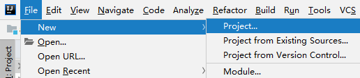

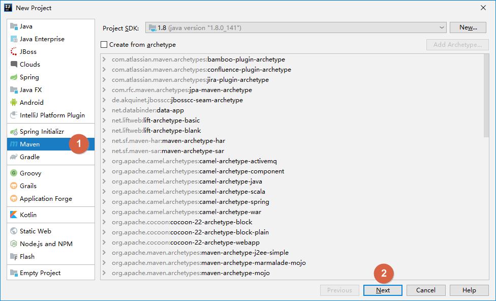
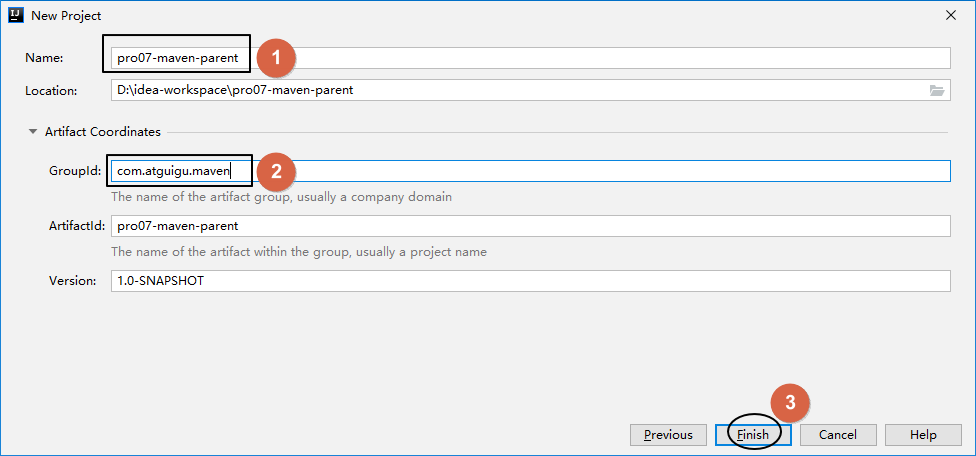

2、开启自动导入

创建 Project 后，IDEA 会自动弹出下面提示，我们选择`『Enable Auto-Import』`，意思是启用自动导入。

这个自动导入一定要开启，因为 Project、Module 新创建或 pom.xml 每次修改时都应该让 IDEA 重新加载 Maven 信息。这对 Maven 目录结构认定、Java 源程序编译、依赖 jar 包的导入都有非常关键的影响。

另外也可以通过 IDEA 的 Settings 设置来开启：

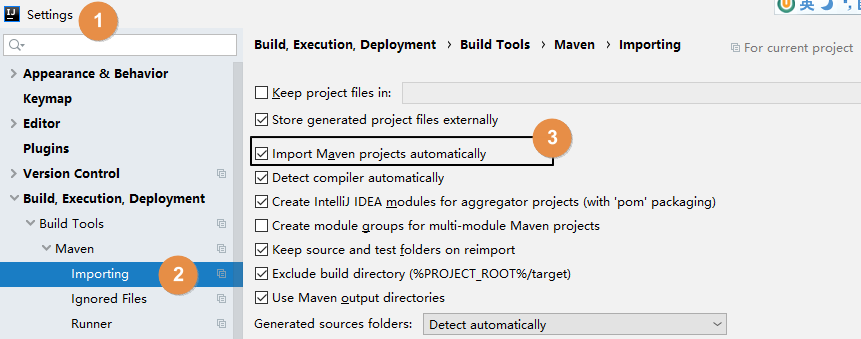

## 第二节 配置 Maven 信息

每次创建 Project 后都需要设置 Maven 家目录位置，否则 IDEA 将使用内置的 Maven 核心程序（不稳定）并使用默认的本地仓库位置。这样一来，我们在命令行操作过程中已下载好的 jar 包就白下载了，默认的本地仓库通常在 C 盘，还影响系统运行。

配置之后，IDEA 会根据我们在这里指定的 Maven 家目录自动识别到我们在 settings.xml 配置文件中指定的本地仓库。

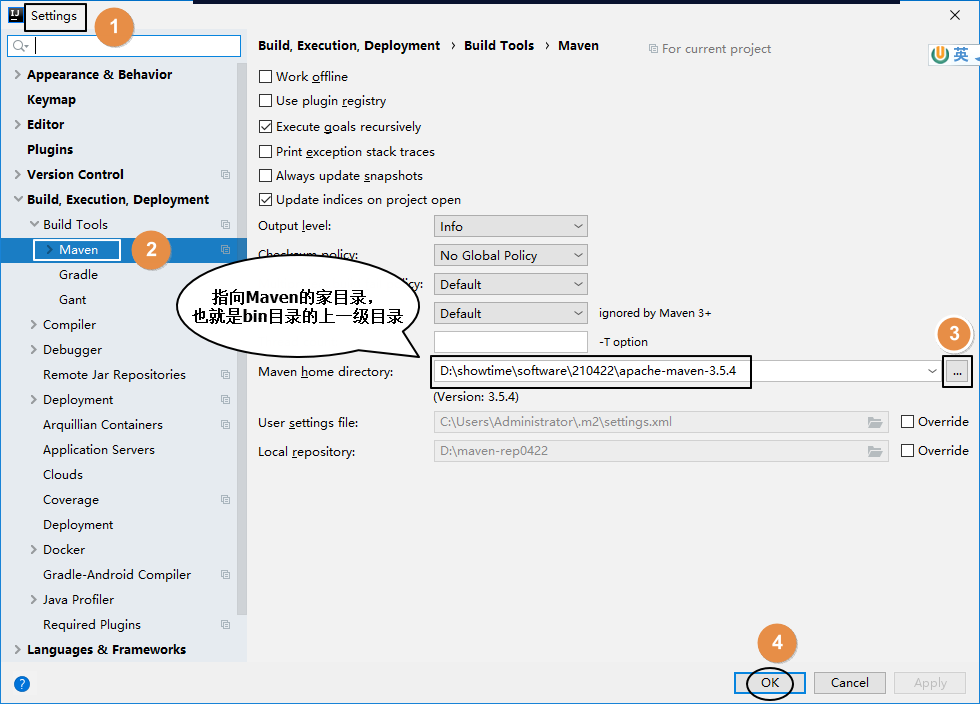

## 第三节 创建 Java 模块工程

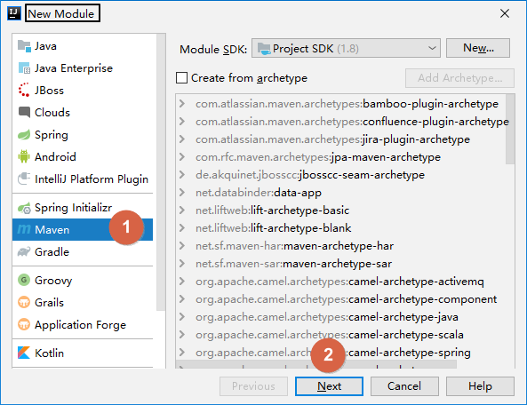


## 第四节 创建 Web 模块工程

1、创建模块

按照前面的同样操作创建模块，此时这个模块其实还是一个Java模块。

2、修改打包方式

Web 模块将来打包当然应该是 war 包。

```xml
<packaging>war</packaging>
```

3、Web 设定

首先打开项目结构菜单：


然后到 Facets 下查看 IDEA 是否已经帮我们自动生成了 Web 设定。正常来说只要我们确实设置了打包方式为 war，那么 IDEA 2019 版就会自动生成 Web 设定。

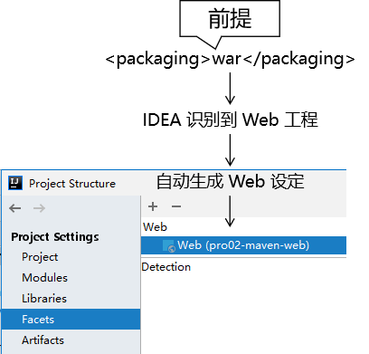

另外，对于 IDEA 2018 诸版本没有自动生成 Web 设定，那么请参照下面两图，我们自己创建：

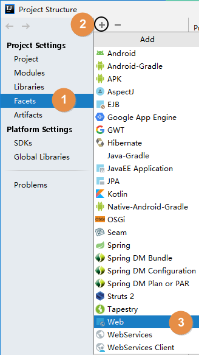

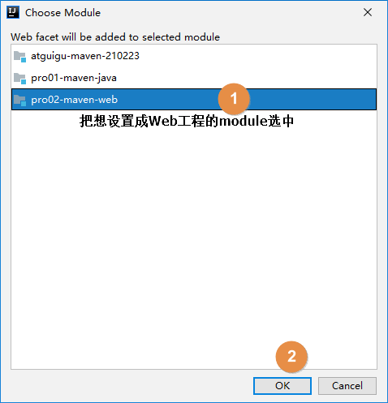

4、借助IDEA生成web.xml

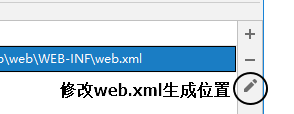

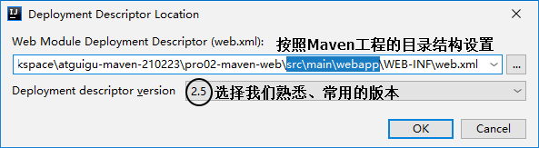


5、设置 Web 资源的根目录

结合 Maven 的目录结构，Web 资源的根目录需要设置为 src/main/webapp 目录。

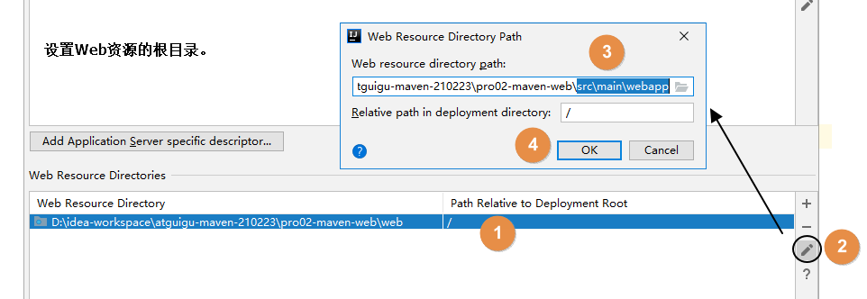
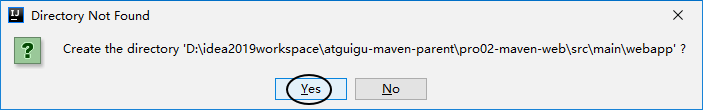


## 第五节 其他操作

### 1、在IDEA中执行Maven命令

①直接执行

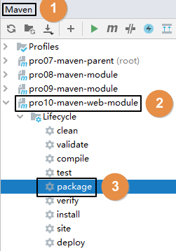

②手动输入

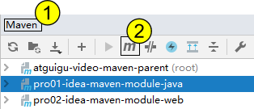

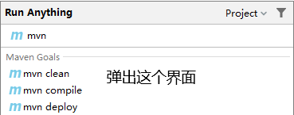

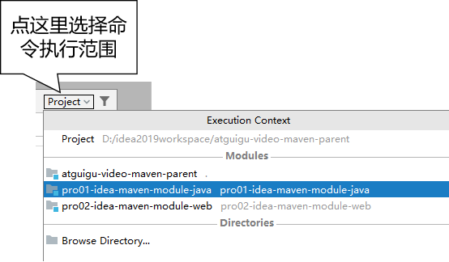

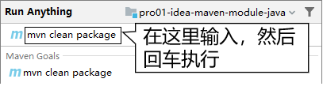

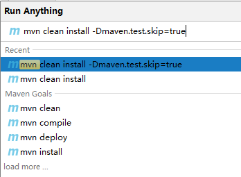


```bash
# -D 表示后面要附加命令的参数，字母 D 和后面的参数是紧挨着的，中间没有任何其它字符
# maven.test.skip=true 表示在执行命令的过程中跳过测试
mvn clean install -Dmaven.test.skip=true
```

### 2、在IDEA中查看某个模块的依赖信息

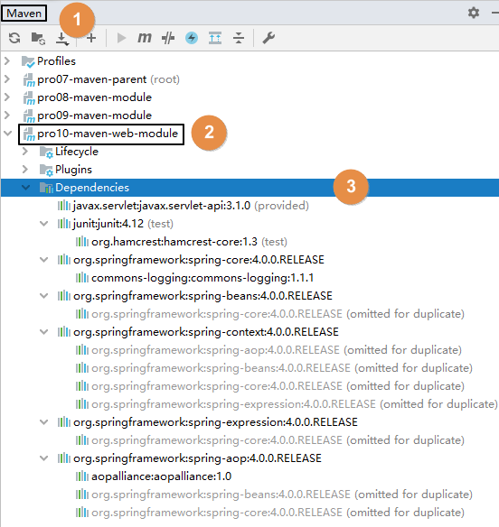

### 3、工程导入

Maven工程除了自己创建的，还有很多情况是别人创建的。而为了参与开发或者是参考学习，我们都需要导入到 IDEA 中。下面我们分几种不同情况来说明：

①来自版本控制系统

目前我们通常使用的都是 Git（本地库） + 码云（远程库）的版本控制系统，结合 IDEA 的相关操作方式请点这里 (opens new window)查看克隆远程库部分。

②来自工程目录

直接使用 IDEA 打开工程目录即可。下面咱们举个例子：

[1]工程压缩包

假设别人发给我们一个 Maven 工程的 zip 压缩包：maven-rest-demo.zip。从码云或GitHub上也可以以 ZIP 压缩格式对项目代码打包下载。

[2]解压

如果你的所有 IDEA 工程有一个专门的目录来存放，而不是散落各处，那么首先我们就把 ZIP 包解压到这个指定目录中。

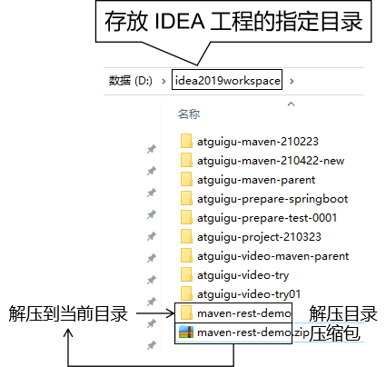

[3]打开

只要我们确认在解压目录下可以直接看到 pom.xml，那就能证明这个解压目录就是我们的工程目录。那么接下来让 IDEA 打开这个目录就可以了。

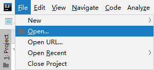


[4]设置 Maven 核心程序位置

打开一个新的 Maven 工程，和新创建一个 Maven 工程是一样的，此时 IDEA 的 settings 配置中关于 Maven 仍然是默认值：

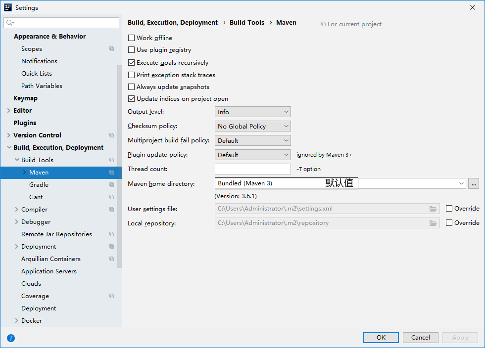


所以我们还是需要像新建 Maven 工程那样，指定一下 Maven 核心程序位置：

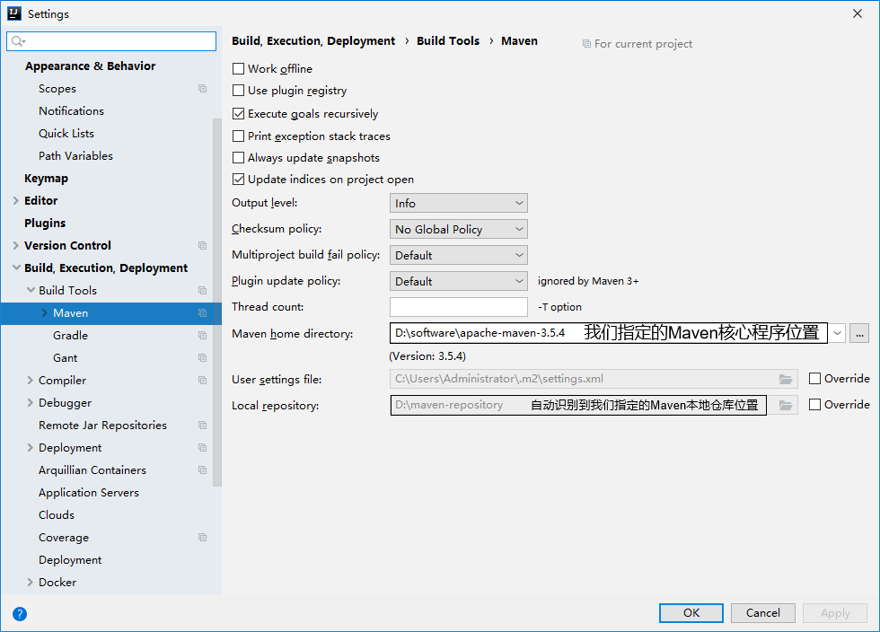


### 4、模块导入

①情景重现

在实际开发中，通常会忽略模块（也就是module）所在的项目（也就是project）仅仅导入某一个模块本身。这么做很可能是类似这样的情况：比如基于 Maven 学习 SSM 的时候，做练习需要导入老师发给我们的代码参考。

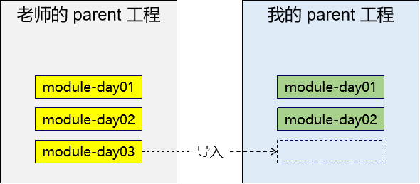

②导入 Java 类型模块

[1]找到老师发的工程目录


[2]复制我们想要导入的模块目录

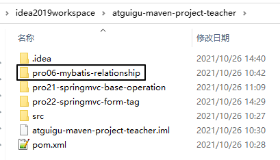

[3]粘贴到我们自己工程目录下

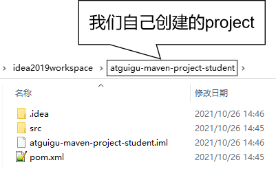


这个工程（project）是我们事先在 IDEA 中创建好的。


[4]在 IDEA 中执行导入

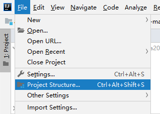

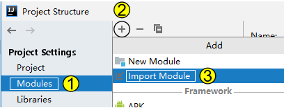

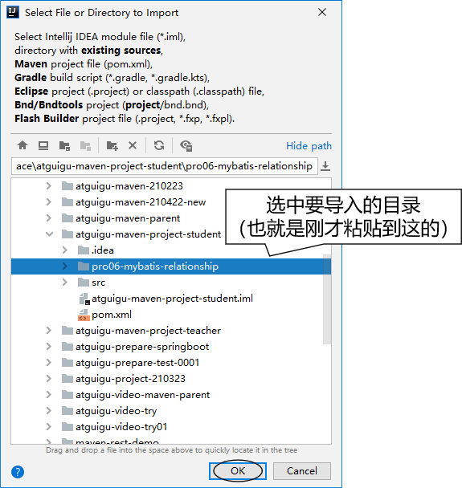

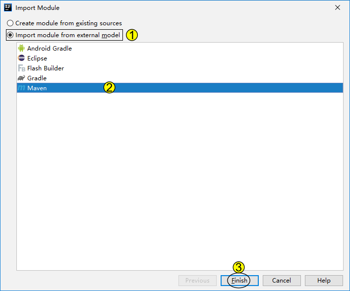

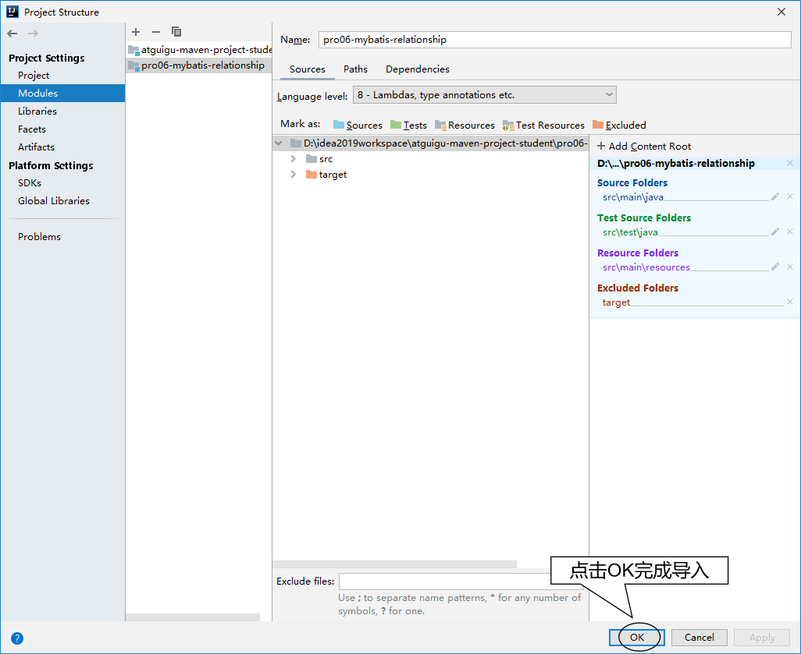

[5]修改 pom.xml

刚刚导入的 module 的父工程坐标还是以前的，需要改成我们自己的 project。

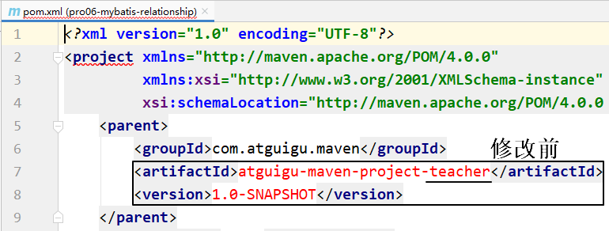


[6]最终效果

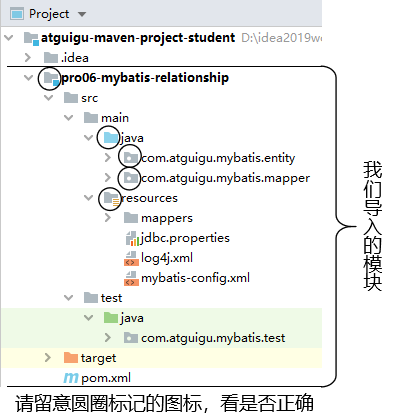

③导入 Web 类型模块

其它操作和上面演示的都一样，只是多一步：删除多余的、不正确的 web.xml 设置。如下图所示：

