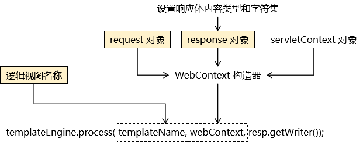

[返回目录](/blog/maven/index.md)

# 第六章 单一架构案例

http://heavy_code_industry.gitee.io/code_heavy_industry/pro002-maven/chapter06/

## 第一节 创建工程，引入依赖

### 1、架构

①架构的概念

『架构』其实就是『项目的结构』，只是因为架构是一个更大的词，通常用来形容比较大规模事物的结构。

②单一架构

单一架构也叫『all-in-one』结构，就是所有代码、配置文件、各种资源都在同一个工程。

- 一个项目包含一个工程
- 导出一个 war 包
- 放在一个 Tomcat 上运行

### 2、创建工程

```bash
$ tree  -L 3

/all-in-one-demo
├── pom.xml
└── src
    ├── main
    │   ├── java
    │   └── resources
    └── test
        └── java
```

### 3、引入依赖

①搜索依赖信息的网站

[1]到哪儿找？

- https://mvnrepository.com/

[2]怎么选择？

- 确定技术选型：确定我们项目中要使用哪些技术
- 到 mvnrepository 网站搜索具体技术对应的具体依赖信息

确定这个技术使用哪个版本的依赖

- 考虑因素1：看是否有别的技术要求这里必须用某一个版本
- 考虑因素2：如果没有硬性要求，那么选择较高版本或下载量大的版本


```xml
<!-- https://mvnrepository.com/artifact/mysql/mysql-connector-java -->
<dependency>
    <groupId>mysql</groupId>
    <artifactId>mysql-connector-java</artifactId>
    <version>5.1.37</version>
</dependency>
```

在实际使用中检验所有依赖信息是否都正常可用

确定技术选型、组建依赖列表、项目划分模块……等等这些操作其实都属于架构设计的范畴。

- 项目本身所属行业的基本特点
- 项目具体的功能需求
- 项目预计访问压力程度
- 项目预计将来需要扩展的功能
- 设计项目总体的体系结构

②持久化层所需依赖

- `mysql:mysql-connector-java:5.1.37`
- `com.alibaba:druid:1.2.8`
- `commons-dbutils:commons-dbutils:1.6`

③表述层所需依赖

- `javax.servlet:javax.servlet-api:3.1.0`
- `org.thymeleaf:thymeleaf:3.0.11.RELEASE`

④辅助功能所需依赖
- `junit:junit:4.12`
- `ch.qos.logback:logback-classic:1.2.3`

⑤最终完整依赖信息

```xml
<!-- https://mvnrepository.com/artifact/mysql/mysql-connector-java -->
<dependency>
    <groupId>mysql</groupId>
    <artifactId>mysql-connector-java</artifactId>
    <version>5.1.37</version>
</dependency>
<!-- https://mvnrepository.com/artifact/com.alibaba/druid -->
<dependency>
    <groupId>com.alibaba</groupId>
    <artifactId>druid</artifactId>
    <version>1.2.8</version>
</dependency>
<!-- https://mvnrepository.com/artifact/commons-dbutils/commons-dbutils -->
<dependency>
    <groupId>commons-dbutils</groupId>
    <artifactId>commons-dbutils</artifactId>
    <version>1.6</version>
</dependency>
<!-- https://mvnrepository.com/artifact/javax.servlet/javax.servlet-api -->
<dependency>
    <groupId>javax.servlet</groupId>
    <artifactId>javax.servlet-api</artifactId>
    <version>3.1.0</version>
    <scope>provided</scope>
</dependency>
<!-- https://mvnrepository.com/artifact/org.thymeleaf/thymeleaf -->
<dependency>
    <groupId>org.thymeleaf</groupId>
    <artifactId>thymeleaf</artifactId>
    <version>3.0.11.RELEASE</version>
</dependency>
<!-- https://mvnrepository.com/artifact/junit/junit -->
<dependency>
    <groupId>junit</groupId>
    <artifactId>junit</artifactId>
    <version>4.12</version>
    <scope>test</scope>
</dependency>
<!-- https://mvnrepository.com/artifact/ch.qos.logback/logback-classic -->
<dependency>
    <groupId>ch.qos.logback</groupId>
    <artifactId>logback-classic</artifactId>
    <version>1.2.3</version>
    <scope>test</scope>
</dependency>
```

### 4、建包

| package功能	| package 名称 |
| -	| - |
| 主包	| com.atguigu.imperial.court |
| 子包[实体类]	| com.atguigu.imperial.court.entity |
| 子包[Servlet基类包]	| com.atguigu.imperial.court.servlet.base |
| 子包[Servlet模块包]	| com.atguigu.imperial.court.servlet.module |
| 子包[Service接口包]	| com.atguigu.imperial.court.service.api |
| 子包[Service实现类包] | com.atguigu.imperial.court.service.impl |
| 子包[Dao接口包]	| com.atguigu.imperial.court.dao.api |
| 子包[Dao实现类包]	| com.atguigu.imperial.court.dao.impl |
| 子包[Filter]	| com.atguigu.imperial.court.filter |
| 子包[异常类包]  |	com.atguigu.imperial.court.exception |
| 子包[工具类] | com.atguigu.imperial.court.util |
| 子包[测试类]	| com.atguigu.imperial.court.test |

```
$ tree -d
.
└── src
    ├── main
    │   ├── java
    │   │   └── com
    │   │       └── atguigu
    │   │           └── imperial
    │   │               └── court
    │   │                   ├── dao
    │   │                   │   ├── api
    │   │                   │   └── impl
    │   │                   ├── entity
    │   │                   ├── exception
    │   │                   ├── filter
    │   │                   ├── service
    │   │                   │   ├── api
    │   │                   │   └── impl
    │   │                   ├── servlet
    │   │                   │   ├── base
    │   │                   │   └── module
    │   │                   └── util
    │   └── resources
    └── test
        └── java
            └── com
                └── atguigu
                    └── imperial
                        └── court
                            ├── dao
                            └── util

```

## 第二节 搭建环境：持久化层

### 1、数据建模

①物理建模

```sql
create database db_imperial_court;

use db_imperial_court;

create table t_emp
(
    emp_id         int primary key auto_increment,
    emp_name       char(100) not null,
    emp_position   char(100) not null,
    login_account  char(100) not null unique,
    login_password char(100) not null
);

create table t_memorials
(
    memorials_id          int primary key auto_increment,
    memorials_title       char(100)     not null,
    memorials_content     varchar(5000) not null,
    memorials_emp         int           not null,
    memorials_create_time char(100),
    feedback_time       char(100),
    feedback_content    varchar(1000),
    memorials_status      int           not null
);
```

导入测试数据

```sql
insert into t_emp(emp_name, emp_position, login_account, login_password)
values ('爱新觉罗·玄烨', 'emperor', 'xiaoxuanzi1654', '25325C896624D444B2E241807DCAC98B'), # 16540504
       ('纳兰明珠', 'minister', 'brightball1635', 'A580D0EF93C22036C859E194C14CB777'),   # 16351119
       ('赫舍里·索额图', 'minister', 'tutu1636', 'E40FD7D49B8B7EF46F47407D583C3538'); # 17030921

insert into t_memorials(memorials_title,
                      memorials_content,
                      memorials_emp,
                      memorials_create_time,
                      feedback_time,
                      feedback_content,
                      memorials_status)
values ('浙江巡抚奏钱塘堤决口疏', '皇上啊，不好啦！钱塘江发大水啦！堤坝冲毁啦！您看这咋弄啊！', 2, '1690-05-07', null, null, 0),
       ('左都御史参鳌拜圈地疏', '皇上啊，鳌拜这厮不是东西呀！占老百姓的地哇！还打人呀！您看咋弄啊！', 3, '1690-04-14', null, null, 0),
       ('都察院劾吴三桂不臣疏', '皇上啊，不得了啦！吴三桂那孙子想造反呀！', 2, '1693-11-18', null, null, 0),
       ('兵部奏准噶尔犯境疏', '皇上啊，不得了啦！葛尔丹要打过来了呀！', 3, '1693-11-18', null, null, 0),
       ('朝鲜使臣朝拜事宜呈皇上御览', '皇上啊！朝鲜国的人要来啦！咱们请他们吃猪肉炖粉条子吧！', 2, '1680-06-11', null, null, 0),
       ('英吉利炮舰购买事宜疏', '皇上啊！英国的小船船咱们买多少啊？', 3, '1680-06-12', null, null, 0),
       ('劾杭州织造贪墨疏', '皇上啊！杭州织造有问题啊！', 2, '1680-06-13', null, null, 0),
       ('禀畅春园落成疏', '皇上啊！畅春园修好了哇！您啥时候过来看看呀！', 3, '1680-06-14', null, null, 0),
       ('请旨木兰秋狝疏', '皇上啊！秋天到啦，又该打猎啦！', 2, '1680-06-15', null, null, 0),
       ('核准西北军饷银两疏', '皇上啊！您看看这钱数算的对不对呀！', 3, '1680-06-16', null, null, 0),
       ('请旨裁撤三藩疏', '皇上啊！咱们不裁撤三藩就芭比Q了哇！', 2, '1680-06-17', null, null, 0),
       ('蒙古王公进京朝拜疏', '皇上啊！蒙古王公要来啦！咱们请他们吃猪肉炖粉条子吧！', 3, '1680-06-18', null, null, 0),
       ('礼部请旨九阿哥赐名疏', '皇上啊！您看九阿哥该叫什么名字呀？', 2, '1680-06-19', null, null, 0),
       ('户部尚书请旨告老还乡疏', '皇上啊！臣想回家养老啦！您看看啥时候给臣把俸禄结一下啊！', 3, '1680-06-20', null, null, 0),
       ('查江宁织造贪墨疏', '皇上啊！江宁织造有问题啊！', 2, '1680-06-21', null, null, 0)
       ;
```

②逻辑建模

[1] Emp 实体类

```java
public class Emp {

    private Integer empId;
    private String empName;
    private String empPosition;
    private String loginAccount;
    private String loginPassword;
}
```

[2] Memorials 实体类

```java
public class Memorials {

    private Integer memorialsId;
    private String memorialsTitle;
    private String memorialsContent;
    
    // 奏折摘要数据库没有，这里是为了配和页面显示
    private String memorialsContentDigest;
    private Integer memorialsEmp;

    // 员工姓名数据库没有，这里是为了配合页面显示
    private String memorialsEmpName;
    private String memorialsCreateTime;
    private String feedbackTime;
    private String feedbackContent;
    private Integer memorialsStatus;
}
```


### 2、数据库连接信息

说明：这是我们第一次用到 Maven 约定目录结构中的 resources 目录，这个目录存放各种配置文件。

/src/main/resources/jdbc.properties

```bash
driverClassName=com.mysql.jdbc.Driver
url=jdbc:mysql://192.168.198.100:3306/db_imperial_court
username=root
password=atguigu
initialSize=10
maxActive=20
maxWait=10000
```

### 3、获取数据库连接

①创建 JDBCUtils 工具类

src/main/java/com/atguigu/imperial/court/util/JDBCUtils.java

②创建 javax.sql.DataSource 对象

```java
// 将数据源对象设置为静态属性，保证大对象的单一实例
private static DataSource dataSource;

static {

    // 1.创建一个用于存储外部属性文件信息的Properties对象
    Properties properties = new Properties();

    // 2.使用当前类的类加载器加载外部属性文件：jdbc.properties
    InputStream inputStream = JDBCUtils.class.getClassLoader().getResourceAsStream("jdbc.properties");

    try {

        // 3.将外部属性文件jdbc.properties中的数据加载到properties对象中
        properties.load(inputStream);

        // 4.创建数据源对象
        dataSource = DruidDataSourceFactory.createDataSource(properties);

    } catch (Exception e) {
        e.printStackTrace();
    }

}
```

③创建 ThreadLocal 对象

[1]提出需求

(1)在一个方法内控制事务

如果在每一个 Service 方法中都写下面代码，那么代码重复性就太高了：


```java
try{

	// 1、获取数据库连接
	// 重要：要保证参与事务的多个数据库操作（SQL 语句）使用的是同一个数据库连接
	Connection conn = JDBCUtils.getConnection();
	
	// 2、核心操作
	// ...
	
	// 3、核心操作成功结束，可以提交事务
	conn.commit();

}catch(Exception e){

	// 4、核心操作抛出异常，必须回滚事务
	conn.rollBack();

}finally{

	// 5、释放数据库连接
	JDBCUtils.releaseConnection(conn);
	
}
```

(2)将重复代码抽取到 Filter

所谓『当前请求覆盖的 Servlet 方法、Service 方法、Dao 方法』其实就是 chain.doFilter(request, response) 间接调用的方法。

```java
public void doFilter(ServletRequest request, ServletResponse response, FilterChain chain){

	try{

		// 1、获取数据库连接
		// 重要：要保证参与事务的多个数据库操作（SQL 语句）使用的是同一个数据库连接
		Connection conn = JDBCUtils.getConnection();
        
        // 重要操作：关闭自动提交功能
        connection.setAutoCommit(false);
		
		// 2、核心操作：通过 chain 对象放行当前请求
		// 这样就可以保证当前请求覆盖的 Servlet 方法、Service 方法、Dao 方法都在同一个事务中。
		// 同时各个请求都经过这个 Filter，所以当前事务控制的代码在这里只写一遍就行了，
		// 避免了代码的冗余。
		chain.doFilter(request, response);
		
		// 3、核心操作成功结束，可以提交事务
		conn.commit();

	}catch(Exception e){

		// 4、核心操作抛出异常，必须回滚事务
		conn.rollBack();

	}finally{

		// 5、释放数据库连接
		JDBCUtils.releaseConnection(conn);
		
	}

}
```

(3)数据的跨方法传递

通过 JDBCUtils 工具类获取到的 Connection 对象需要传递给 Dao 方法，让事务涉及到的所有 Dao 方法用的都是同一个 Connection 对象。

但是 Connection 对象无法通过 chain.doFilter() 方法以参数的形式传递过去。

所以从获取到 Connection 对象到使用 Connection 对象中间隔着很多不是我们自己声明的方法——我们无法决定它们的参数。

[2] ThreadLocal 对象的功能


- 全类名：java.lang.ThreadLocal<T>
- 泛型 T：要绑定到当前线程的数据的类型
- 具体三个主要的方法：

| 方法名	| 功能 |
| -	| - |
| set(T value)	将数据绑定到当前线程 |
| get()	从当前线程获取已绑定的数据 |
| remove()	将数据从当前线程移除 |

[3] Java 代码

```java
// 由于 ThreadLocal 对象需要作为绑定数据时 k-v 对中的 key，所以要保证唯一性
// 加 static 声明为静态资源即可保证唯一性
private static ThreadLocal<Connection> threadLocal = new ThreadLocal<>();
```

④声明方法：获取数据库连接

```java
/**
 * 工具方法：获取数据库连接并返回
 * @return
 */
public static Connection getConnection() {

    Connection connection = null;

    try {
        // 1、尝试从当前线程检查是否存在已经绑定的 Connection 对象
        connection = threadLocal.get();

        // 2、检查 Connection 对象是否为 null
        if (connection == null) {
            
            // 3、如果为 null，则从数据源获取数据库连接
            connection = dataSource.getConnection();

            // 4、获取到数据库连接后绑定到当前线程
            threadLocal.set(connection);
            
        }
    } catch (SQLException e) {
        e.printStackTrace();
        
        // 为了调用工具方法方便，编译时异常不往外抛
        // 为了不掩盖问题，捕获到的编译时异常封装为运行时异常抛出
        throw new RuntimeException(e);
    }

    return connection;
}
```

⑤声明方法：释放数据库连接

```java
/**
 * 释放数据库连接
 */
public static void releaseConnection(Connection connection) {

    if (connection != null) {

        try {
            // 在数据库连接池中将当前连接对象标记为空闲
            connection.close();

            // 将当前数据库连接从当前线程上移除
            threadLocal.remove();

        } catch (SQLException e) {
            e.printStackTrace();
            throw new RuntimeException(e);
        }

    }

}
```

⑥初步测试


src/test/java/com/atguigu/imperial/court/util/JDBCUtilsTest.java

```java
package com.atguigu.imperial.court.util;

import org.junit.Test;

import java.sql.Connection;

public class JDBCUtilsTest {

    @Test
    public void getConnection() {
        Connection connection = JDBCUtils.getConnection();
        System.out.println(connection);
        JDBCUtils.releaseConnection(connection);
    }
}
```

⑦完整代码

```java
/**
 * 功能1：从数据源获取数据库连接
 * 功能2：从数据库获取到数据库连接后，绑定到本地线程（借助 ThreadLocal）
 * 功能3：释放线程时和本地线程解除绑定
 */
public class JDBCUtils {

    // 数据源成员变量设置为静态资源，保证大对象的单例性；同时保证静态方法中可以访问
    private static DataSource dataSource;

    // 由于 ThreadLocal 对象需要作为绑定数据时 k-v 对中的 key，所以要保证唯一性
    // 加 static 声明为静态资源即可保证唯一性
    private static ThreadLocal<Connection> threadLocal = new ThreadLocal<>();

    // 在静态代码块中初始化数据源
    static {

        try {
            // 操作思路分析：
            // 从 jdbc.properties 文件中读取连接数据库的信息
            // 为了保证程序代码的可移植性，需要基于一个确定的基准来读取这个文件
            // 确定的基准：类路径的根目录。resources 目录下的内容经过构建操作中的打包操作后会确定放在 WEB-INF/classes 目录下。
            // WEB-INF/classes 目录存放编译好的 *.class 字节码文件，所以这个目录我们就称之为类路径。
            // 类路径无论在本地运行还是在服务器端运行都是一个确定的基准。
            // 操作具体代码：
            // 1、获取当前类的类加载器
            ClassLoader classLoader = JDBCUtils.class.getClassLoader();

            // 2、通过类加载器对象从类路径根目录下读取文件
            InputStream stream = classLoader.getResourceAsStream("jdbc.properties");

            // 3、使用 Properties 类封装属性文件中的数据
            Properties properties = new Properties();
            properties.load(stream);

            // 4、根据 Properties 对象（已封装了数据库连接信息）来创建数据源对象
            dataSource = DruidDataSourceFactory.createDataSource(properties);
        } catch (Exception e) {
            e.printStackTrace();

            // 为了避免在真正抛出异常后，catch 块捕获到异常从而掩盖问题，
            // 这里将所捕获到的异常封装为运行时异常继续抛出
            throw new RuntimeException(e);
        }
    }

    /**
     * 工具方法：获取数据库连接并返回
     * @return
     */
    public static Connection getConnection() {

        Connection connection = null;

        try {
            // 1、尝试从当前线程检查是否存在已经绑定的 Connection 对象
            connection = threadLocal.get();

            // 2、检查 Connection 对象是否为 null
            if (connection == null) {

                // 3、如果为 null，则从数据源获取数据库连接
                connection = dataSource.getConnection();

                // 4、获取到数据库连接后绑定到当前线程
                threadLocal.set(connection);
            }
        } catch (SQLException e) {
            e.printStackTrace();

            // 为了调用工具方法方便，编译时异常不往外抛
            // 为了不掩盖问题，捕获到的编译时异常封装为运行时异常抛出
            throw new RuntimeException(e);
        }

        return connection;
    }

    /**
     * 释放数据库连接
     */
    public static void releaseConnection(Connection connection) {

        if (connection != null) {

            try {
                // 在数据库连接池中将当前连接对象标记为空闲
                connection.close();

                // 将当前数据库连接从当前线程上移除
                threadLocal.remove();

            } catch (SQLException e) {
                e.printStackTrace();
                throw new RuntimeException(e);
            }
        }
    }
}
```

### 4、BaseDao

src/main/java/com/atguigu/imperial/court/dao/BaseDao.java

①泛型的说明


②创建 QueryRunner 对象

```java
// DBUtils 工具包提供的数据库操作对象
private QueryRunner runner = new QueryRunner();
```

③通用增删改方法

特别说明：在 BaseDao 方法中获取数据库连接但是不做释放，因为我们要在控制事务的 Filter 中统一释放。

```java
/**
 * 通用的增删改方法，insert、delete、update 操作都可以用这个方法
 * @param sql 执行操作的 SQL 语句
 * @param parameters SQL 语句的参数
 * @return 受影响的行数
 */
public int update(String sql, Object ... parameters) {

    try {
        Connection connection = JDBCUtils.getConnection();

        int affectedRowNumbers = runner.update(connection, sql, parameters);
        
        return affectedRowNumbers;
    } catch (SQLException e) {
        e.printStackTrace();

        // 如果真的抛出异常，则将编译时异常封装为运行时异常抛出
        new RuntimeException(e);
        
        return 0;
    }

}

```

④查询单个对象

```java
/**
 * 查询单个对象
 * @param sql 执行查询的 SQL 语句
 * @param entityClass 实体类对应的 Class 对象
 * @param parameters 传给 SQL 语句的参数
 * @return 查询到的实体类对象
 */
public T getSingleBean(String sql, Class<T> entityClass, Object ... parameters) {

    try {
        // 获取数据库连接
        Connection connection = JDBCUtils.getConnection();

        return runner.query(connection, sql, new BeanHandler<>(entityClass), parameters);

    } catch (SQLException e) {
        e.printStackTrace();

        // 如果真的抛出异常，则将编译时异常封装为运行时异常抛出
        new RuntimeException(e);
    }

    return null;
}
```

⑤查询多个对象

```java
/**
 * 查询返回多个对象的方法
 * @param sql 执行查询操作的 SQL 语句
 * @param entityClass 实体类的 Class 对象
 * @param parameters SQL 语句的参数
 * @return 查询结果
 */
public List<T> getBeanList(String sql, Class<T> entityClass, Object ... parameters) {
    try {
        // 获取数据库连接
        Connection connection = JDBCUtils.getConnection();

        return runner.query(connection, sql, new BeanListHandler<>(entityClass), parameters);

    } catch (SQLException e) {
        e.printStackTrace();

        // 如果真的抛出异常，则将编译时异常封装为运行时异常抛出
        new RuntimeException(e);
    }

    return null;
}
```

⑥测试

src/test/java/com/atguigu/imperial/court/dao/BaseDaoTest.java

```java
private BaseDao<Emp> baseDao = new BaseDao<>();

@Test
public void testGetSingleBean() {

    String sql = "select emp_id empId,emp_name empName,emp_position empPosition,login_account loginAccount,login_password loginPassword from t_emp where emp_id=?";

    Emp emp = baseDao.getSingleBean(sql, Emp.class, 1);

    System.out.println("emp = " + emp);

}

@Test
public void testGetBeanList() {

    String sql = "select emp_id empId,emp_name empName,emp_position empPosition,login_account loginAccount,login_password loginPassword from t_emp";

    List<Emp> empList = baseDao.getBeanList(sql, Emp.class);

    for (Emp emp : empList) {
        System.out.println("emp = " + emp);
    }

}

@Test
public void testUpdate() {

    String sql = "update t_emp set emp_position=? where emp_id=?";

    String empPosition = "minister";
    String empId = "3";

    int affectedRowNumber = baseDao.update(sql, empPosition, empId);

    System.out.println("affectedRowNumber = " + affectedRowNumber);

}
```

### 5、子类 Dao

创建接口和实现类如下：

```
src/main/java/com/atguigu/imperial/court/dao

$ tree 
.
├── BaseDao.java
├── api
│   ├── EmpDao.java
│   └── MemorialsDao.java
└── impl
    ├── EmpDaoImpl.java
    └── MemorialsDaoImpl.java

```


## 第三节 搭建环境：事务控制

### 1、总体思路


### 2、TransactionFilter

①创建 Filter 类

```
/src/main/java/
    com/atguigu/imperial/court/
        filter/
            TransactionFilter.java
```

②TransactionFilter 完整代码

```java
public class TransactionFilter implements Filter {

    // 声明集合保存静态资源扩展名
    private static Set<String> staticResourceExtNameSet;

    static {
        staticResourceExtNameSet = new HashSet<>();
        staticResourceExtNameSet.add(".png");
        staticResourceExtNameSet.add(".jpg");
        staticResourceExtNameSet.add(".css");
        staticResourceExtNameSet.add(".js");
    }

    @Override
    public void doFilter(ServletRequest servletRequest, ServletResponse servletResponse, FilterChain filterChain) throws IOException, ServletException {

        // 前置操作：排除静态资源
        HttpServletRequest request = (HttpServletRequest) servletRequest;
        String servletPath = request.getServletPath();
        if (servletPath.contains(".")) {
            String extName = servletPath.substring(servletPath.lastIndexOf("."));

            if (staticResourceExtNameSet.contains(extName)) {

                // 如果检测到当前请求确实是静态资源，则直接放行，不做事务操作
                filterChain.doFilter(servletRequest, servletResponse);

                // 当前方法立即返回
                return ;
            }

        }

        Connection connection = null;

        try{

            // 1、获取数据库连接
            connection = JDBCUtils.getConnection();

            // 重要操作：关闭自动提交功能
            connection.setAutoCommit(false);

            // 2、核心操作
            filterChain.doFilter(servletRequest, servletResponse);

            // 3、提交事务
            connection.commit();

        }catch (Exception e) {

            try {
                // 4、回滚事务
                connection.rollback();
            } catch (SQLException ex) {
                ex.printStackTrace();
            }

            // 页面显示：将这里捕获到的异常发送到指定页面显示
            // 获取异常信息
            String message = e.getMessage();

            // 将异常信息存入请求域
            request.setAttribute("systemMessage", message);

            // 将请求转发到指定页面
            request.getRequestDispatcher("/").forward(request, servletResponse);

        }finally {

            // 5、释放数据库连接
            JDBCUtils.releaseConnection(connection);

        }

    }

    @Override
    public void init(FilterConfig filterConfig) throws ServletException {}
    
    @Override
    public void destroy() {}
}
```

③配置 web.xml

```xml
<?xml version="1.0" encoding="UTF-8"?>
<web-app version="2.4"
         xmlns="http://java.sun.com/xml/ns/j2ee"
         xmlns:xsi="http://www.w3.org/2001/XMLSchema-instance"
         xsi:schemaLocation="http://java.sun.com/xml/ns/j2ee
        http://java.sun.com/xml/ns/j2ee/web-app_2_4.xsd">
    <filter>
        <filter-name>txFilter</filter-name>
        <filter-class>com.atguigu.imperial.court.filter.TransactionFilter</filter-class>
    </filter>
    <filter-mapping>
        <filter-name>txFilter</filter-name>
        <url-pattern>/*</url-pattern>
    </filter-mapping>
</web-app>

```

④注意点

[1]确保异常回滚

在程序执行的过程中，必须让所有 catch 块都把编译时异常转换为运行时异常抛出；如果不这么做，在 TransactionFilter 中 catch 就无法捕获到底层抛出的异常，那么该回滚的时候就无法回滚。

[2]谨防数据库连接提前释放

由于诸多操作都是在使用同一个数据库连接，那么中间任何一个环节释放数据库连接都会导致后续操作无法正常完成。

## 第四节 搭建环境：表述层

1、视图模板技术 Thymeleaf

①服务器端渲染


②Thymeleaf 简要工作机制

[1]初始化阶段

- 目标：创建 TemplateEngine 对象
- 封装：因为对每一个请求来说，TemplateEngine 对象使用的都是同一个，所以在初始化阶段准备好


[2]请求处理阶段



③逻辑视图与物理视图

假设有下列页面地址：

```
/WEB-INF/pages/apple.html
/WEB-INF/pages/banana.html
/WEB-INF/pages/orange.html
/WEB-INF/pages/grape.html
/WEB-INF/pages/egg.html
```

这样的地址可以直接访问到页面本身，我们称之为：物理视图。

而将物理视图中前面、后面的固定内容抽取出来，让每次请求指定中间变化部分即可，那么中间变化部分就叫：逻辑视图。


④ViewBaseServlet 完整代码

为了简化视图页面处理过程，我们将 Thymeleaf 模板引擎的初始化和请求处理过程封装到一个 Servlet 基类中：ViewBaseServlet。以后负责具体模块业务功能的 Servlet 继承该基类即可直接使用。

```
/src/main/java/
    com/atguigu/imperial/court/
        servlet/
            base/
                ViewBaseServlet.java
```

ViewBaseServlet 完整代码

```java
public class ViewBaseServlet extends HttpServlet {

    private TemplateEngine templateEngine;

    @Override
    public void init() throws ServletException {

        // 1.获取ServletContext对象
        ServletContext servletContext = this.getServletContext();

        // 2.创建Thymeleaf解析器对象
        ServletContextTemplateResolver templateResolver = new ServletContextTemplateResolver(servletContext);

        // 3.给解析器对象设置参数
        // ①HTML是默认模式，明确设置是为了代码更容易理解
        templateResolver.setTemplateMode(TemplateMode.HTML);

        // ②设置前缀
        String viewPrefix = servletContext.getInitParameter("view-prefix");

        templateResolver.setPrefix(viewPrefix);

        // ③设置后缀
        String viewSuffix = servletContext.getInitParameter("view-suffix");

        templateResolver.setSuffix(viewSuffix);

        // ④设置缓存过期时间（毫秒）
        templateResolver.setCacheTTLMs(60000L);

        // ⑤设置是否缓存
        templateResolver.setCacheable(true);

        // ⑥设置服务器端编码方式
        templateResolver.setCharacterEncoding("utf-8");

        // 4.创建模板引擎对象
        templateEngine = new TemplateEngine();

        // 5.给模板引擎对象设置模板解析器
        templateEngine.setTemplateResolver(templateResolver);

    }

    protected void processTemplate(String templateName, HttpServletRequest req, HttpServletResponse resp) throws IOException {
        // 1.设置响应体内容类型和字符集
        resp.setContentType("text/html;charset=UTF-8");

        // 2.创建WebContext对象
        WebContext webContext = new WebContext(req, resp, getServletContext());

        // 3.处理模板数据
        templateEngine.process(templateName, webContext, resp.getWriter());
    }
}
```

特别提醒：这个类不需要掌握，因为以后都被框架封装了，我们现在只是暂时用一下。

⑤声明初始化参数

web.xml

```xml
<!-- 配置 Web 应用初始化参数指定视图前缀、后缀 -->
<!-- 
    物理视图举例：/WEB-INF/pages/index.html
    对应逻辑视图：index
-->
<context-param>
    <param-name>view-prefix</param-name>
    <param-value>/WEB-INF/pages/</param-value>
</context-param>

<context-param>
    <param-name>view-suffix</param-name>
    <param-value>.html</param-value>
</context-param>
```

⑥Thymeleaf 的页面语法

[http://heavy_code_industry.gitee.io/code_heavy_industry/pro001-javaweb/lecture/chapter08/](http://heavy_code_industry.gitee.io/code_heavy_industry/pro001-javaweb/lecture/chapter08/)

2、ModelBaseServlet

①提出问题

[1]我们的需求

```
请求 -> UserServlet -> method
```

[2]HttpServlet 的局限
- doGet() 方法：处理 GET 请求
- doPost() 方法：处理 POST 请求

②解决方案

每个请求附带一个请求参数，表明自己要调用的目标方法
Servlet 根据目标方法名通过反射调用目标方法

③ModelBaseServlet 完整代码
```
/src/main/java/
    com/atguigu/imperial/court/
        servlet/
            base/
                ModelBaseServlet.java
```

特别提醒：为了配合 TransactionFilter 实现事务控制，捕获的异常必须抛出。

```java
public class ModelBaseServlet extends ViewBaseServlet {

    protected void doGet(HttpServletRequest request, HttpServletResponse response) throws ServletException, IOException {

        // 在doGet()方法中调用doPost()方法，这样就可以在doPost()方法中集中处理所有请求
        doPost(request, response);
    }

    protected void doPost(HttpServletRequest request, HttpServletResponse response) throws ServletException, IOException {

        // 1.在所有request.getParameter()前面设置解析请求体的字符集
        request.setCharacterEncoding("UTF-8");

        // 2.从请求参数中获取method对应的数据
        String method = request.getParameter("method");

        // 3.通过反射调用method对应的方法
        // ①获取Class对象
        Class<? extends ModelBaseServlet> clazz = this.getClass();

        try {
            // ②获取method对应的Method对象
            Method methodObject = clazz.getDeclaredMethod(method, HttpServletRequest.class, HttpServletResponse.class);

            // ③打开访问权限
            methodObject.setAccessible(true);

            // ④通过Method对象调用目标方法
            methodObject.invoke(this, request, response);
        } catch (Exception e) {
            e.printStackTrace();

            // 重要提醒：为了配合 TransactionFilter 实现事务控制，捕获的异常必须抛出。
            throw new RuntimeException(e);
        }
    }

}
```

④继承关系


## 第五节 搭建环境：辅助功能

1、常量类

```
/src/main/java/
    com/atguigu/imperial/court/
        util/
            ImperialCourtConst.java
```

```java
public class ImperialCourtConst {

    public static final String LOGIN_FAILED_MESSAGE = "账号、密码错误，不可进宫！";
    public static final String ACCESS_DENIED_MESSAGE = "宫闱禁地，不得擅入！";

}
```

2、MD5 加密工具方法

```
/src/main/java/
    com/atguigu/imperial/court/
        util/
            MD5Util.java
```

```java
public class MD5Util {

    /**
     * 针对明文字符串执行MD5加密
     * @param source
     * @return
     */
    public static String encode(String source) {

        // 1.判断明文字符串是否有效
        if (source == null || "".equals(source)) {
            throw new RuntimeException("用于加密的明文不可为空");
        }

        // 2.声明算法名称
        String algorithm = "md5";

        // 3.获取MessageDigest对象
        MessageDigest messageDigest = null;
        try {
            messageDigest = MessageDigest.getInstance(algorithm);
        } catch (NoSuchAlgorithmException e) {
            e.printStackTrace();
        }

        // 4.获取明文字符串对应的字节数组
        byte[] input = source.getBytes();

        // 5.执行加密
        byte[] output = messageDigest.digest(input);

        // 6.创建BigInteger对象
        int signum = 1;
        BigInteger bigInteger = new BigInteger(signum, output);

        // 7.按照16进制将bigInteger的值转换为字符串
        int radix = 16;
        String encoded = bigInteger.toString(radix).toUpperCase();

        return encoded;
    }

}
```


3、日志配置文件

```
/src/main/resources/
    logback.xml
```

```xml
<?xml version="1.0" encoding="UTF-8"?>
<configuration debug="true">
    <!-- 指定日志输出的位置 -->
    <appender name="STDOUT"
              class="ch.qos.logback.core.ConsoleAppender">
        <encoder>
            <!-- 日志输出的格式 -->
            <!-- 按照顺序分别是：时间、日志级别、线程名称、打印日志的类、日志主体内容、换行 -->
            <pattern>[%d{HH:mm:ss.SSS}] [%-5level] [%thread] [%logger] [%msg]%n</pattern>
            <charset>UTF-8</charset>
        </encoder>
    </appender>

    <!-- 设置全局日志级别。日志级别按顺序分别是：DEBUG、INFO、WARN、ERROR -->
    <!-- 指定任何一个日志级别都只打印当前级别和后面级别的日志。 -->
    <root level="INFO">
        <!-- 指定打印日志的appender，这里通过“STDOUT”引用了前面配置的appender -->
        <appender-ref ref="STDOUT" />
    </root>

    <!-- 专门给某一个包指定日志级别 -->
    <logger name="com.atguigu" level="DEBUG" additivity="false">
        <appender-ref ref="STDOUT" />
    </logger>

</configuration>
```

## 第六节 业务功能：登录

1、显示首页

①流程图


②创建 PortalServlet

```
/src/main/java/
    com/atguigu/imperial/court/
        servlet/
            module/
                PortalServlet.java
```

```java
public class PortalServlet extends ViewBaseServlet {

    @Override
    protected void doGet(HttpServletRequest req, HttpServletResponse resp) throws ServletException, IOException {
        doPost(req, resp);
    }

    @Override
    protected void doPost(HttpServletRequest req, HttpServletResponse resp) throws ServletException, IOException {
        // 声明要访问的首页的逻辑视图
        String templateName = "index";
        
        // 调用父类的方法根据逻辑视图名称渲染视图
        processTemplate(templateName, req, resp);
    }
}
```

[2]注册

web.xml

```xml
<servlet>
    <servlet-name>portalServlet</servlet-name>
    <servlet-class>com.atguigu.imperial.court.servlet.module.PortalServlet</servlet-class>
</servlet>
<servlet-mapping>
    <servlet-name>portalServlet</servlet-name>
    <url-pattern>/</url-pattern>
</servlet-mapping>
```


③在 index.html 中编写登录表单

```
src/main/
    webapp/WEB-INF/
        pages/
            index.html
```

```html
<!DOCTYPE html>
<html lang="en" xml:th="http://www.thymeleaf.org">
<head>
    <meta charset="UTF-8">
    <title>Title</title>
</head>
<body>
<!-- @{/auth} 解析后：/demo/auth -->
<form th:action="@{/auth}" method="post">
    <!-- 传递 method 请求参数，目的是为了让当前请求调用 AuthServlet 中的 login() 方法 -->
    <input type="hidden" name="method" value="login" />

    <!-- th:text 解析表达式后会替换标签体 -->
    <!-- ${attrName} 从请求域获取属性名为 attrName 的属性值 -->
    <p th:text="${message}"></p>
    <p th:text="${systemMessage}"></p>
    
    账号：<input type="text" name="loginAccount"/><br/>
    密码：<input type="password" name="loginPassword"><br/>
    <button type="submit">进宫</button>
</form>

</body>
</html>
```

## 2、登录操作

①流程图


②创建 EmpService 


EmpServiceImpl

```java
public class EmpServiceImpl implements EmpService {

    private EmpDao empDao = new EmpDaoImpl();

    @Override
    public Emp getEmpByLoginAccount(String loginAccount, String loginPassword) {

        // 1、对密码执行加密
        String encodedLoginPassword = MD5Util.encode(loginPassword);

        // 2、根据账户和加密密码查询数据库
        Emp emp = empDao.selectEmpByLoginAccount(loginAccount, encodedLoginPassword);

        // 3、检查 Emp 对象是否为 null
        if (emp != null) {
            //	①不为 null：返回 Emp
            return emp;
        } else {
            //	②为 null：抛登录失败异常
            throw new LoginFailedException(ImperialCourtConst.LOGIN_FAILED_MESSAGE);
        }
    }
}

```
③创建登录失败异常

```
/src/main/java/
    com/atguigu/imperial/court/
        exception/
            LoginFailedException.java
```
```java
public class LoginFailedException extends RuntimeException {

    public LoginFailedException() {
    }

    public LoginFailedException(String message) {
        super(message);
    }

    public LoginFailedException(String message, Throwable cause) {
        super(message, cause);
    }

    public LoginFailedException(Throwable cause) {
        super(cause);
    }

    public LoginFailedException(String message, Throwable cause, boolean enableSuppression, boolean writableStackTrace) {
        super(message, cause, enableSuppression, writableStackTrace);
    }
}
```

④增加常量声明

```java
public class ImperialCourtConst {

    public static final String LOGIN_FAILED_MESSAGE = "账号、密码错误，不可进宫！";
    public static final String ACCESS_DENIED_MESSAGE = "宫闱禁地，不得擅入！";
    public static final String LOGIN_EMP_ATTR_NAME = "loginInfo";

}
```

⑤创建 AuthServlet

[1]创建 Java 类

```
/src/main/java/
    com/atguigu/imperial/court/
        servlet/module/
            AuthServlet.java
```

```java
public class AuthServlet extends ModelBaseServlet {

    private EmpService empService = new EmpServiceImpl();

    protected void login(
            HttpServletRequest request,
            HttpServletResponse response)
            throws ServletException, IOException {

        try {
            // 1、获取请求参数
            String loginAccount = request.getParameter("loginAccount");
            String loginPassword = request.getParameter("loginPassword");

            // 2、调用 EmpService 方法执行登录逻辑
            Emp emp = empService.getEmpByLoginAccount(loginAccount, loginPassword);

            // 3、通过 request 获取 HttpSession 对象
            HttpSession session = request.getSession();

            // 4、将查询到的 Emp 对象存入 Session 域
            session.setAttribute(ImperialCourtConst.LOGIN_EMP_ATTR_NAME, emp);

            // 5、前往指定页面视图
            String templateName = "temp";
            processTemplate(templateName, request, response);

        } catch (Exception e) {
            e.printStackTrace();

            // 6、判断此处捕获到的异常是否是登录失败异常
            if (e instanceof LoginFailedException) {
                // 7、如果是登录失败异常则跳转回登录页面
                // ①将异常信息存入请求域
                request.setAttribute("message", e.getMessage());

                // ②处理视图：index
                processTemplate("index", request, response);

            }else {
                // 8、如果不是登录异常则封装为运行时异常继续抛出
                throw new RuntimeException(e);

            }

        }

    }
}
```

注册 web.xml

```xml
<servlet>
    <servlet-name>authServlet</servlet-name>
    <servlet-class>com.atguigu.imperial.court.servlet.module.AuthServlet</servlet-class>
</servlet>
<servlet-mapping>
    <servlet-name>authServlet</servlet-name>
    <url-pattern>/auth</url-pattern>
</servlet-mapping>
```

⑦EmpDao 方法
```java
public class EmpDaoImpl extends BaseDao<Emp> implements EmpDao {
    @Override
    public Emp selectEmpByLoginAccount(String loginAccount, String encodedLoginPassword) {

        // 1、编写 SQL 语句
        String sql = "select emp_id empId," +
                "emp_name empName," +
                "emp_position empPosition," +
                "login_account loginAccount," +
                "login_password loginPassword " +
                "from t_emp where login_account=? and login_password=?";

        // 2、调用父类方法查询单个对象
        return super.getSingleBean(sql, Emp.class, loginAccount, encodedLoginPassword);
    }
}
```

⑧临时页面

```html
<!DOCTYPE html>
<html lang="en" xml:th="http://www.thymeleaf.org">
<head>
    <meta charset="UTF-8">
    <title>临时</title>
</head>
<body>

    <p th:text="${session.loginInfo}"></p>

</body>
</html>
```

3、退出登录

①在临时页面编写超链接

```html
<a th:href="@{/auth?method=logout}">退朝</a>
```


②在 AuthServlet 编写退出逻辑

```java
protected void logout(HttpServletRequest request, HttpServletResponse response) throws ServletException, IOException {

    // 1、通过 request 对象获取 HttpSession 对象
    HttpSession session = request.getSession();

    // 2、将 HttpSession 对象强制失效
    session.invalidate();

    // 3、回到首页
    String templateName = "index";
    processTemplate(templateName, request, response);
}
```

## 第七节 业务功能：显示奏折列表

1、流程图


2、创建组件

①创建 WorkServlet

[1]创建 Java 类

刚开始是空的，还没有写方法：

```java
public class WorkServlet extends ModelBaseServlet {
    
    private MemorialsService memorialsService = new MemorialsServiceImpl();
    
}
```

[2]注册

```xml
<servlet>
    <servlet-name>workServlet</servlet-name>
    <servlet-class>com.atguigu.imperial.court.servlet.module.WorkServlet</servlet-class>
</servlet>
<servlet-mapping>
    <servlet-name>workServlet</servlet-name>
    <url-pattern>/work</url-pattern>
</servlet-mapping>
```

②创建 MemorialsService

[1]接口

[2]实现类

```java
public class MemorialsServiceImpl implements MemorialsService {

    private MemorialsDao memorialsDao = new MemorialsDaoImpl();

}
```

3、WorkServlet 方法

```java
protected void showMemorialsDigestList(HttpServletRequest request, HttpServletResponse response) throws ServletException, IOException {

    // 1、调用 Service 方法查询数据
    List<Memorials> memorialsList = memorialsService.getAllMemorialsDigest();

    // 2、将查询得到的数据存入请求域
    request.setAttribute("memorialsList", memorialsList);

    // 3、渲染视图
    String templateName = "memorials-list";
    processTemplate(templateName, request, response);
}
```

4、MemorialsService 方法

```java
@Override
public List<Memorials> getAllMemorialsDigest() {
    return memorialsDao.selectAllMemorialsDigest();
}
```

5、MemorialsDao 方法

```java
@Override
public List<Memorials> selectAllMemorialsDigest() {

    String sql = "select memorials_id memorialsId,\n" +
            "       memorials_title memorialsTitle,\n" +
            "       concat(left(memorials_content, 10), \"...\") memorialsContentDigest,\n" +
            "       emp_name memorialsEmpName,\n" +
            "       memorials_create_time memorialsCreateTime,\n" +
            "       memorials_status memorialsStatus\n" +
            "from t_memorials m left join  t_emp e on m.memorials_emp=e.emp_id;";

    return getBeanList(sql, Memorials.class);
}
```

6、页面显示

memorials-list.html

①页面上的样式声明

```html
<style type="text/css">
    table {
        border-collapse: collapse;
        margin: 0px auto 0px auto;
    }

    table th, td {
        border: 1px solid black;
        text-align: center;
    }

    div {
        text-align: right;
    }
</style>
```

②用户登录信息部分

```html
<!-- 登录信息部分 -->
<div>
    <span th:if="${session.loginInfo.empPosition == 'emperor'}">恭请皇上圣安</span>
    <span th:if="${session.loginInfo.empPosition == 'minister'}">给<span th:text="${session.loginInfo.empName}">XXX</span>大人请安</span>
    <a th:href="@{/auth?method=logout}">退朝</a>
</div>
```

③数据展示信息部分

```html
<!-- 数据显示部分 -->
<table>
    <thead>
        <tr>
            <th>奏折标题</th>
            <th>内容摘要</th>
            <th>上疏大臣</th>
            <th>上疏时间</th>
            <th>奏折状态</th>
            <th>奏折详情</th>
        </tr>
    </thead>
    <tbody th:if="${#lists.isEmpty(memorialsList)}">
        <tr>
            <td colspan="6">没有人上过折子</td>
        </tr>
    </tbody>
    <tbody th:if="${not #lists.isEmpty(memorialsList)}">
        <tr th:each="memorials : ${memorialsList}">
            <td th:switch="${memorials.memorialsStatus}">
                <span th:text="${memorials.memorialsTitle}" th:case="0" style="color: red;">奏折标题</span>
                <span th:text="${memorials.memorialsTitle}" th:case="1" style="color: blue;">奏折标题</span>
                <span th:text="${memorials.memorialsTitle}" th:case="2">奏折标题</span>
            </td>
            <td th:switch="${memorials.memorialsStatus}">
                <span th:text="${memorials.memorialsContentDigest}" th:case="0" style="color: red;">内容摘要</span>
                <span th:text="${memorials.memorialsContentDigest}" th:case="1" style="color: blue;">内容摘要</span>
                <span th:text="${memorials.memorialsContentDigest}" th:case="2">内容摘要</span>
            </td>
            <td th:switch="${memorials.memorialsStatus}">
                <span th:text="${memorials.memorialsEmpName}" th:case="0" style="color: red;">上疏大臣</span>
                <span th:text="${memorials.memorialsEmpName}" th:case="1" style="color: blue;">上疏大臣</span>
                <span th:text="${memorials.memorialsEmpName}" th:case="2">上疏大臣</span>
            </td>
            <td th:switch="${memorials.memorialsStatus}">
                <span th:text="${memorials.memorialsCreateTime}" th:case="0" style="color: red;">上疏时间</span>
                <span th:text="${memorials.memorialsCreateTime}" th:case="1" style="color: blue;">上疏时间</span>
                <span th:text="${memorials.memorialsCreateTime}" th:case="2">上疏时间</span>
            </td>
            <td th:switch="${memorials.memorialsStatus}">
                <span th:case="0" style="color: red;">未读</span>
                <span th:case="1" style="color: blue;">已读</span>
                <span th:case="2">已批示</span>
            </td>

            <td>
                <a th:href="@{/work?method=detail}">奏折详情</a>
            </td>
        </tr>
    </tbody>
</table>
```

7、和登录成功对接

```java
protected void login(
        HttpServletRequest request,
        HttpServletResponse response)
        throws ServletException, IOException {

    try {
        // 1、获取请求参数
        String loginAccount = request.getParameter("loginAccount");
        String loginPassword = request.getParameter("loginPassword");

        // 2、调用 EmpService 方法执行登录逻辑
        Emp emp = empService.getEmpByLoginAccount(loginAccount, loginPassword);

        // 3、通过 request 获取 HttpSession 对象
        HttpSession session = request.getSession();

        // 4、将查询到的 Emp 对象存入 Session 域
        session.setAttribute(ImperialCourtConst.LOGIN_EMP_ATTR_NAME, emp);

        // 5、前往指定页面视图
        // 前往临时页面
        // String templateName = "temp";
        // processTemplate(templateName, request, response);

        // 前往正式的目标地址
        response.sendRedirect(request.getContextPath() + "/work?method=showMemorialsDigestList");

    } catch (Exception e) {
        e.printStackTrace();

        // 6、判断此处捕获到的异常是否是登录失败异常
        if (e instanceof LoginFailedException) {
            // 7、如果是登录失败异常则跳转回登录页面
            // ①将异常信息存入请求域
            request.setAttribute("message", e.getMessage());

            // ②处理视图：index
            processTemplate("index", request, response);

        }else {
            // 8、如果不是登录异常则封装为运行时异常继续抛出
            throw new RuntimeException(e);

        }

    }
}
```


## 第八节 业务功能：显示奏折详情

1、流程图


2、调整奏折列表页面的超链接

```html
<a th:href="@{/work(method='showMemorialsDetail',memorialsId=${memorials.memorialsId})}">奏折详情</a>
```

3、WorkServlet 方法

```java
protected void showMemorialsDetail(
        HttpServletRequest request,
        HttpServletResponse response)
        throws ServletException, IOException {

    // 1、从请求参数读取 memorialsId
    String memorialsId = request.getParameter("memorialsId");

    // 2、根据 memorialsId 从 Service 中查询 Memorials 对象
    Memorials memorials = memorialsService.getMemorialsDetailById(memorialsId);

    // 3、将 Memorials 对象存入请求域
    request.setAttribute("memorials", memorials);

    // 4、解析渲染视图
    String templateName = "memorials_detail";
    processTemplate(templateName, request, response);

}
```

4、MemorialsService 方法

```java
    @Override
    public Memorials getMemorialsDetailById(String memorialsId) {

        return memorialsDao.selectMemorialsById(memorialsId);

    }
```

5、MemorialsDao 方法

```java
@Override
public Memorials selectMemorialsById(String memorialsId) {

    String sql = "select memorials_id memorialsId,\n" +
            "       memorials_title memorialsTitle,\n" +
            "       memorials_content memorialsContent,\n" +
            "       emp_name memorialsEmpName,\n" +
            "       memorials_create_time memorialsCreateTime,\n" +
            "       memorials_status memorialsStatus,\n" +
            "       feedback_time feedbackTime,\n" +
            "       feedback_content feedbackContent\n" +
            "from t_memorials m left join  t_emp e on m.memorials_emp=e.emp_id " +
            "where memorials_id=?;";

    return getSingleBean(sql, Memorials.class, memorialsId);
}
```

6、详情页

memorials_detail.html

```html
<!-- 登录信息部分 -->
<div>
    <span th:if="${session.loginInfo.empPosition == 'emperor'}">恭请皇上圣安</span>
    <span th:if="${session.loginInfo.empPosition == 'minister'}">给<span th:text="${session.loginInfo.empName}">XXX</span>大人请安</span>
    <a th:href="@{/auth?method=logout}">退朝</a>
</div>

<table>
    <tr>
        <td>奏折标题</td>
        <td th:text="${memorials.memorialsTitle}"></td>
    </tr>
    <tr>
        <td>上疏大臣</td>
        <td th:text="${memorials.memorialsEmpName}"></td>
    </tr>
    <tr>
        <td>上疏时间</td>
        <td th:text="${memorials.memorialsCreateTime}"></td>
    </tr>
    <tr>
        <td>奏折内容</td>
        <td th:text="${memorials.memorialsContent}"></td>
    </tr>
    <tr th:if="${memorials.memorialsStatus == 2}">
        <td>批复时间</td>
        <td th:text="${memorials.feedbackTime}"></td>
    </tr>
    <tr th:if="${memorials.memorialsStatus == 2}">
        <td>批复时间</td>
        <td th:text="${memorials.feedbackContent}"></td>
    </tr>
</table>

<div th:if="${memorials.memorialsStatus != 2}">
    <form th:action="@{/work}" method="post">

        <input type="hidden" name="method" value="feedBack" />
        <input type="hidden" name="memorialsId" th:value="${memorials.memorialsId}"/>

        <textarea name="feedbackContent"></textarea>

        <button type="submit">御批</button>

    </form>
</div>

<a th:href="@{/work?method=showMemorialsDigestList}">返回列表</a>
```

7、更新状态

①业务逻辑规则

一份未读奏折，点击查看后，需要从未读变成已读。


②WorkServlet 方法

```java
protected void showMemorialsDetail(
        HttpServletRequest request,
        HttpServletResponse response)
        throws ServletException, IOException {

    // 1、从请求参数读取 memorialsId
    String memorialsId = request.getParameter("memorialsId");

    // 2、根据 memorialsId 从 Service 中查询 Memorials 对象
    Memorials memorials = memorialsService.getMemorialsDetailById(memorialsId);

    // **********************补充功能**********************
    // 获取当前奏折对象的状态
    Integer memorialsStatus = memorials.getMemorialsStatus();

    // 判断奏折状态
    if (memorialsStatus == 0) {
        // 更新奏折状态：数据库修改
        memorialsService.updateMemorialsStatusToRead(memorialsId);

        // 更新奏折状态：当前对象修改
        memorials.setMemorialsStatus(1);
    }
    // **********************补充功能**********************

    // 3、将 Memorials 对象存入请求域
    request.setAttribute("memorials", memorials);

    // 4、解析渲染视图
    String templateName = "memorials_detail";
    processTemplate(templateName, request, response);

}
```

③MemorialsService 方法

```java
@Override
public void updateMemorialsStatusToRead(String memorialsId) {
    memorialsDao.updateMemorialsStatusToRead(memorialsId);
}
```

④MemorialsDao 方法

```java
@Override
public void updateMemorialsStatusToRead(String memorialsId) {
    String sql = "update t_memorials set memorials_status=1 where memorials_id=?";
    update(sql, memorialsId);
}
```


## 第九节 业务功能：批复奏折

1、本质

提交表单，更新数据。

2、WorkServlet 方法

```java
protected void feedBack(HttpServletRequest request, HttpServletResponse response) throws ServletException, IOException {

    // 获取表单提交的请求参数
    String memorialsId = request.getParameter("memorialsId");
    String feedbackContent = request.getParameter("feedbackContent");

    // 执行更新
    memorialsService.updateMemorialsFeedBack(memorialsId, feedbackContent);

    // 重定向回显示奏折列表页面
    response.sendRedirect(request.getContextPath() + "/work?method=showMemorialsDigestList");
}
```

3、MemorialsService 方法

```java
@Override
public void updateMemorialsFeedBack(String memorialsId, String feedbackContent) {
    memorialsDao.updateMemorialsFeedBack(memorialsId, feedbackContent);
}
```

4、MemorialsDao 方法

```java
@Override
public void updateMemorialsFeedBack(String memorialsId, String feedbackContent) {

    String feedbackTime = new SimpleDateFormat("yyyy-MM-dd").format(new Date());

    String sql = "update t_memorials set memorials_status=2,feedback_content=?,feedback_time=? where memorials_id=?";
    
    update(sql, feedbackContent, feedbackTime, memorialsId);
}
```

## 第十节 业务功能：登录检查

1、流程图


2、创建 LoginFilter

①创建 Java 类

```java
public class LoginFilter implements Filter {
    @Override
    public void init(FilterConfig filterConfig) throws ServletException {}

    @Override
    public void doFilter(ServletRequest servletRequest, ServletResponse servletResponse, FilterChain filterChain) throws IOException, ServletException {
        // 1、获取 HttpSession 对象
        HttpServletRequest request = (HttpServletRequest) servletRequest;

        HttpSession session = request.getSession();
        
        // 2、尝试从 Session 域获取已登录的对象
        Object loginEmp = session.getAttribute(ImperialCourtConst.LOGIN_EMP_ATTR_NAME);
        
        // 3、判断 loginEmp 是否为空
        if (loginEmp != null) {
            
            // 4、若不为空则说明当前请求已登录，直接放行
            filterChain.doFilter(request, servletResponse);
            
            return ;
        }
        
        // 5、若为空说明尚未登录，则回到登录页面
        request.setAttribute("systemMessage", ImperialCourtConst.ACCESS_DENIED_MESSAGE);
        request.getRequestDispatcher("/").forward(request, servletResponse);
    }

    @Override
    public void destroy() {}
}
```

②注册

把 LoginFilter 放在 TransactionFilter 前面声明，

原因是：如果登录检查失败不放行，直接跳转到页面，此时将不必执行 TransactionFilter 中的事务操作，可以节约性能。

```xml
<filter>
    <filter-name>loginFilter</filter-name>
    <filter-class>com.atguigu.imperial.court.filter.LoginFilter</filter-class>
</filter>
<filter-mapping>
    <filter-name>loginFilter</filter-name>
    <url-pattern>/work</url-pattern>
</filter-mapping>
```


## 第十一节 打包部署

Linux教程目录

http://heavy_code_industry.gitee.io/code_heavy_industry/pro006-Linux/lecture/

1、适配部署环境

MySQL 连接信息中，IP 地址部分需要改成 localhost。

jdbc.properties

```bash
url=jdbc:mysql://localhost:3306/db_imperial_court
```

2、跳过测试打包

```bash
mvn clean package -Dmaven.test.skip=true
```

可以人为指定最终 war 包名称：

```xml
<!-- 对构建过程进行自己的定制 -->
<build>
    <!-- 当前工程在构建过程中使用的最终名称 -->
    <finalName>demo-me</finalName>
</build>
```

3、部署执行

①上传 war 包

[略]

②启动 Tomcat

```
/opt/apache-tomcat-8.5.75/bin/startup.sh
```

③访问测试

