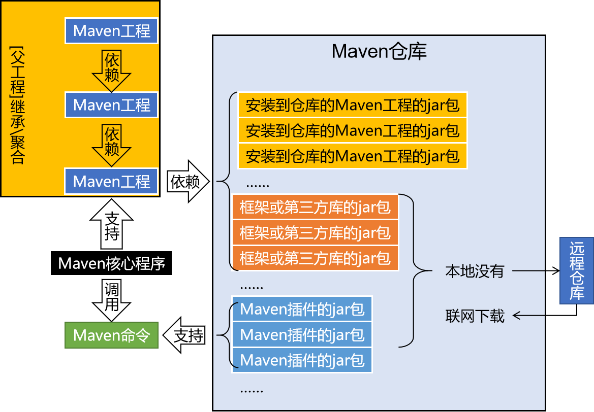

[返回目录](/blog/maven/index.md)

# Maven 入门篇

[[otc]]

## 第一章 Maven 概述

### 第一节 为什么要学习 Maven

1、Maven 作为`依赖管理` 工具

2、Maven 作为`构建管理` 工具

### 第二节 什么是 Maven

Maven 是 Apache 软件基金会组织维护的一款专门为 Java 项目提供构建和依赖管理支持的工具。

1、构建

构建过程包含的主要的环节：

1. 清理：删除上一次构建的结果，为下一次构建做好准备
2. 编译：Java 源程序编译成 \*.class 字节码文件
3. 测试：运行提前准备好的测试程序
4. 报告：针对刚才测试的结果生成一个全面的信息
5. 打包
   - Java 工程：jar 包
   - Web 工程：war 包
6. 安装：把一个 Maven 工程经过打包操作生成的 jar 包或 war 包存入 Maven 仓库
7. 部署
   - 部署 jar 包：把一个 jar 包部署到 Nexus 私服服务器上
   - 部署 war 包：借助相关 Maven 插件（例如 cargo），将 war 包部署到 Tomcat 服务器上

2、依赖

依赖管理中要解决的具体问题：

1. jar 包的下载：使用 Maven 之后，jar 包会从规范的远程仓库下载到本地
2. jar 包之间的依赖：通过依赖的传递性自动完成
3. jar 包之间的冲突：通过对依赖的配置进行调整，让某些 jar 包不会被导入

3、Maven 的工作机制



## 第二章 Maven 核心程序解压和配置

### 第一节 Maven 核心程序解压与配置

1、Maven 官网地址

- 首页：[https://maven.apache.org/](https://maven.apache.org/)
- 下载页面：[https://maven.apache.org/download.cgi](https://maven.apache.org/download.cgi)

2、解压 Maven 核心程序

```
$ tree -L 1
.
├── LICENSE
├── NOTICE
├── README.txt
├── bin
├── boot
├── conf
├── lib
└── repository
```

3、指定本地仓库

本地仓库默认值：

```bash
# 用户家目录下
~/.m2/repository
```

核心配置文件：conf/settings.xml

```xml
<localRepository>/opt/maven-repository</localRepository>
```

> 注意：本地仓库本身也需要使用一个`非中文`、`没有空格` 的目录

4、配置阿里云提供的镜像仓库

[https://developer.aliyun.com/mvn/guide](https://developer.aliyun.com/mvn/guide)

```xml
<mirror>
  <id>aliyunmaven</id>
  <mirrorOf>*</mirrorOf>
  <name>阿里云公共仓库</name>
  <url>https://maven.aliyun.com/repository/public</url>
</mirror>
```

5、配置 Maven 工程的基础 JDK 版本

Java 工程使用的默认 JDK 版本是 1.5

```xml
<profile>
    <id>jdk-1.8</id>
    <activation>
        <activeByDefault>true</activeByDefault>
        <jdk>1.8</jdk>
    </activation>
    <properties>
        <maven.compiler.source>1.8</maven.compiler.source>
        <maven.compiler.target>1.8</maven.compiler.target>
        <maven.compiler.compilerVersion>1.8</maven.compiler.compilerVersion>
    </properties>
</profile>
```

### 第二节 配置环境变量

1、检查 JAVA_HOME 配置是否正确

```bash
# windows
$ echo %JAVA_HOME%

# linux
$ echo $JAVA_HOME

$ java -version
java version "1.8.0_361"
Java(TM) SE Runtime Environment (build 1.8.0_361-b09)
Java HotSpot(TM) 64-Bit Server VM (build 25.361-b09, mixed mode)
```

2、配置 MAVEN_HOME 和 PATH

> TIP：
> 配置环境变量的规律：
> XXX_HOME 通常指向的是 bin 目录的上一级；
> PATH 指向的是 bin 目录

`vim ~/.bash_profile`

```bash
# maven
export MAVEN_HOME=/Users/tom/Applications/apache-maven-3.6.3
export PATH=${PATH}:${MAVEN_HOME}/bin
```

3、验证

```bash
$ mvn -v
Apache Maven 3.6.3 (cecedd343002696d0abb50b32b541b8a6ba2883f)
Maven home: /Users/hina/Applications/apache-maven-3.6.3
Java version: 1.8.0_361, vendor: Oracle Corporation, runtime: /Users/hina/Applications/jdk/jdk1.8.0_361.jdk/Contents/Home/jre
Default locale: zh_CN, platform encoding: UTF-8
OS name: "mac os x", version: "10.14.4", arch: "x86_64", family: "mac"
```

## 第三章 使用 Maven：命令行环境

### 第一节 实验一：根据坐标创建 Maven 工程

1、Maven 核心概念：坐标

1.1、数学中的坐标：

使用 x、y、z 三个『向量』作为空间的坐标系，可以在『空间』中唯一的定位到一个『点』。

1.2、Maven中的坐标

（1）向量说明

使用三个『向量』在『Maven的仓库』中唯一的定位到一个『jar』包。

- groupId：公司或组织的 id
- artifactId：一个项目或者是项目中的一个模块的 id
- version：版本号

（2）三个向量的取值方式

- groupId：公司或组织域名的倒序，通常也会加上项目名称

例如：com.atguigu.maven

- artifactId：模块的名称，将来作为 Maven 工程的工程名
- version：模块的版本号，根据自己的需要设定

例如：SNAPSHOT 表示快照版本，正在迭代过程中，不稳定的版本

例如：RELEASE 表示正式版本

举例：

- groupId：com.atguigu.maven
- artifactId：pro01-atguigu-maven
- version：1.0-SNAPSHOT

（3）坐标和仓库中 jar 包的存储路径之间的对应关系

坐标：

```xml
<groupId>javax.servlet</groupId>
<artifactId>servlet-api</artifactId>
<version>2.5</version>
```

上面坐标对应的 jar 包在 Maven 本地仓库中的位置：
```
Maven本地仓库根目录\javax\servlet\servlet-api\2.5\servlet-api-2.5.jar
```

2、实验操作

（1）创建目录作为后面操作的工作空间

此时我们已经有了三个目录，分别是：

- Maven 核心程序
- Maven 本地仓库
- 本地工作空间

（2）使用命令生成Maven工程


运行命令
```bash
mvn archetype:generate 
```

重要的两项，其余项可以直接回车，使用默认值

```bash
Define value for property 'groupId': com.atguigu.maven
Define value for property 'artifactId': pro01-maven-java
```

当前路径下生成的工程目录

```bash
$ tree
.
└── pro01-maven-java
    ├── pom.xml
    └── src
        ├── main
        │   └── java
        │       └── com
        │           └── atguigu
        │               └── maven
        │                   └── App.java
        └── test
            └── java
                └── com
                    └── atguigu
                        └── maven
                            └── AppTest.java
```

（3）调整

Maven 默认生成的工程，对 junit 依赖的是较低的 3.8.1 版本，我们可以改成较适合的 4.12 版本。

自动生成的 App.java 和 AppTest.java 可以删除。

```xml
<!-- 依赖信息配置 -->
<!-- dependencies复数标签：里面包含dependency单数标签 -->
<dependencies>
    <!-- dependency单数标签：配置一个具体的依赖 -->
    <dependency>
        <!-- 通过坐标来依赖其他jar包 -->
        <groupId>junit</groupId>
        <artifactId>junit</artifactId>
        <!-- <version>3.8.1</version> -->
        <version>4.12</version>
        <!-- 依赖的范围 -->
        <scope>test</scope>
    </dependency>
</dependencies>
```

（4）自动生成的 pom.xml 解读

```xml

<!-- pom.xml所采用的标签结构 -->
<modelVersion>4.0.0</modelVersion>

  <!-- 项目名 -->
  <groupId>com.atguigu.maven</groupId>
  <!-- 模块名 -->
  <artifactId>pro01-maven-java</artifactId>
  <!-- 版本号 -->
  <version>1.0-SNAPSHOT</version>
  
  <!-- 当前Maven工程的打包方式，可选值有下面三种： -->
  <!-- jar：表示这个工程是一个Java工程  -->
  <!-- war：表示这个工程是一个Web工程 -->
  <!-- pom：表示这个工程是“管理其他工程”的工程 -->
  <packaging>jar</packaging>

  <name>pro01-maven-java</name>
  <url>http://maven.apache.org</url>

  <!-- 定义属性 -->
  <properties>
	<!-- 工程构建过程中读取源码时使用的字符集 -->
    <project.build.sourceEncoding>UTF-8</project.build.sourceEncoding>
  </properties>

  <!-- 当前工程所依赖的jar包 -->
  <dependencies>
	<!-- 使用dependency配置一个具体的依赖 -->
    <dependency>
	
	  <!-- 在dependency标签内使用具体的坐标依赖我们需要的一个jar包 -->
      <groupId>junit</groupId>
      <artifactId>junit</artifactId>
      <version>4.12</version>
	  
	  <!-- scope标签配置依赖的范围 -->
      <scope>test</scope>
    </dependency>
  </dependencies>
```


### 第二节 实验二：在 Maven 工程中编写代码

### 第三节 实验三：执行 Maven 的构建命令

### 第四节 实验四：创建 Maven 版的 Web 工程

### 第五节 实验五：让 Web 工程依赖 Java 工程

### 第六节 实验六：测试依赖范围

### 第七节 实验七：测试依赖的传递性

### 第八节 实验八：测试依赖的排除

### 第九节 实验九：继承

### 第十节 实验十：聚合

## 第四章 使用 Maven：IDEA 环境

## 第五章 其他核心概念

## 第六章 单一架构案例
