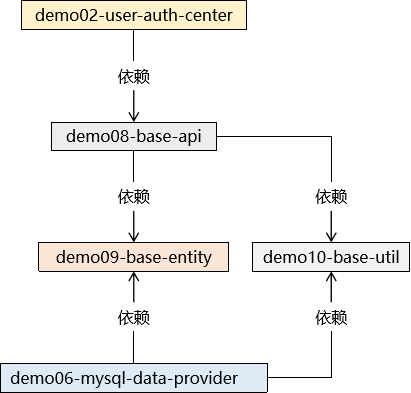

[返回目录](/blog/maven/index.md)

# 第一节 创建工程

1、创建工程

| 工程名                          | 地位   | 说明               |
| ------------------------------- | ------ | ------------------ |
| demo-imperial-court-ms-show     | 父工程 | 总体管理各个子工程 |
| demo01-imperial-court-gateway   | 子工程 | 网关               |
| demo02-user-auth-center         | 子工程 | 用户中心           |
| demo03-emp-manager-center       | 子工程 | 员工数据维护中心   |
| demo04-memorials-manager-center | 子工程 | 奏折数据维护中心   |
| demo05-working-manager-center   | 子工程 | 批阅奏折工作中心   |
| demo06-mysql-data-provider      | 子工程 | mysql 数据提供者   |
| demo07-redis-data-provider      | 子工程 | redis 数据提供者   |
| demo08-base-api                 | 子工程 | 声明 feign 接口    |
| demo09-base-entity              | 子工程 | 实体类             |
| demo10-base-util                | 子工程 | 工具类             |

2、建立工程间依赖关系

http://heavy_code_industry.gitee.io/code_heavy_industry/pro002-maven/chapter08/verse01.html
