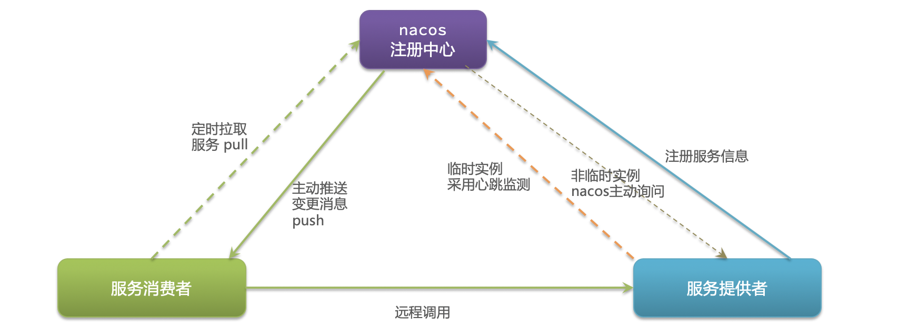

[返回目录](/blog/microservices/index)

# nacos注册中心

文档

- [https://nacos.io/zh-cn/index.html](https://nacos.io/zh-cn/index.html)
- [https://github.com/alibaba/nacos](https://github.com/alibaba/nacos)

## 认识和安装Nacos

官网简介：一个更易于构建云原生应用的动态服务发现、配置管理和服务管理平台。

下载页面

- [https://github.com/alibaba/nacos/releases/tag/1.4.2](https://github.com/alibaba/nacos/releases/tag/1.4.2)

下载安装

```bash
# 使用加速下载
wget https://ghproxy.com/https://github.com/alibaba/nacos/releases/download/1.4.2/nacos-server-1.4.2.tar.gz

# 解压
tar -zxvf nacos-server-1.4.2.tar.gz

# 启动命令(standalone代表着单机模式运行，非集群模式)
bash ./bin/startup.sh -m standalone

# 关闭服务器
bash shutdown.sh

# 查看日志
tail -f ./logs/start.out
```

管理后台

- web地址：[http://localhost:8848/nacos/](http://localhost:8848/nacos/)
- 账号：nacos
- 密码：nacos

## Nacos快速入门


1、父工程的pom文件中中引入SpringCloudAlibaba的依赖：

```xml
<dependencyManagement>
    <dependencies>
        <dependency>
            <groupId>com.alibaba.cloud</groupId>
            <artifactId>spring-cloud-alibaba-dependencies</artifactId>
            <version>2.2.6.RELEASE</version>
            <type>pom</type>
            <scope>import</scope>
        </dependency>
    </dependencies>
</dependencyManagement>
```

2、在子模块pom文件中引入nacos客户端依赖：

```xml
<dependency>
    <groupId>com.alibaba.cloud</groupId>
    <artifactId>spring-cloud-starter-alibaba-nacos-discovery</artifactId>
</dependency>
```


3、子模块配置文件application.yml中添加nacos服务配置

```yaml
spring:
  # nacos 服务地址
  cloud:
    nacos:
      server-addr: localhost:8848

```

4、注释掉eureka的依赖和配置

5、重启子项目

## Nacos服务分级存储模型

1、分级存储模型

- 服务：例如userservice
- 集群：例如杭州或上海
- 实例：例如杭州机房某台部署了userservice的服务器


2、设置实例的集群属性

application.yml

```bash
# 杭州
spring.cloud.nacos.discovery.cluster-name: ZH
```

或者

```yaml
spring:
  cloud:
    nacos:
      discovery:
       cluster-name: ZH # 杭州，名称可自定义
```

3、设置负载均衡规则

```yaml
userservice:
  ribbon:
    # 负载均衡规则：优先选择本地集群
    NFLoadBalancerRuleClassName: com.alibaba.cloud.nacos.ribbon.NacosRule 
```

4、权重配置

Nacos管理后台配置权重

- 权重范围0-1
- 权重为0，则不会被访问

## Nacos环境隔离

层级
- namespace
- group
- service/data

不同namespace下的服务不可见

在Nacos管理后台创建命名空间

配置命名空间

```yaml
spring:
  cloud:
    nacos:
      discovery:
        namespace: 40064e91-3b46-4f1e-920a-4ce0ad682ddc # dev
```

## Nacos与Eureka的区别



1、Nacos的服务实例分为两种类型

- 临时实例：如果实例宕机超过一定时间，会从服务列表剔除，默认的类型。
- 非临时实例：如果实例宕机，不会从服务列表剔除，也可以叫永久实例。

2、配置一个服务实例为永久实例

```yaml
spring:
  cloud:
    nacos:
      discovery:
        ephemeral: false # 设置为非临时实例
```

3、Nacos与eureka的共同点

- 都支持服务注册和服务拉取
- 都支持服务提供者心跳方式做健康检测

4、Nacos与Eureka的区别

  - Nacos支持服务端主动检测提供者状态：
    - 临时实例：采用心跳模式
    - 非临时实例：采用主动检测模式（服务器压力较大）
  - 临时实例心跳不正常会被剔除，非临时实例则不会被剔除
  - Nacos支持服务列表变更的消息推送模式，服务列表更新更及时
  - Nacos集群默认采用AP方式，当集群中存在非临时实例时，采用CP模式；Eureka采用AP方式
