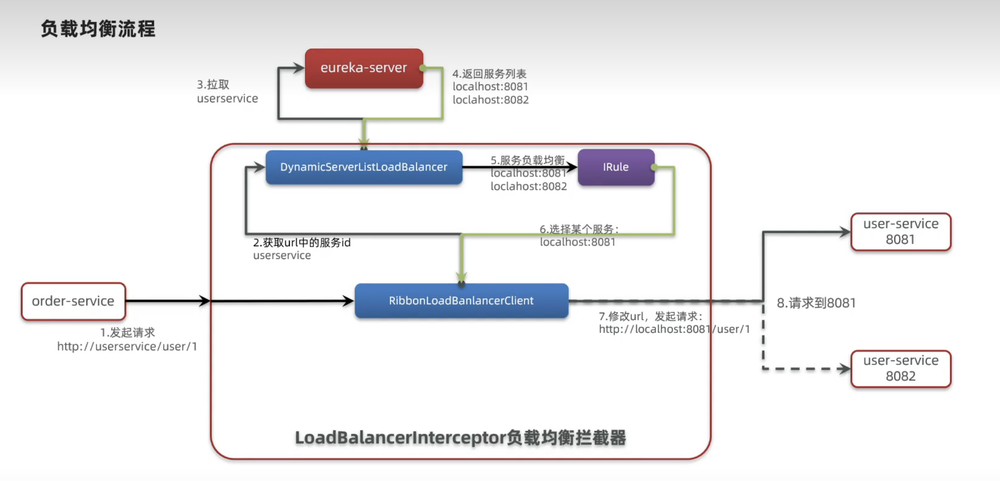

[返回目录](/blog/microservices/index)

# Ribbon负载均衡原理

## 负载均衡原理



## 负载均衡策略

| 内置负载均衡规则类 | 规则描述 |
| - | - |
| RoundRobinRule | 简单轮询 |
| AvailabilityFilteringRule | 进行忽略 |
| WeightedResponseTimeRule | 赋予权重值 |
| ZoneAvoidanceRule | 以区域可用轮询，`默认` |
| BestAvailableRule | 忽略短路，选择并发数较低 |
| RandomRule | 随机选择 |
| RetryRule | 重试机制 |

修改负载均衡规则

方式1、代码方式

作用范围：全局

```java
@Bean
public IRule randomRule(){
    return new RandomRule();
}
```

方式2、配置方式

作用范围：指定服务

application.yml

```yaml
userservice:
    ribbon:
        # 负载均衡规则
        NFLoadBalancerRuleClassName: com.netflix.loadbalancer.RandomRule 
```

## 懒加载

Ribbon默认采用懒加载模式

开启饥饿加载

```yaml
ribbon:
    eager-load:
        # 开启饥饿加载
        enabled: true 

        # 指定对userservice这个服务饥饿加载
        clients: 
            - userservice
```
