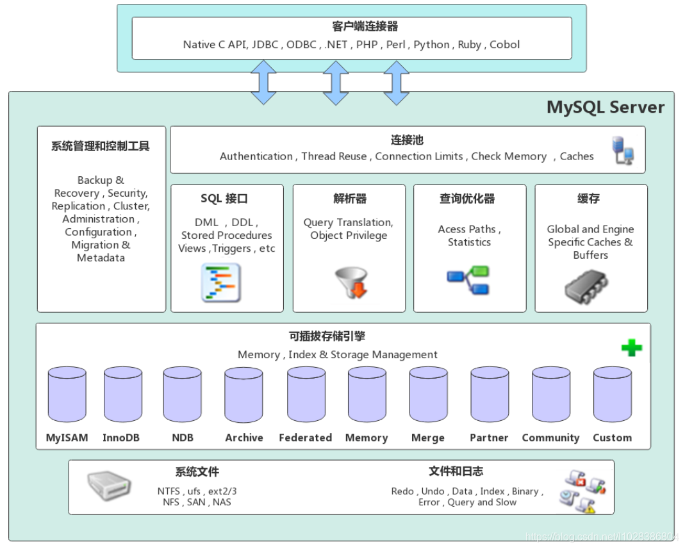
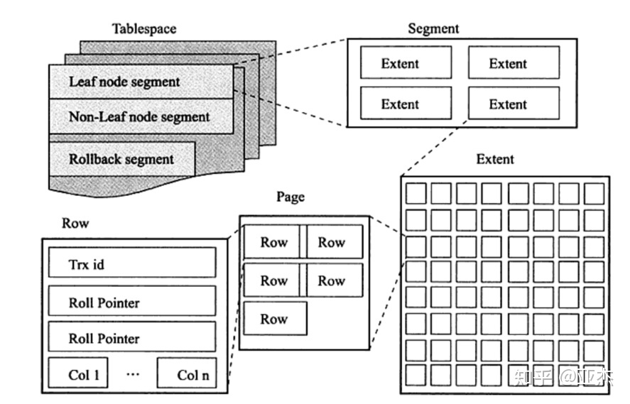

# 存储引擎

## 1、MySQL体系结构

- 连接层

- 服务层

- 引擎层

- 存储层



## 2、存储引擎简介

存储引擎就是存储数据、建立索引、更新/查询数据等技术的实现方式。

存储引擎是基于表的，而不是基于库的，所以存储引擎也可以成为表类型

创建表的时候，指定存储引擎

```sql
-- 默认存储引擎：InnoDB
create table 表名(
    字段 字段类型 [comment 字段注释]
) engine = InnoDB [comment 表注释];
```

查看当前数据库支持的存储引擎

```sql
show engines;

+--------------------+---------+----------------------------------------------------------------+--------------+------+------------+
| Engine             | Support | Comment                                                        | Transactions | XA   | Savepoints |
+--------------------+---------+----------------------------------------------------------------+--------------+------+------------+
| ARCHIVE            | YES     | Archive storage engine                                         | NO           | NO   | NO         |
| BLACKHOLE          | YES     | /dev/null storage engine (anything you write to it disappears) | NO           | NO   | NO         |
| MRG_MYISAM         | YES     | Collection of identical MyISAM tables                          | NO           | NO   | NO         |
| FEDERATED          | NO      | Federated MySQL storage engine                                 | NULL         | NULL | NULL       |
| MyISAM             | YES     | MyISAM storage engine                                          | NO           | NO   | NO         |
| PERFORMANCE_SCHEMA | YES     | Performance Schema                                             | NO           | NO   | NO         |
| InnoDB             | DEFAULT | Supports transactions, row-level locking, and foreign keys     | YES          | YES  | YES        |
| MEMORY             | YES     | Hash based, stored in memory, useful for temporary tables      | NO           | NO   | NO         |
| CSV                | YES     | CSV storage engine                                             | NO           | NO   | NO         |
+--------------------+---------+----------------------------------------------------------------+--------------+------+------------+
9 rows in set (0.05 sec)

```

示例1、创建表 my_myisam ，指定MyISAM存储引擎

```sql
create table my_myisam(
    id int,
    name varchar(10)
) engine = MyISAM
```

示例2、创建表 my_memory ，指定MEMORY存储引擎

```sql
create table my_memory(
    id int,
    name varchar(10)
) engine = MEMORY
```

## 3、存储引擎特点

### 3.1、InnoDB

兼顾高可靠性和高性能的通用存储引擎

MySQL > 5.5 默认引擎InnoDB

1、特点

1. DML 操作遵循ACID模型，支持`事务`
2. `行级锁`，提高并发访问性能
3. 支持`外键`foreign key 约束，保证数据的完整性和正确性

2、文件

- 表名.idb 表空间文件包含：结构、数据、索引

```sql
-- 开启参数后，每个表的数据单独保存
show variables like 'innodb_file_per_table';
```

查看表结构

```bash
$ ibd2sdi 表名.idb
```

逻辑存储结构

- 表空间 tablespace
- 段 segment
- 区 extent 1M = 64页
- 页 page 16k
- 行 row



### 3.2、MyISAM

MySQL早期的存储引擎

1、特点

1. 不支持事务，不支持外键
2. 支持表锁，不支持行锁
3. 访问速度快

2、文件

- .sdi 存储表结构信息
- .myd 存储数据
- .myi 存储索引
 

### 3.3、Memory

表数据存储在内存中，由于收到硬件问题，或者断电问题的影响，只能将这些表作为临时表或缓存使用

1、特点

1. 内存存放
2. hash索引（默认）

2、文件

- *.sdi 存储表结构信息

特点 | InnoDB | MyISAM | Memory
- | - | - | - 
存储限制 | 64TB | 有 | 有
事务安全 | `支持` | - | -
锁机制 | `行锁` | 表锁 | 表锁
B+tree索引|  支持 |  支持 |  支持
Hash索引 | - | - |  支持
全文索引 支持（>5.6版本）|  支持 | -
空间使用 | 高 | 低 | N/A
内存使用 | 高 | 低 | 中等
批量插入速度 | 低 | 高 | 高
支持外键 | `支持` | - | -

## 4、存储引擎选择

- InnoDB 事务的完整性要求较高，并发条件下要求数据的一致性，数据除了插入和查询，还有更新和删除操作（默认）

- MyISAM 读取和插入为主，只有很少的更新和删除操作，对事务的完整性、并发性要求不高（MongoDB）

- Memory 访问速度快，通常用于临时表及缓存，对表的大小有限制，无法保障数据的安全性（Redis）

