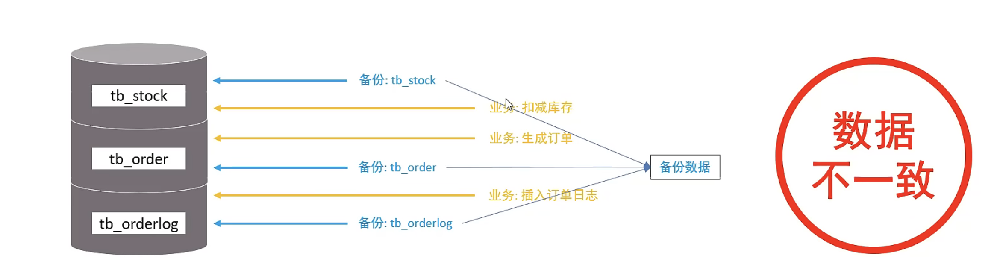
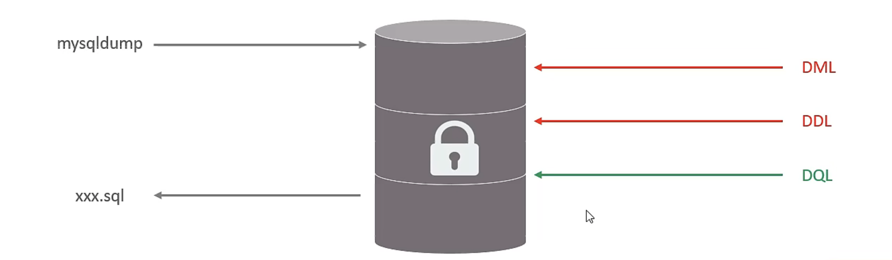

# 锁

1. 概述
2. 全局锁
3. 表级锁
4. 行级锁

## 1、概述

锁是计算机协调多个进程或线程并发访问某一资源的机制。

### 1.1、分类：

MySQL 按照锁的粒度分：

1. 全局锁：锁定数据库中的所有表
2. 表级锁：每次操作锁住整张表
3. 行级锁：每次操作锁住对应的行数据

## 2、全局锁

全局锁就是对整个数据库实例加锁，加锁后整个实例就处于`只读`状态，后续的DML的写语句，DDL语句，以及更新操作的事务提交语句都将被阻塞

其典型的使用场景是做全库的逻辑备份，对所有的表进行锁定，从而获取一致性视图，保证数据的完整性

不加锁操作数据



加锁操作数据



语法

```sql
-- 增加全局锁
flush tables with read lock;

-- 备份数据
mysqldump -uroot -p123456 <database> > database.sql 

-- 解锁
unlock tables;
```

## 表级锁
## 行级锁

