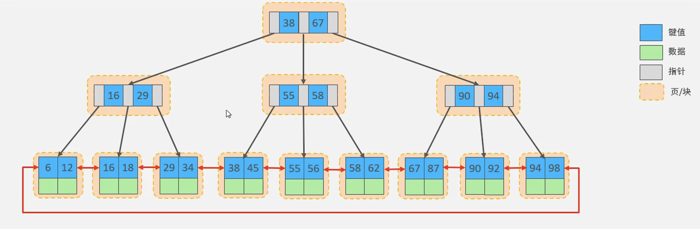

# 索引

1. 索引概述
2. 索引结构
3. 索引分类
4. 索引语法
5. SQL 性能分析
6. 索引使用
7. 索引设计原则

## 1. 索引概述

索引（index）帮助 MySQL 高效获取数据的数据结构（有序）。

索引的优缺点

| 优点                                                          | 缺点                                                                 |
| ------------------------------------------------------------- | -------------------------------------------------------------------- |
| 提高数据检索的效率，降低数据库的 IO 成本                      | 索引列也要占用空间                                                   |
| 通过索引列对数据进行排序，降低数据排序的成本，降低 CPU 的消耗 | 索引大大提高查询效率，同时却降低更新表的速度（insert,update,delete） |

## 2. 索引结构

MySQL 的索引是在存储引擎层实现的，不同的存储引擎有不同的结构

主要包含以下几种

| 索引结构    | 描述                                                                         |
| ----------- | ---------------------------------------------------------------------------- |
| B+Tree 索引 | B+树索引是最常见的索引类型，大部分引擎都支持                                 |
| Hash 索引   | 底层数据结构是用哈希表实现的，只有精确匹配索引列的查询才有效，不支持范围查询 |
| R-tree      | 空间索引是 MyISAM 引擎的特殊索引类型，主要用于地理空间数据类型，通常很少使用 |
| Full-text   | 全文索引是一种通过倒排索引，快速匹配文档的方式，类似 Lucene,Solr,ES          |

各数据库对不同类型索引的支持情况

| 索引        | innoDB       | MyISAM | Memory |
| ----------- | ------------ | ------ | ------ |
| B+Tree 索引 | 支持         | 支持   | 支持   |
| Hash 索引   | 不支持       | 不支持 | 支持   |
| R-tree      | 不支持       | 支持   | 不支持 |
| Full-text   | 5.6 之后支持 | 支持   | 不支持 |

算法可视化演示：[https://www.cs.usfca.edu/~galles/visualization/Algorithms.html](https://www.cs.usfca.edu/~galles/visualization/Algorithms.html)


### 2.1、二叉树

二叉树的缺点：

1. 顺序插入时，会行成一个链表，查询性能大大降低
2. 大数据量情况下，层级较深，检索速度慢


### 2.2、红黑树

红黑树:

1. 大数据量的情况下，层级较深，检索数独慢


### 2.3、 B Tree

B Tree（多路平衡查找树）

以一颗最大度数（max-degree）为5（5阶）的B-Tree为例（每个节点最多存储4个Key,5个指针）

树的度数指的是一个节点的子节点个数


### 2.4、 B+Tree

以一颗最大度数（max-degree）为 4（4 阶）的 B+Tree 为例

B Tree 和 B+Tree 的区别

1. 所有的数据都会出现在叶子节点
2. 叶子结点行成一个单向链表


### 2.5、MySQL 索引

MySQL 索引数据结构对经典的 B+Tree 进行了优化，在原有 B+Tree 的基础之上，增加了一个指向相邻叶子节点的链表指针，就形成了带有顺序指针的 B+Tree，提高了区间访问的性能




### 2.6、Hash

哈希索引就是采用一定的hash算法，将键值换算成新的hash值，映射到对应的槽位上，然后存储在hash表中

如果两个或多个键值，映射到一个相同的槽位上，他们就产生了hash冲突（哈希碰撞），可以通过链表来解决


Hash索引的特点:

1. hash索引只能用于等值比较（=，in），不支持范围查询（between, >, <）
2. 无法利用索引完成排序操作
3. 查询效率高，通常只需要一次检索就可以，效率通常要高于B+Tree索引

支持Hash索引的存储引擎：Memory

InnoDB中具有自适应hash功能


### 2.7、思考

为什么InnoDB存储引擎选择使用B+Tree索引结构？

1. 相对于二叉树，层级更少，搜索效率高

2. 相对于B-Tree，无论是叶子节点还是非叶子节点，都会保存数据，这样导致一页中存储的键值减少，指针减少，要保存同样的数据量，只能增加树的高度，导致性能降低

3. 相对于Hash索引，B+Tree支持范围匹配及排序操作

## 3、索引分类

|分类 | 含义 | 特点 | 关键字|
|-|-|-|-|
|主键索引 | 针对于表中主键创建的索引|默认自动创建，只能有一个 | primary |
|唯一索引 | 避免同一个表中某列数据中的值重复 | 可以有多个 | unique |
|常规索引|快读定位特定数据 | 可以有多个| index |
|全文索引 |全文索引查找的是文本中的关键词，而不是比较索引中的值 | 可以有多个| fulltext |

根据索引存储形式，又可以分为

|分类 | 含义 | 特点|
|-|-|-|
| 聚集索引 clustered index | 将数据存储与索引放到了一块，索引结构的叶子节点保存了行数据 | 必须有，而且只有一个 |
| 二级索引 secondary index | 将数据与索引分开存储，索引结构的叶子节点关联的是对应的主键 | 可以存在多个 | 

聚集索引选取规则：

1. 如果存在主键，主键索引就是聚集索引
2. 如果不存在主键，将使用第一个唯一索引（unique）作为聚集索引
3. 如果表没有主键，或没有合适的唯一索引，则InnoDB会自动生成一个rowid作为隐藏的聚集索引

索引示例


查询示例


### 3.1、思考1

以下SQL语句，哪个执行效率高？为什么？

```sql
select * from user where id = 10;

select * from user where name = 'Arm';
```

备注：id为主键，name字段有索引

直接用id查询效率较高

1. id查询可以使用聚集索引

2. name查询需要使用回表查询，先查询二级索引，查询到id，再查询聚集索引

### 3.2、思考2

InnoDB主键索引的B+Tree高度为多高？

假设：

一页中可以存储16k数据，一行数据大小为1k，可以存储16行。InnoDB的指针占用6个字节，主键即使为bigint，占用字节数为8。

树的高度为2：

```js
// n为key的数量 (n+1)表示指针数量
n * 8 + ( n + 1) * 6 = 16 * 1024 // 算出n约等于1170

1171 * 16 = 18736
```

如果高度为3

```js
1171 * 1171 * 16 = 21939856
```

## 4、索引的语法

创建索引

```sql
create [unique|fulltext] index index_name on table_name (index_column_name,...);
```

查看索引

```sql
show index form table_name;
```


删除索引

```sql
drop index index_name on table_name;
```

### 4.1、案例

需求：

1. name姓名字段，该字段的值可能会重复，该字段创建索引
2. phone手机号字段，是非空，且唯一的，创建唯一索引
3. 为profession、age、status创建联合索引
4. 为email建立合适的索引来提升查询效率


准备测试数据

```sql
create table tb_user(
    id int primary key auto_increment comment '主键',
    name varchar(20) comment '姓名',
    phone varchar(11) comment '手机号',
    profession varchar(10) comment '专业',
    age int comment '年龄',
    status int comment '状态',
    email varchar(50) comment '邮箱'
);

-- 插入测试数据
insert into tb_user (name, phone, profession, age, status, email)
values ('张飞', '15210231227', '美术', 23, 1, '123@qq.com');
insert into tb_user (name, phone, profession, age, status, email)
values ('关羽', '15210231297', '物理', 24, 1, '3339@qq.com');
insert into tb_user (name, phone, profession, age, status, email)
values ('刘备', '15214231297', '数学', 25, 0, '666@qq.com');
insert into tb_user (name, phone, profession, age, status, email)
values ('孙权', '15215231297', '语文', 20, 1, '111@qq.com');

-- 查看数据
mysql> select * from tb_user;
+----+--------+-------------+------------+------+--------+-------------+
| id | name   | phone       | profession | age  | status | email       |
+----+--------+-------------+------------+------+--------+-------------+
|  1 | 张飞   | 15210231227 | 美术       |   23 |      1 | 123@qq.com  |
|  2 | 关羽   | 15210231297 | 物理       |   24 |      1 | 3339@qq.com |
|  3 | 刘备   | 15214231297 | 数学       |   25 |      0 | 666@qq.com  |
|  4 | 孙权   | 15215231297 | 语文       |   20 |      1 | 111@qq.com  |
+----+--------+-------------+------------+------+--------+-------------+
4 rows in set (0.00 sec)

-- 查看已有索引
mysql> show index from tb_user;
+---------+------------+----------+--------------+-------------+-----------+-------------+----------+--------+------+------------+---------+---------------+---------+------------+
| Table   | Non_unique | Key_name | Seq_in_index | Column_name | Collation | Cardinality | Sub_part | Packed | Null | Index_type | Comment | Index_comment | Visible | Expression |
+---------+------------+----------+--------------+-------------+-----------+-------------+----------+--------+------+------------+---------+---------------+---------+------------+
| tb_user |          0 | PRIMARY  |            1 | id          | A         |           4 |     NULL |   NULL |      | BTREE      |         |               | YES     | NULL       |
+---------+------------+----------+--------------+-------------+-----------+-------------+----------+--------+------+------------+---------+---------------+---------+------------+
1 row in set (0.01 sec)

-- 或者
mysql> show index from tb_user\G
*************************** 1. row ***************************
        Table: tb_user
   Non_unique: 0
     Key_name: PRIMARY
 Seq_in_index: 1
  Column_name: id
    Collation: A
  Cardinality: 4
     Sub_part: NULL
       Packed: NULL
         Null:
   Index_type: BTREE
      Comment:
Index_comment:
      Visible: YES
   Expression: NULL
1 row in set (0.00 sec)
```

完成需求

```sql
-- 创建普通索引
create index idx_user_name on tb_user (name);

-- 默认创建B+Tree的索引结构
show index from tb_user;
+---------+------------+---------------+--------------+-------------+-----------+-------------+----------+--------+------+------------+---------+---------------+---------+------------+
| Table   | Non_unique | Key_name      | Seq_in_index | Column_name | Collation | Cardinality | Sub_part | Packed | Null | Index_type | Comment | Index_comment | Visible | Expression |
+---------+------------+---------------+--------------+-------------+-----------+-------------+----------+--------+------+------------+---------+---------------+---------+------------+
| tb_user |          0 | PRIMARY       |            1 | id          | A         |           4 |     NULL |   NULL |      | BTREE      |         |               | YES     | NULL       |
| tb_user |          1 | idx_user_name |            1 | name        | A         |           4 |     NULL |   NULL | YES  | BTREE      |         |               | YES     | NULL       |
+---------+------------+---------------+--------------+-------------+-----------+-------------+----------+--------+------+------------+---------+---------------+---------+------------+
2 rows in set (0.00 sec)


-- 创建唯一索引
create unique index idx_user_phone on tb_user (phone);

mysql> show index from tb_user;
+---------+------------+----------------+--------------+-------------+-----------+-------------+----------+--------+------+------------+---------+---------------+---------+------------+
| Table   | Non_unique | Key_name       | Seq_in_index | Column_name | Collation | Cardinality | Sub_part | Packed | Null | Index_type | Comment | Index_comment | Visible | Expression |
+---------+------------+----------------+--------------+-------------+-----------+-------------+----------+--------+------+------------+---------+---------------+---------+------------+
| tb_user |          0 | PRIMARY        |            1 | id          | A         |           4 |     NULL |   NULL |      | BTREE      |         |               | YES     | NULL       |
| tb_user |          0 | idx_user_phone |            1 | phone       | A         |           4 |     NULL |   NULL | YES  | BTREE      |         |               | YES     | NULL       |
| tb_user |          1 | idx_user_name  |            1 | name        | A         |           4 |     NULL |   NULL | YES  | BTREE      |         |               | YES     | NULL       |
+---------+------------+----------------+--------------+-------------+-----------+-------------+----------+--------+------+------------+---------+---------------+---------+------------+
3 rows in set (0.01 sec)


-- 创建联合索引
create index idx_user_profession_age_status on tb_user (profession, age, status);

mysql> show index from tb_user;
+---------+------------+--------------------------------+--------------+-------------+-----------+-------------+----------+--------+------+------------+---------+---------------+---------+------------+
| Table   | Non_unique | Key_name                       | Seq_in_index | Column_name | Collation | Cardinality | Sub_part | Packed | Null | Index_type | Comment | Index_comment | Visible | Expression |
+---------+------------+--------------------------------+--------------+-------------+-----------+-------------+----------+--------+------+------------+---------+---------------+---------+------------+
| tb_user |          0 | PRIMARY                        |            1 | id          | A         |           4 |     NULL |   NULL |      | BTREE      |         |               | YES     | NULL       |
| tb_user |          0 | idx_user_phone                 |            1 | phone       | A         |           4 |     NULL |   NULL | YES  | BTREE      |         |               | YES     | NULL       |
| tb_user |          1 | idx_user_name                  |            1 | name        | A         |           4 |     NULL |   NULL | YES  | BTREE      |         |               | YES     | NULL       |
| tb_user |          1 | idx_user_profession_age_status |            1 | profession  | A         |           4 |     NULL |   NULL | YES  | BTREE      |         |               | YES     | NULL       |
| tb_user |          1 | idx_user_profession_age_status |            2 | age         | A         |           4 |     NULL |   NULL | YES  | BTREE      |         |               | YES     | NULL       |
| tb_user |          1 | idx_user_profession_age_status |            3 | status      | A         |           4 |     NULL |   NULL | YES  | BTREE      |         |               | YES     | NULL       |
+---------+------------+--------------------------------+--------------+-------------+-----------+-------------+----------+--------+------+------------+---------+---------------+---------+------------+
6 rows in set (0.00 sec)


-- 创建普通索引
create index idx_user_email on tb_user (email);

mysql> show index from tb_user;
+---------+------------+--------------------------------+--------------+-------------+-----------+-------------+----------+--------+------+------------+---------+---------------+---------+------------+
| Table   | Non_unique | Key_name                       | Seq_in_index | Column_name | Collation | Cardinality | Sub_part | Packed | Null | Index_type | Comment | Index_comment | Visible | Expression |
+---------+------------+--------------------------------+--------------+-------------+-----------+-------------+----------+--------+------+------------+---------+---------------+---------+------------+
| tb_user |          0 | PRIMARY                        |            1 | id          | A         |           4 |     NULL |   NULL |      | BTREE      |         |               | YES     | NULL       |
| tb_user |          0 | idx_user_phone                 |            1 | phone       | A         |           4 |     NULL |   NULL | YES  | BTREE      |         |               | YES     | NULL       |
| tb_user |          1 | idx_user_name                  |            1 | name        | A         |           4 |     NULL |   NULL | YES  | BTREE      |         |               | YES     | NULL       |
| tb_user |          1 | idx_user_profession_age_status |            1 | profession  | A         |           4 |     NULL |   NULL | YES  | BTREE      |         |               | YES     | NULL       |
| tb_user |          1 | idx_user_profession_age_status |            2 | age         | A         |           4 |     NULL |   NULL | YES  | BTREE      |         |               | YES     | NULL       |
| tb_user |          1 | idx_user_profession_age_status |            3 | status      | A         |           4 |     NULL |   NULL | YES  | BTREE      |         |               | YES     | NULL       |
| tb_user |          1 | idx_user_email                 |            1 | email       | A         |           4 |     NULL |   NULL | YES  | BTREE      |         |               | YES     | NULL       |
+---------+------------+--------------------------------+--------------+-------------+-----------+-------------+----------+--------+------+------------+---------+---------------+---------+------------+
7 rows in set (0.00 sec)
```