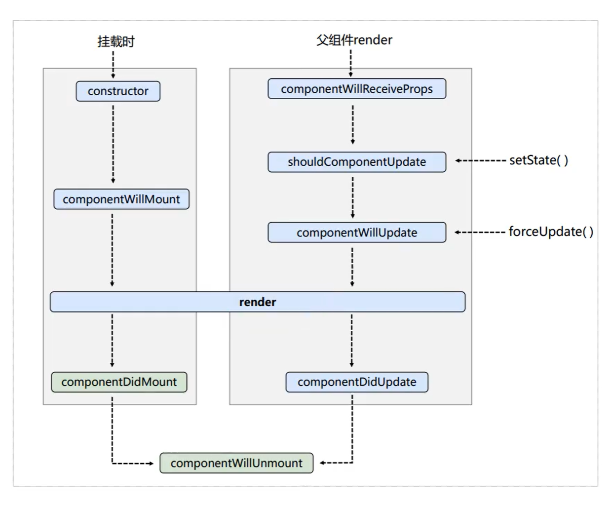
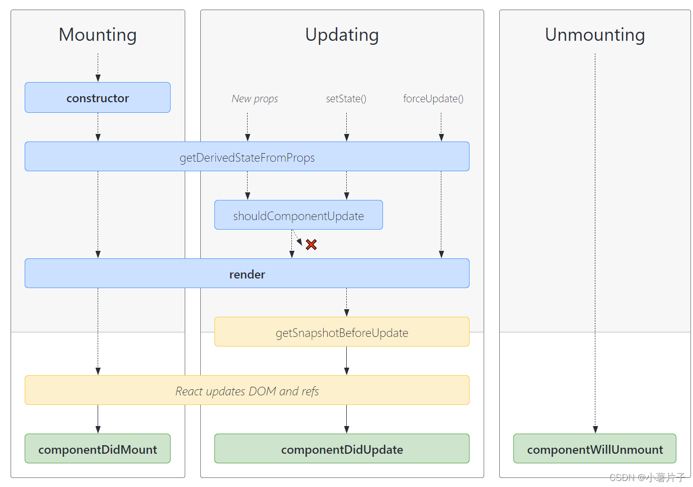

# React 基础篇-基于CDN

## 1、React 入门

### 1.1、学习资料

- React 基础 https://www.yuque.com/fechaichai/qeamqf/xbai87
- Mobx https://www.yuque.com/fechaichai/qeamqf/apomum
- React-极客园 PC 项目 https://www.yuque.com/fechaichai/tzzlh1
- [https://www.runoob.com/react/react-tutorial.html](https://www.runoob.com/react/react-tutorial.html)

- 英文官网 [https://react.dev/](https://react.dev/)
- 中文官网 [https://react.docschina.org/](https://react.docschina.org/)

### 1.2、js 回顾

直接使用 js 操作 DOM 的示例

```html
<ul id="list"></ul>

<script type="text/javascript">
  let list = [
    { id: "001", name: "刘备", age: 40 },
    { id: "002", name: "关羽", age: 30 },
    { id: "003", name: "张飞", age: 20 },
  ];

  let html = list
    .map((item) => {
      return `<li>${item.name}-${item.age}</li>`;
    })
    .join("");

  document.getElementById("list").innerHTML = html;
</script>
```

渲染结果如下

```html
<ul id="list">
  <li>刘备-40</li>
  <li>关羽-30</li>
  <li>张飞-20</li>
</ul>
```

## 2、React 的基本使用

### 2.1、Hello World

以下代码是来自 [官网](https://gist.githubusercontent.com/gaearon/0275b1e1518599bbeafcde4722e79ed1/raw/db72dcbf3384ee1708c4a07d3be79860db04bff0/example.html) 的一个示例

```html
<!DOCTYPE html>
<html>
  <head>
    <meta charset="UTF-8" />
    <title>Hello World</title>

    <!-- react 核心库 -->
    <script src="https://unpkg.com/react@18/umd/react.development.js"></script>
    <!-- react-dom: 用于支持react操作dom -->
    <script src="https://unpkg.com/react-dom@18/umd/react-dom.development.js"></script>

    <!-- babel：将jsx转为js -->
    <script src="https://unpkg.com/@babel/standalone/babel.min.js"></script>
  </head>

  <body>
    <!-- React 容器 -->
    <div id="root"></div>

    <script type="text/babel">
      function MyApp() {
        return <h1>Hello, world!</h1>;
      }

      // 渲染到页面
      const container = document.getElementById("root");
      const root = ReactDOM.createRoot(container);
      root.render(<MyApp />);
    </script>
  </body>
</html>
```

渲染结果

```html
<div id="root">
  <h1>Hello, world!</h1>
</div>
```

为了开发环境加载依赖更快，将 js 文件下载到本地，统一采用本地加载的方式

```html
<!-- react 核心库 -->
<!-- <script src="https://unpkg.com/react@18/umd/react.development.js"></script> -->
<script src="../js/react.development.js"></script>

<!-- react-dom: 用于支持react操作dom -->
<!-- <script src="https://unpkg.com/react-dom@18/umd/react-dom.development.js"></script> -->
<script src="../js/react-dom.development.js"></script>

<!-- babel：将jsx转为js -->
<!-- <script src="https://unpkg.com/@babel/standalone/babel.min.js"></script> -->
<script src="../js/babel.min.js"></script>
```

### 2.2、创建虚拟 DOM

方式一：babel + jsx

```html
<!-- React 容器 -->
<div id="root"></div>

<script type="text/babel">
  const vdom = <h1 id="title">Hello World!</h1>;

  // 渲染到页面
  const container = document.getElementById("root");
  const root = ReactDOM.createRoot(container);
  root.render(vdom);
</script>
```

渲染结果

```html
<div id="root"><h1 id="title">Hello World!</h1></div>
```

方式二：js

```html
<!-- React 容器 -->
<div id="root"></div>

<script type="text/javascript">
  // const vdom = <h1 id="title">Hello World!</h1>;

  // 参数：标签名，标签属性，标签内容
  const vdom = React.createElement("h1", { id: "title" }, "Hello World!");

  // 渲染到页面
  const container = document.getElementById("root");
  const root = ReactDOM.createRoot(container);
  root.render(vdom);
</script>
```

渲染结果

```html
<div id="root"><h1 id="title">Hello World!</h1></div>
```

### 2.3、虚拟 DOM 与真实 DOM

1. 虚拟 DOM 本质是 Object 类型对象
2. 虚拟 DOM 较为轻量，真实 DOM 比较重，因为真实 DOM 上存在很多属性
3. 虚拟 DOM 最终会被 React 转换为真实 DOM，呈现在页面上

可以借助以下方式查看 js 对象

```js
// 方式一
console.dir();

// 方式二
debugger;
```

## 3、React JSX

### 3.1、JSX

JSX 全称：JavaScript XML

JSX 语法规则：

1. 不需要引号，可以用小括号`()`包裹
2. js 表达式用`{}`
3. 类名不要用`class`，要用`className`
4. 内联样式要用对象表达式 `style={{key: value}}`
5. 内联样式的 key 需要使用小驼峰命名规则：需要使用`fontSize`表示`font-size`
6. 只有一个根标签
7. 标签必须闭合
8. 标签首字母小写是 html 元素; 标签首字母大写是 React 组件

示例

```html
<style>
  .title {
    color: red;
  }
</style>

<!-- React 容器 -->
<div id="root"></div>

<script type="text/babel">
  function Button() {
    return <button>Click Me</button>;
  }

  function MyApp() {
    return (
      <div>
        <h1 className="title">Hello, world!</h1>
        <div style={{ fontSize: "16px" }}>Hello, world!</div>
        <input type="text"></input>
        <Button></Button>
      </div>
    );
  }

  // 渲染到页面
  const container = document.getElementById("root");
  const root = ReactDOM.createRoot(container);
  root.render(<MyApp />);
</script>
```

渲染结果

```html
<div id="root">
  <div>
    <h1 class="title">Hello, world!</h1>
    <div style="font-size: 16px;">Hello, world!</div>
    <input type="text" />
    <button>Click Me</button>
  </div>
</div>
```

### 3.2、React 渲染 list

```html
<!-- React 容器 -->
<div id="root"></div>

<script type="text/babel">
  const data = ["React", "Vue", "Angular"];

  function MyApp() {
    return (
      <ul>
        {data.map((item, index) => {
          return <li key={index}>{item}</li>;
        })}
      </ul>
    );
  }

  // 渲染到页面
  const container = document.getElementById("root");
  const root = ReactDOM.createRoot(container);
  root.render(<MyApp />);
</script>
```

```html
<div id="root">
  <ul>
    <li>React</li>
    <li>Vue</li>
    <li>Angular</li>
  </ul>
</div>
```

## 4、其他事项

### 4.1、模块和组件

- 模块：一个 js 文件
- 组件：代码和资源的集合

### 4.2、开发者工具

安装浏览器插件`React Developer Tools`

## 5、组件

### 5.1、函数式组件

适用于简单组件

```html
<!-- React 容器 -->
<div id="root"></div>

<script type="text/babel">
  function MyComponent() {
    return <div>Hello React!</div>;
  }

  // 渲染到页面
  const container = document.getElementById("root");
  const root = ReactDOM.createRoot(container);
  root.render(<MyComponent />);
</script>
```

渲染结果

```html
<div id="root">
  <div>Hello React!</div>
</div>
```

### 5.2、类式组件

适用于复杂组件

类的知识复习

```js
class Person {
  // 构造方法
  constructor(name, age) {
    this.name = name;
    this.age = age;
  }

  // 普通方法
  speek() {
    console.log(`我的名字是:${this.name}, 今年${this.age}岁了`);
  }
}

// 继承
class Student extends Person {
  // 需要先调用super
  constructor(name, age, grade) {
    super(name, age);
    this.grade = grade;
  }

  // 覆写父类方法
  speek() {
    console.log(
      `我的名字是:${this.name}, 今年${this.age}岁了, 我的年级是:${this.grade}`
    );
  }

  study() {
    console.log("我在学校学习");
  }
}

const p = new Person("张三", 18);
p.speek();
// 我的名字是:张三, 今年18岁了

const s = new Student("李四", 19, 2);
s.speek();
// 我的名字是:李四, 今年19岁了, 我的年级是:2
s.study();
// 我在学校学习
```

```html
<!-- React 容器 -->
<div id="root"></div>

<script type="text/babel">
  // 类组件需要继承React.Component
  class MyComponent extends React.Component {
    render() {
      return <div>Hello React!</div>;
    }
  }

  // 渲染到页面
  const container = document.getElementById("root");
  const root = ReactDOM.createRoot(container);
  root.render(<MyComponent />);
</script>
```

渲染结果

```html
<div id="root">
  <div>Hello React!</div>
</div>
```

## 6、组件属性 state

### 6.1、使用 state

复习：js 原生事件绑定的 3 种方式

```html
<button id="btn1">按钮1</button>
<button id="btn2">按钮2</button>
<button id="btn3" onclick="handleButtonClick()">按钮3</button>

<script>
  const btn1 = document.getElementById("btn1");
  btn1.addEventListener("click", () => {
    console.log("按钮1被点击");
  });

  const btn2 = document.getElementById("btn2");
  btn2.onclick = () => {
    console.log("按钮2被点击");
  };

  function handleButtonClick() {
    console.log("按钮3被点击");
  }
</script>
```

复习：js 中的 this 指向

```js
class Person {
  constructor(name, age) {
    this.name = name;
    this.age = age;
  }
  say() {
    console.log(this);
  }
}

const person = new Person();
person.say(); // Person

const x = person.say;
x(); // undefined
```

复习：改变 this 指向

```js
function foo() {
  console.log(this);
}

foo(); // Window

// 返回一个新的函数
const foo2 = foo.bind({ name: "Tom" });
foo2(); // {name: 'Tom'}
```

类组件 state 的初始化和更新

```html
<!-- React 容器 -->
<div id="root"></div>

<script type="text/babel">
  class Weather extends React.Component {
    constructor(props) {
      super(props);

      // 初始化状态
      this.state = {
        isHot: false,
      };

      // 解决this指向问题
      this.handleClick = this.handleClick.bind(this);
    }

    render() {
      // 读取状态
      const { isHot } = this.state;

      return (
        <h1 onClick={this.handleClick}>今天天气：{isHot ? "炎热" : "凉快"}</h1>
      );
    }

    handleClick() {
      // 修改state值
      this.setState({
        isHot: !this.state.isHot,
      });
    }
  }

  // 渲染到页面
  const container = document.getElementById("root");
  const root = ReactDOM.createRoot(container);
  root.render(<Weather />);
</script>
```

### 6.2、简写形式

```html
<!-- React 容器 -->
<div id="root"></div>

<script type="text/babel">
  class Weather extends React.Component {
    // 初始化状态
    state = {
      isHot: false,
    };

    // 自定义方法，使用箭头函数
    handleClick = () => {
      // 修改state值
      this.setState({
        isHot: !this.state.isHot,
      });
    };

    render() {
      // 读取状态
      const { isHot } = this.state;
      return (
        <h1 onClick={this.handleClick}>今天天气：{isHot ? "炎热" : "凉快"}</h1>
      );
    }
  }

  // 渲染到页面
  const container = document.getElementById("root");
  const root = ReactDOM.createRoot(container);
  root.render(<Weather />);
</script>
```

### 6.3、state 总结

1. state 值是对象
2. 组件被称为`状态机`，通过更新组件的 state 来更新对应页面显示
3. 状态数据不能直接修改或更新，需要通过`this.setState()` 方法
4. 类组件自定义方法 this 为 undefined，需要通过`bind(this)`或者`箭头函数` 解决

## 7、组件属性 props

组件属性 props（properties 的简写），也叫`标签属性`，

```html
<!-- React 容器 -->
<div id="root"></div>

<script type="text/babel">
  class Person extends React.Component {
    render() {
      const { name, age } = this.props;

      return (
        <ul>
          <li>{name}</li>
          <li>{age}</li>
        </ul>
      );
    }
  }

  // 渲染到页面
  const container = document.getElementById("root");
  const root = ReactDOM.createRoot(container);
  root.render(<Person name="Tom" age="18" />);
</script>
```

渲染结果

```html
<div id="root">
  <ul>
    <li>Tom</li>
    <li>18</li>
  </ul>
</div>
```

复习：展开运算符

```js
// 1、展开数组
const arr1 = [1, 2, 3];
console.log(arr1); // (3) [1, 2, 3]
console.log(...arr1); // 1 2 3

// 2、合并数组
const arr2 = [4, 5, 6];
const arr3 = [...arr1, ...arr2];
console.log(arr3); // (6) [1, 2, 3, 4, 5, 6]

// 3、函数中接收不确定个数的参数
function sum(...arr) {
  return arr.reduce((preValue, currentValue) => {
    return preValue + currentValue;
  });
}

console.log(sum(1, 2, 3, 4, 5, 6)); // 21

// 4、对象复制
const obj1 = { name: "Tom", age: 18 };
const obj2 = { ...obj1 };
console.log(obj2); // {name: 'Tom', age: 18}

// 5、对象合并
const obj3 = { ...obj1, name: "Jerry" };
console.log(obj3); // {name: 'Jerry', age: 18}
```

更多参考：展开语法 (Spread syntax)[https://developer.mozilla.org/zh-CN/docs/Web/JavaScript/Reference/Operators/Spread_syntax](https://developer.mozilla.org/zh-CN/docs/Web/JavaScript/Reference/Operators/Spread_syntax)

### 7.1、批量传递

```html
<!-- React 容器 -->
<div id="root"></div>

<script type="text/babel">
  class Person extends React.Component {
    render() {
      const { name, age } = this.props;

      return (
        <ul>
          <li>{name}</li>
          <li>{age}</li>
        </ul>
      );
    }
  }

  const data = {
    name: "Tom",
    age: 18,
  };
  // 渲染到页面
  const container = document.getElementById("root");
  const root = ReactDOM.createRoot(container);
  // root.render(<Person name="Tom" age="18" />);
  root.render(<Person {...data} />);
</script>
```

> 注意：react 中的属性展开传递和 js 展开语法没有关系，仅是 react 提供的语法糖

### 7.2、类型限制

引入依赖 prop-types

```html
<script src="https://unpkg.com/prop-types@15.6/prop-types.js"></script>
```

```html
<!-- React 容器 -->
<div id="root"></div>

<script type="text/babel">
  class Person extends React.Component {
    render() {
      const { name, age, sex } = this.props;

      return (
        <ul>
          <li>{name}</li>
          <li>{age}</li>
          <li>{sex}</li>
        </ul>
      );
    }
  }

  // 类型限制
  Person.propTypes = {
    name: PropTypes.string.isRequired, // 字符串，必传
    age: PropTypes.number, // 数字
    sex: PropTypes.string, // 字符串
    speek: PropTypes.func, // 函数
  };

  // 默认值
  Person.defaultProps = {
    sex: "男",
    age: 18,
  };

  // 渲染到页面
  const container = document.getElementById("root");
  const root = ReactDOM.createRoot(container);
  root.render(<Person name="Tom" age={18} />);
  // root.render(<Person {...data} />);
</script>
```

渲染结果

```html
<div id="root">
  <ul>
    <li>Tom</li>
    <li>18</li>
    <li>男</li>
  </ul>
</div>
```

### 7.3、简化写法

复习：js 类 class 的类属性和实例属性

```js
class Person {
  // 静态属性，类属性
  static name = "Tom";

  // 实例属性
  age = 18;
}

console.log(Person.name); // Tom
console.log(Person.age); // undefined

// 实例化
const person = new Person();
console.log(person.name); // undefined
console.log(person.age); // 18
```

简化写法

```html
<!-- React 容器 -->
<div id="root"></div>

<script type="text/babel">
  class Person extends React.Component {
    // 类型限制
    static propTypes = {
      name: PropTypes.string.isRequired, // 字符串，必传
      age: PropTypes.number, // 数字
      sex: PropTypes.string, // 字符串
      speek: PropTypes.func, // 函数
    };

    // 默认值
    static defaultProps = {
      sex: "男",
      age: 18,
    };

    render() {
      const { name, age, sex } = this.props;

      return (
        <ul>
          <li>{name}</li>
          <li>{age}</li>
          <li>{sex}</li>
        </ul>
      );
    }
  }

  // 渲染到页面
  const container = document.getElementById("root");
  const root = ReactDOM.createRoot(container);

  root.render(<Person name="Tom" age={18} />);
</script>
```


### 7.4、函数式组件

```html
<!-- React 容器 -->
<div id="root"></div>

<script type="text/babel">
  function Person(props) {
    const { name, age, sex } = props;

    return (
      <ul>
        <li>{name}</li>
        <li>{age}</li>
        <li>{sex}</li>
      </ul>
    );
  }

  // 类型限制
  Person.propTypes = {
    name: PropTypes.string.isRequired, // 字符串，必传
    age: PropTypes.number, // 数字
    sex: PropTypes.string, // 字符串
    speek: PropTypes.func, // 函数
  };

  // 默认值
  Person.defaultProps = {
    sex: "男",
    age: 18,
  };

  // 渲染到页面
  const container = document.getElementById("root");
  const root = ReactDOM.createRoot(container);
  root.render(<Person name="Tom" age={18} />);
</script>
```

渲染结果

```html
<div id="root">
  <ul>
    <li>Tom</li>
    <li>18</li>
    <li>男</li>
  </ul>
</div>
```

### 7.5、props 总结

1. 通过标签属性从外向组件内传递变化的数据
2. 组件内部不要修改 props 数据

## 8、组件属性refs

### 8.1、字符串 ref

> 注意：该方法已经不推荐使用

```html
<input ref="input" />
```

### 8.2、内联回调

内联回调函数 ref

> 备注：内联函数方式，数据更新的时候会被调用两次

```jsx
<input ref={(currentNode) => (this.input = currentNode)} />
```

### 8.3、属性绑定

属性绑定回调函数 ref

```jsx
<input ref={this.saveInput} />
```

完整示例

```html
<!-- React 容器 -->
<div id="root"></div>

<script type="text/babel">
  class InputComponent extends React.Component {
    state = {
      isActive: false,
    };

    handleInputBlur = () => {
      // 回调函数形式
      const { input } = this;

      console.log("handleInputBlur", input.value);
    };

    handleClick = () => {
      // 字符串形式
      const { input } = this.refs;

      console.log("handleClick", input.value);

      // 修改state
      const { isActive } = this.state;

      this.setState({
        isActive: !isActive,
      });
    };

    // 绑定方法回调
    saveInput = (input) => {
      this.input2 = input;
    };

    handleInputBlur2 = () => {
      const { input2 } = this;

      console.log("handleClick", input2.value);
    };

    render() {
      return (
        <div>
          {/* 这是jsx中的注释 */}
          <input ref="input" type="text" placeholder="点击按钮提示" />

          <button onClick={this.handleClick}>点击显示</button>

          <input
            ref={(r) => (this.input = r)}
            onBlur={this.handleInputBlur}
            type="text"
            placeholder="失去焦点按钮提示"
          />

          <input
            ref={this.saveInput}
            onBlur={this.handleInputBlur2}
            type="text"
            placeholder="失去焦点按钮提示"
          />
        </div>
      );
    }
  }

  const root = ReactDOM.createRoot(document.getElementById("root"));
  root.render(<InputComponent />);
</script>
```

### 8.4、createRef

推荐该方式

```html
<!-- React 容器 -->
<div id="root"></div>

<script type="text/babel">
  class InputComponent extends React.Component {
    // 创建一个ref容器
    inputRef = React.createRef();

    handleClick = () => {
      console.log("handleClick", this.inputRef.current.value);
    };

    render() {
      return (
        <div>
          <input ref={this.inputRef} type="text" placeholder="点击按钮提示" />

          <button onClick={this.handleClick}>点击显示</button>
        </div>
      );
    }
  }

  const root = ReactDOM.createRoot(document.getElementById("root"));
  root.render(<InputComponent />);
</script>
```

获取React事件回调参数

```html
<!-- React 容器 -->
<div id="root"></div>

<script type="text/babel">
  class InputComponent extends React.Component {
    handleBlur = (event) => {
      console.log("handleClick", event.target.value);
    };

    render() {
      return (
        <div>
          <input
            type="text"
            placeholder="点击按钮提示"
            onBlur={this.handleBlur}
          />
        </div>
      );
    }
  }

  const root = ReactDOM.createRoot(document.getElementById("root"));
  root.render(<InputComponent />);
</script>
```

## 9、Form表单数据收集

### 9.1、非受控组件

```html
<!-- React 容器 -->
<div id="root"></div>

<script type="text/babel">
  class InputComponent extends React.Component {
    // 创建一个ref容器
    usernameRef = React.createRef();
    passwordRef = React.createRef();

    handleSubmit = (event) => {
      event.preventDefault(); // 阻止默认行为

      let data = {
        username: this.usernameRef.current.value,
        password: this.passwordRef.current.value,
      };

      console.log(data);
    };

    render() {
      return (
        <form onSubmit={this.handleSubmit}>
          <label>
            用户名
            <input
              ref={this.usernameRef}
              type="text"
              placeholder="用户名"
            />
          </label>

          <label>
            密码
            <input
              ref={this.passwordRef}
              type="password"
              placeholder="密码"
            />
          </label>
          <button>提交</button>
        </form>
      );
    }
  }

  // 渲染组件
  const root = ReactDOM.createRoot(document.getElementById("root"));
  root.render(<InputComponent />);
</script>
```


### 9.2、受控组件


```html
<!-- React 容器 -->
<div id="root"></div>

<script type="text/babel">
  class InputComponent extends React.Component {
    state = {
      username: "",
      password: "",
    };

    // 保存用户名
    handleUsernameChange = (event) => {
      this.setState({
        username: event.target.value,
      });
    };

    // 保存密码
    handlePasswordChange = (event) => {
      this.setState({
        password: event.target.value,
      });
    };

    // 提交表单
    handleSubmit = (event) => {
      event.preventDefault(); // 阻止默认行为

      let data = {
        username: this.state.username,
        password: this.state.password,
      };

      console.log(data);
    };

    render() {
      return (
        <form onSubmit={this.handleSubmit}>
          <label>
            用户名
            <input
              onChange={this.handleUsernameChange}
              type="text"
              placeholder="用户名"
            />
          </label>

          <label>
            密码
            <input
              onChange={this.handlePasswordChange}
              type="password"
              placeholder="密码"
            />
          </label>
          <button>提交</button>
        </form>
      );
    }
  }

  // 渲染组件
  const root = ReactDOM.createRoot(document.getElementById("root"));
  root.render(<InputComponent />);
</script>
```

### 9.3、柯里化

复习：js对象属性

```js
let a = "name";
let obj = {};

obj[a] = "Tom";
console.log(obj); // {name: 'Tom'}

obj = {
  [a]: "Jack",
};
console.log(obj); // {name: 'Jack'}
```

高阶函数（满足其中一个即可）：

1. 接收函数作为参数
2. 返回值是函数

常见的高阶函数：Promise、setTimeout、Array.map() 等等

函数柯里化：

通过函数调用，继续返回函数的方式，实现多次接收参数，最后统一处理的函数编码形式

复习：js 柯里化函数

```js
// 普通函数
function sum(a, b, c) {
  return a + b + c;
}
console.log(sum(1, 2, 3)); // 6

// 柯里化
function currySum(a) {
  return function (b) {
    return function (c) {
      return a + b + c;
    };
  };
}

console.log(currySum(1)(2)(3)); // 6
```

柯里化函数优化表单接收数据

```html
<!-- React 容器 -->
<div id="root"></div>

<script type="text/babel">
  class InputComponent extends React.Component {
    state = {
      username: "",
      password: "",
    };

    // 保存用户名
    handleDataChange = (name) => {
      return (event) => {
        this.setState({
          [name]: event.target.value,
        });
      };
    };

    // 提交表单
    handleSubmit = (event) => {
      event.preventDefault(); // 阻止默认行为

      let data = {
        username: this.state.username,
        password: this.state.password,
      };

      console.log(data);
    };

    render() {
      return (
        <form onSubmit={this.handleSubmit}>
          <label>
            用户名
            <input
              onChange={this.handleDataChange("username")}
              type="text"
              placeholder="用户名"
            />
          </label>

          <label>
            密码
            <input
              onChange={this.handleDataChange("password")}
              type="password"
              placeholder="密码"
            />
          </label>
          <button>提交</button>
        </form>
      );
    }
  }

  // 渲染组件
  const root = ReactDOM.createRoot(document.getElementById("root"));
  root.render(<InputComponent />);
</script>
```

### 9.4、不使用柯里化

不使用柯里化函数优化表单接收数据

```html
<!-- React 容器 -->
<div id="root"></div>

<script type="text/babel">
  class InputComponent extends React.Component {
    state = {
      username: "",
      password: "",
    };

    // 保存用户名
    handleDataChange = (name, event) => {
      this.setState({
        [name]: event.target.value,
      });
    };

    // 提交表单
    handleSubmit = (event) => {
      event.preventDefault(); // 阻止默认行为

      let data = {
        username: this.state.username,
        password: this.state.password,
      };

      console.log(data);
    };

    render() {
      return (
        <form onSubmit={this.handleSubmit}>
          <label>
            用户名
            <input
              onChange={(event) => this.handleDataChange("username", event)}
              type="text"
              placeholder="用户名"
            />
          </label>

          <label>
            密码
            <input
              onChange={(event) => this.handleDataChange("password", event)}
              type="password"
              placeholder="密码"
            />
          </label>
          <button>提交</button>
        </form>
      );
    }
  }

  // 渲染组件
  const root = ReactDOM.createRoot(document.getElementById("root"));
  root.render(<InputComponent />);
</script>
```

## 10、生命周期

react16生命周期



```js
class LifeComponent extends React.Component {
  // 组件挂载完成
  componentDidMount() {
    console.log("componentDidMount");
  }

  // 组件即将卸载
  componentWillUnmount() {
    console.log("componentWillUnmount");
  }

  render() {
    return (
      <div>
        <h2>Hello</h2>
      </div>
    );
  }
}
```

### 10.1、组件内部

组件内部生命周期

```js
class LifeComponent extends React.Component {
  constructor(props) {
    super(props);
    console.log("constructor");

    this.state = {
      count: 0,
    };
  }

  // 更新数据
  handleAddClick = () => {
    console.log("handleAddClick");
    let { count } = this.state;
    count += 1;
    this.setState({ count });
  };

  // 强制更新
  handleForceClick = () => {
    console.log("handleForceClick");

    this.forceUpdate()
  };

  // 组件将要挂载
  componentWillMount() {
    console.log("componentWillMount");
  }

  // 组件挂载完成
  componentDidMount() {
    console.log("componentDidMount");
  }

  // 组件是否需要更新：阀门
  shouldComponentUpdate() {
    console.log("shouldComponentUpdate");
    return true
  }

  // 组件将要更新
  componentWillUpdate() {
    console.log("componentWillUpdate");
  }

  // 组件更新完成
  componentDidUpdate() {
    console.log("componentDidUpdate");
  }

  // 组件即将卸载
  componentWillUnmount() {
    console.log("componentWillUnmount");
  }

  render() {
    console.log("render");
    const { count } = this.state;

    return (
      <div>
        <h2>{count}</h2>
        <button onClick={this.handleAddClick}>+1</button>
        <button onClick={this.handleForceClick}>强制更新</button>
      </div>
    );
  }
  }
```

### 10.2、父子组件

父子组件参数更新

```js
class ParentComponent extends React.Component {
  state = {
    count: 0,
  };

  handleClick = () => {
    const { count } = this.state;

    this.setState({
      count: count + 1,
    });
  };

  render() {
    const { count } = this.state;

    return (
      <div>
        <ChildComponent count={count}></ChildComponent>
        <button onClick={this.handleClick}>更新</button>
      </div>
    );
  }
}

class ChildComponent extends React.Component {
  // 接收父组件的数据更新
  componentWillReceiveProps() {
    console.log("componentWillReceiveProps");
  }

  // 组件将要挂载
  componentWillMount() {
    console.log("componentDidMount");
  }

  // 组件挂载完成
  componentDidMount() {
    console.log("componentDidMount");
  }

  // 组件是否需要更新：阀门
  shouldComponentUpdate() {
    console.log("shouldComponentUpdate");
    return true;
  }

  // 组件将要更新
  componentWillUpdate() {
    console.log("componentWillUpdate");
  }

  // 组件更新完成
  componentDidUpdate() {
    console.log("componentDidUpdate");
  }

  // 组件即将卸载
  componentWillUnmount() {
    console.log("componentWillUnmount");
  }

  render() {
    console.log("render");
    const { count } = this.props;

    return (
      <div>
        <h2>{count}</h2>
      </div>
    );
  }
}
```


### 10.3、生命周期总结

1、挂载顺序

```
constructor
componentWillMount
render
componentDidMount  初始化工作：开启定时器、发送网络请求、订阅消息
```

2、数据更新顺序

```
handleAddClick
shouldComponentUpdate
componentWillUpdate
render        -- 必须存在
componentDidUpdate
```

3、强制更新顺序

```
handleForceClick
componentWillUpdate
render
componentDidUpdate
```

4、父级组件参数更新

```
componentWillReceiveProps
shouldComponentUpdate
componentWillUpdate
render
componentDidUpdate
```

5、组件卸载
```
componentWillUnmount
```

## 11、react18生命周期




示例

```js
class MyComponent extends React.Component {
  state = {
    count: 0,
  };

  constructor(props) {
    super(props);
    console.log("constructor", props);
  }

  handleClick = () => {
    const { count } = this.state;

    this.setState({
      count: count + 1,
    });
  };

  // state的值任何时候都取决于props
  static getDerivedStateFromProps(props, state) {
    console.log("getDerivedStateFromProps", props, state);
    return null;
  }

  // 控制组件更新的阀门
  shouldComponentUpdate(nextProps, nextState) {
    console.log("shouldComponentUpdate", nextProps, nextState);
    return true;
  }

  // 获取更新之前的快照
  getSnapshotBeforeUpdate(prevProps, prevState) {
    console.log("getSnapshotBeforeUpdate", prevProps, prevState);
    return null;
  }

  // 组件更新完毕
  componentDidUpdate(prevProps, prevState, snapshot) {
    console.log("componentDidUpdate", prevProps, prevState, snapshot);
  }

  // 组件挂载完毕
  componentDidMount() {
    console.log("componentDidMount");
  }

  // 组件将要卸载
  componentWillUnmount(){
    console.log("componentWillUnmount");
  }

  render() {
    console.log("render");

    const { count } = this.state;

    return (
      <div>
        <div>{count}</div>
        <button onClick={this.handleClick}>更新</button>
      </div>
    );
  }
}

// 渲染组件
const root = ReactDOM.createRoot(document.getElementById("root"));
root.render(<MyComponent age={19} />);
```

### 11.1、getSnapshotBeforeUpdate示例

实现需求：滚动条滚动到固定位置，不随数据增多而滚动

```html
<style>
  .list {
    height: 150px;
    overflow: auto;
    background-color: #76c56a;
  }

  .item {
    line-height: 30px;
  }
</style>
<!-- React 容器 -->
<div id="root"></div>

<script type="text/babel">
  class MyComponent extends React.Component {
    state = {
      list: [],
    };

    constructor(props) {
      super(props);
      this.timer = null;
      this.listRef = React.createRef();
    }

    // 获取更新之前的快照
    getSnapshotBeforeUpdate(prevProps, prevState) {
      console.log("getSnapshotBeforeUpdate", prevProps, prevState);

      return {
        scrollHeight: this.listRef.current.scrollHeight,
      };
    }

    // 组件更新完毕
    componentDidUpdate(prevProps, prevState, snapshot) {
      console.log("componentDidUpdate", prevProps, prevState, snapshot);
      this.listRef.current.scrollTop +=
        this.listRef.current.scrollHeight - snapshot.scrollHeight;
    }

    // 组件挂载完毕
    componentDidMount() {
      this.timer = setInterval(() => {
        const { list } = this.state;

        let item = "文章：" + (list.length + 1);

        this.setState({
          list: [item, ...list],
        });
      }, 1000);
    }

    // 组件将要卸载
    componentWillUnmount() {
      console.log("componentWillUnmount");
      clearTimeout(this.timer);
      this.timer = null;
    }

    render() {
      console.log("render");

      const { list } = this.state;

      return (
        <div className="list" ref={this.listRef}>
          {list.map((item, index) => {
            return (
              <div key={index} className="item">
                {item}
              </div>
            );
          })}
        </div>
      );
    }
  }

  // 渲染组件
  const root = ReactDOM.createRoot(document.getElementById("root"));
  root.render(<MyComponent />);
</script>
```

### 11.2、 总结


挂载时

```
constructor
getDerivedStateFromProps
render            -- 重要，初始化渲染
componentDidMount -- 重要，开启监听，发送ajax请求
```

更新时

```
getDerivedStateFromProps
shouldComponentUpdate
render
getSnapshotBeforeUpdate
componentDidUpdate
```

卸载时
```
componentWillUnmount  -- 重要，收尾工作，如：清理定时器
```

即将废弃的钩子

```
componentWillMount
componentWillReceiveProps
componentWillUpdate
```

## 12、diff 算法

### 12.1、diff 算法示例

```js
class LifeComponent extends React.Component {
  state = {
    list: [
      {
        id: 1,
        name: "张三",
        age: 18,
      },
      {
        id: 2,
        name: "李四",
        age: 20,
      },
    ],
  };

  // 更新数据
  handleAddClick = () => {
    let { list } = this.state;
    let item = {
      id: 3,
      name: "王五",
      age: 22,
    };

    this.setState({
      list: [item, ...list],
    });
  };

  render() {
    console.log("render");
    const { list } = this.state;

    return (
      <div>
        <h2>元素key</h2>
        <button onClick={this.handleAddClick}>+1</button>

        <h3>用index索引值作为key</h3>
        <ul>
          {list.map((item, index) => {
            return (
              <li key={index}>
                {item.name} - {item.age}
                <input type="text"/>
              </li>
            );
          })}
        </ul>

        <br />

        <h3>用id数据唯一值作为key</h3>
        <ul>
          {list.map((item) => {
            return (
              <li key={item.id}>
                {item.name} - {item.age}
                <input type="text"/>
              </li>
            );
          })}
        </ul>
      </div>
    );
  }
}
```


### 12.2、diff分析

index索引值作为key
```
初始数据
{ id: 1, name: "张三", age: 18}
{ id: 2, name: "李四", age: 20}

初始虚拟DOM
<li key=0>张三 - 18</li>
<li key=1>李四 - 20</li>

====================================
更新后的数据
{ id: 3, name: "王五", age: 22}
{ id: 1, name: "张三", age: 18}
{ id: 2, name: "李四", age: 20}

更新后的虚拟DOM
<li key=0>王五 - 22</li>
<li key=1>张三 - 18</li>
<li key=2>李四 - 20</li>


```

id数据唯一值作为key

```
初始数据
{ id: 1, name: "张三", age: 18}
{ id: 2, name: "李四", age: 20}

初始虚拟DOM
<li key=1>张三 - 18</li>
<li key=2>李四 - 20</li>

====================================
更新后的数据
{ id: 3, name: "王五", age: 22}
{ id: 1, name: "张三", age: 18}
{ id: 2, name: "李四", age: 20}


更新后的虚拟DOM
<li key=3>王五 - 22</li>
<li key=1>张三 - 18</li>
<li key=2>李四 - 20</li>
```

index作为key可能会引发问题：对数据的逆序添加、逆序删除等破坏顺序的操作

### 12.3、key的选择

- 最好使用数据的唯一值作为key: 数据id、学号、手机号、身份证号
- 如果仅做简单展示，也可以使用index作为key
