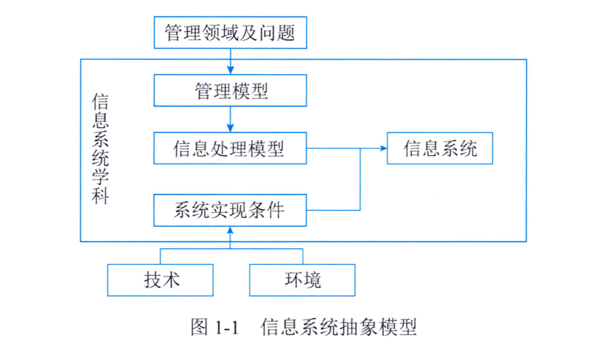
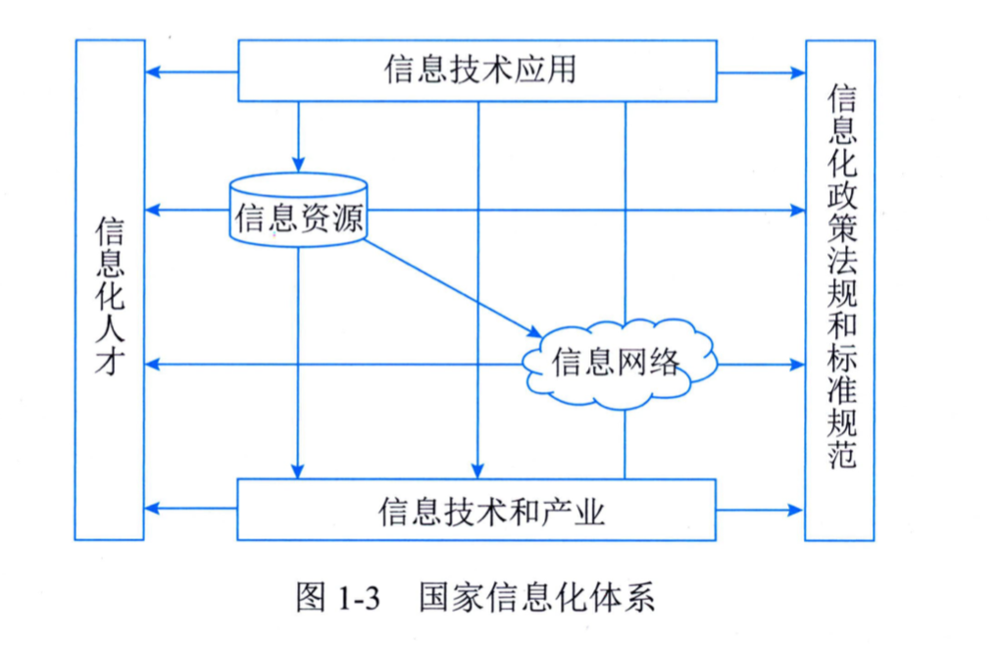
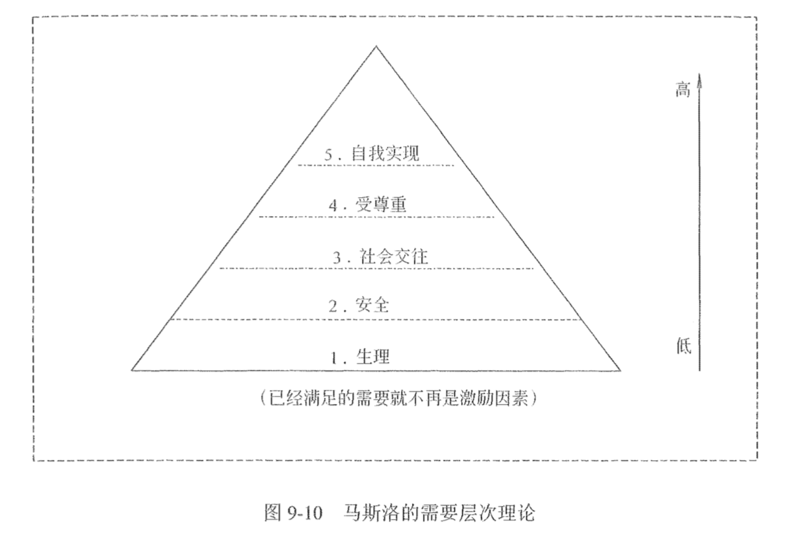
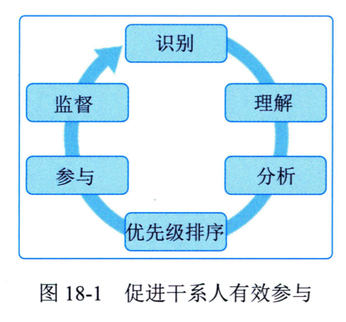

# 软考笔记（2024年5月）

## 第1章 信息化发展

1、`信息`(Information)是物质、能量及其属性的标示的集合，是确定性的增加。它以物质介质为载体，传递和反映世界各种事物存在方式、运动状态等的表征。

香农: “信息是用来消除随机不定性的东西”

信息量的单位为比特( bit)

2、信息的特征， 主要包括：客观性、 普遍性、 无限性、 动态性、 相对性、 依附性、 变换性、 传递性、 层次性、 系统性和转化性等。

3、信息的质量属性主要包括：

- 精确性
- 完整性
- 可靠性
- 及时性：经济与社会信息
- 经济性
- 可验证性
- 安全性: 金融信息

信息系统抽象模型

4、软件的生命周期通常包括：可行性分析与项目开发计划、 需求分析、 概要设计、详细设计、 编码、测试、 维护等阶段。

5、信息系统的生命周期可以简化为：

- 系统规划（可行性分析与项目开发计划）
- 系统分析（需求分析）
- 系统设计（概要设计、 详细设计）
- 系统实施（编码、 测试）
- 系统运行和维护

6、信息化内涵主要包括：
- 信息网络体系
- 信息产业基础
- 社会运行环境
- 效用积累过程

7、组织信息化除驱动和加速组织转型升级和生产力建设外， 还呈现出产品信息化、 产业信息化、 社会生活信息化和国民经济信息化等趋势和方向。

8、国家信息化体系包括6个要素（上鹰，下鸡，左人，右龟）：

- 信息技术应用：龙头、主阵地
- 信息资源：核心任务、关键、薄弱环节
- 信息网络：基础设施
- 信息技术和产业：物质基础
- 信息化人才：成功之本
- 信息化政策法规和标准规范：保障

9、“新基建” 主要包括七大领域：
5G基建、 特高压、 城际高速铁路和城际轨道交通、新能源汽车充电桩、 大数据中心、 人工智能、工业互联网

10、新型基础设施：

- 以新发展理念为引领
- 以技术创新为驱动
- 以信息网络为基础

11、新型基础设施主要包括如下三个方面：

- 信息基础设施：技术新
- 融合基础设施：应用新
- 创新基础设施：平台新

12、工业互联网（Industrial Internet）是新一代信息通信技术与工业经济深度融合的新型基础设施、 应用模式和工业生态。

13、工业互联网不是互联网在工业的简单应用， 是具有更为丰富的内涵和外延。

14、工业互联网平台体系具有四大层级：

- 网络为基础
- 平台为中枢
- 数据为要素
- 安全为保障

工业互联网融合应用六大类典型应用模式

1. 平台化设计
2. 智能化制造
3. 网络化协同
4. 个性化定制
5. 服务化延伸
6. 数字化管理

15、工业互联网网络体系包括三部分：

- 网络互联
- 数据互通
- 标识解析

16、工业互联网平台体系包括四个层级:

- 边缘层
- IaaS：基础设施即服务
- PaaS：平台即服务
- SaaS：软件即服务

相当于工业互联网的“操作系统” 。

17、车联网分别是车与云平台、 车与车、 车与路、 车与人、 车内设备之间等全方位网络链接。

18、车联网（Internet of Vehicles， IoV） 系统是一个“`端、 管、 云`” 三层体系。

19、聚焦数字赋能农业农村现代化建设， 重点建设基础设施、 发展智慧农业和建设数字乡村等方面。

20、两化融合是`信息化`和`工业化` 的高层次的深度结合， 是指以信息化带动工业化、 以工业化促进信息化， 走新型工业化道路。

21、信息化与工业化主要在四个方面进行融合:

- 技术
- 产品
- 业务
- 产业

22、成熟度等级分为五个等级， 自低向高分别是:
- 一级（规划级）
- 二级（规范级）
- 三级（集成级）
- 四级（优化级）
- 五级（引领级）

23、消费互联网以消费者为服务中心， 针对个人用户提升消费过程的体验， 在人们的阅读、 出行、 娱乐、 生活等诸多方面进行改善， 让生活变得更方便、 更快捷。消费互联网本质是个人虚拟化， 增强个人生活消费体验

24、消费互联网具有的属性包括：媒体属性、 产业属性。

25、“迎接数字时代， 激活数据要素潜能， 推进网络强国建设， 加快建设数字经济、数字社会、 数字政府， 以数字化转型整体驱动生产方式、 生活方式和治理方式变革” 成为了新时代我国信息化发展的主旋律。

26、从产业构成来看， 数字经济包括数字产业化和产业数字化两大部分。《数字经济及其核心产业统计分类（2021）》 给出了数字经济具体分类，分别是：数字产品制造业、 数字产品服务业、 数字技术应用业、 数字要素驱动业和数字化效率提升业， 其中， 前4类为数字产业化部分， 第5类为产业数字化部分。

27、从整体构成上看， 数字经济包括数字产业化、 产业数字化、 数字化治理和数据价值化四个部分。

28、产业数字化是指在新一代数字科技支撑和引领下， 以数据为关键要素， 以价值释放为核心， 以数据赋能为主线， 对产业链上下游的全要素数字化升级、 转型和再造的过程。

29、产业数字化具有的典型特征包括：以数字科技变革生产工具;以数据资源为关键生产要素;以数字内容重构产品结构;以信息网络为市场配置纽带;以服务平台为产业生态载体;以数字善治为发展机制条件。

30、数字化治理的核心特征是全社会的数据互通、 数字化全面协同与跨部门的流程再造， 形成“用数据说话、 用数据决策、 用数据管理、 用数据创新” 的治理机制。

31、 数据价值化包括但不限于数据采集、 数据标准、 数据确权、 数据标注、 数据定价、 数据交易、 数据流转、 数据保护等。

32、 数据价值化的“三化” 框架， 即数据资源化、 数据资产化、 数据资本化。

33、 数字政府通常是指以新一代信息技术为支撑， 以“业务数据化、 数据业务化” 为着力点， 通过数据驱动重塑政务信息化管理架构、 业务架构和组织架构， 形成“用数据决策、 数据服务、 数据创新” 的现代化治理模式。

34、 数字政府既是“互联网＋政务” 深度发展的结果， 也是大数据时代政府自觉转型升级的必然， 其核心目的是以人为本， 实施路径是共创、 共享、 共建、 共赢的生态体系。

35、 数字政府也被赋予了新的特征：协同化、 云端化、 智能化、 数据化、 动态化。

36、 数字政府建设关键词主要包括：共享、 互通、 便利。

37、 数字政府从面向社会大众政务服务视角来看， 主要内容重点体现在“一网通办”“跨省通办”“一网统管” 。

38、 数字民生建设重点通常强调：普惠、 赋能、 利民。

39、 智慧城市基本原理表现为：①强调“人民城市为人民” ， 以面向政府、 企业、 市民等主体提供智慧化的服务为主要模式;②重点强化数据治理、 数字孪生、 边际决策、 多元融合和态势感知五个核心能力要素建设;③更加注重规划设计、 部署实施、 运营管理、 评估改进和创新发展在内的智慧城市全生命周期管理;④目标旨在推动城市治理、 民生服务、 生态宜居、 产业经济、 精神文明五位一体的高质量发展;⑤持续推动城市治理体系与治理能力现代化水平提升。

40、 智慧城市发展成熟度划分为规划级、 管理级、 协同级、 优化级、 引领级5个等级。

41、 数字生活主要体现在如下方面： 生活工具数字化、 生活方式数字化、 生活内容数字化。

42、 国家工业信息安全发展研究中心2021年12月提出的全球数字营商环境评价指标体系。该评价体系包含5个一级指标：①数字支撑体系;②数据开发利用与安全;③数字市场准入;④数字市场规则;⑤数字创新环境。

43、 DIKW模型很好地诠释了数据（Data） 、 信息（Information） 、 知识（Knowledge） 和智慧（ Wisdom） 之间的关系， 并揭示了他们的转化过程与方法。S8D模型就是基于DIKW模型， 构筑了“智慧—数据”“数据—智慧” 两大过程的8个转化活动。

44、 组织每个能力因子数字化“封装” 的持续迭代主要包含四项活动， 即：信息物理世界（也称数字孪生,CPS） 建设、 决策能力边际化（PtoE） 部署、 科学社会物理赛博机制构筑（CPSS） 、 数字框架与信息调制（DFIM） 。

45、 元宇宙（Metaverse）的主要特征包括： 
- 沉浸式体验
- 虚拟身份
- 虚拟经济
- 虚拟社会治理

46、组织信息化趋势

- 产品信息化
- 产业信息化
- 社会生活信息化
- 国民经济信息化

## 十四五规划：

1、 党中央、 国务院一直高度重视信息化工作。2016年8月中共中央办公厅、 国务院办公厅颁布的《国家信息化发展战略纲要》 强调国家信息化发展战略总目标是建设网络强国， 分“三步走” ：
- 第一步到2020年， 核心关键技术`部分`领域达到国际先进水平， 信息产业国际竞争力大幅提升， 信息化成为驱动现代化建设的先导力量;
- 第二步到2025年， `建成`国际领先的移动通信网络， `根本`改变核心关键技术受制于人的局面， 实现技术先进、 产业发达、 应用领先、 网络安全坚不可摧的战略目标， 涌现一批具有强大国际竞争力的大型跨国网信企业;
- 第三步到21世纪中叶， 信息化全面支撑富强民主文明和谐的`社会主义现代化`国家建设， 网络强国地位日益巩固， 在引领全球信息化发展方面有更大作为。当前， 我国全面部署了“构建产业数字化转型发展体系” 重大任务， 明确我国信息化进入加快数字化发展、 建设数字中国的新阶段。

2、 《“十四五” 国家信息化规划》 明确了：
- 建设`泛在智联`的数字基础设施体系， 
- 建立高效利用的数据要素资源体系， 
- 构建释放数字生产力的创新发展体系， 
- 培育先进安全的数字产业体系， 
- 构建产业数字化转型发展体系， 
- 构筑共建共治共享的数字社会治理体系，
- 打造协同高效的数字政府服务体系， 
- 构建普惠便捷的数字民生保障体系， 
- 拓展互利共赢的数字领域国际合作体系和建立健全规范有序的数字化发展治理体系等重大任务。

3、 国家“十四五” 规划中提出持续加快建设新型基础设施：

1. 强化数字转型、 智能升级、 融合创新支撑， 布局建设信息基础设施、 融合基础设施、 创新基础设施等新型基础设施;

2. 建设高速泛在、 天地一体、集成互联、 安全高效的信息基础设施， 增强数据感知、 传输、 存储和运算能力;

3. 加快5G网络规模化部署，持续提高用户普及率， 推广升级千兆光纤网络;

4. 前瞻布局6G网络技术储备;

5. 扩容骨干网互联节点， 新设一批国际通信出入口， 全面推进互联网协议第六版（IPv6） 商用部署;

6. 实施中西部地区中小城市基础网络完善工程;

7. 推动物联网全面发展， 打造支持固移融合、 宽窄结合的物联接入能力;

8. 加快构建全国一体化大数据中心体系， 强化算力统筹智能调度， 建设若干国家枢纽节点和大数据中心集群,建设E级和10E级超级计算中心;

9. 积极稳妥发展工业互联网和车联网;

10. 打造全球覆盖、 高效运行的通信、 导航、 遥感空间基础设施体系， 建设商业航天发射场;

11. 加快交通、 能源、 市政等传统基础设施数字化改造， 加强泛在感知、 终端联网、 智能调度体系建设;

12. 发挥市场主导作用， 打通多元化投资渠道， 构建新型基础设施标准体系等。

4、 《中华人民共和国国民经济和社会发展第十四个五年规划和2035年远景目标纲要》 提出了强调加快推动数字产业化， 培育壮大人工智能、 大数据、 区块链、 云计算、 网络安全等新兴数字产业， 提升通信设备、 核心电子元器件、 关键软件等产业水平。构建基于5G的应用场景和产业生态， 在智能交通、 智慧物流、 智慧能源、 智慧医疗等重点领域开展试点示范。鼓励企业开放搜索、 电商、 社交等数据， 发展第三方大数据服务产业。促进共享经济、 平台经济健康发展。数字产业化发展重点包括： 云计算、 大数据、物联网、 工业互联网、 区块链、 人工智能、 拟现实和增强现实。

5、 《中华人民共和国国民经济和社会发展第十四个五年规划和2035年远景目标纲要》 明确提出了推进产业数字化转型， 实施“上云用数赋智” 行动， 推动数据赋能全产业链协同转型。

6、 《中华人民共和国国民经济和社会发展第十四个五年规划和2035年远景目标纲要》 指出“坚持放管并重， 促进发展与规范管理相统一， 构建数字规则体系， 营造开放、 健康、 安全的数字生态” 。

## 第2章 信息技术发展

1、 从网络的作用范围可将网络类别划分为：个人局域网（PAN）、局域网（LAN）、城域网（MAN）、广域网（WAN）、公用网（PublicNetwork）、专用网（Private Network） 。

2、 OSI采用了分层的结构， 从下到上共分：物理层、 数据链路层、 网络层、 传输层、 会话层、 表示层和应用层。

3、 软件定义网络SDN的整体架构由下到上（由南到北） 分为数据平面、 控制平面和应用平面。

4、 第五代移动通信技术（5G） 是具有高速率、 低时延和大连接特点的新一代移动通信技术。为了支持低时延、 高可靠， 5G采用短帧、 快速反馈、 多层/多站数据重传等技术。

5、 国际电信联盟（ITU） 定义了5G的三大类应用场景， 即增强移动宽带（eMBB） 、 超高可靠低时延通信（uRLLC）和海量机器类通信（mMTC） 。

6、 存储分类根据服务器类型分为：封闭系统的存储和开放系统的存储。封闭系统主要指大型机等服务器。开放系统指基于包括麒麟、 欧拉、 UNIX、 Linux等操作系统的服务器。开放系统的存储分为：内置存储和外挂存储。外挂存储根据连接的方式分为直连式存储（DAS） 和网络化存储FAS） 。网络化存储根据传输协议又分为网络接入存储（NAS） 和存储区域网络（SAN） 。

7、 常见的数据结构模型有三种：层次模型、网状模型和关系模型，层次模型和网状模型又统称为格式化数据模型。

8、 数据库根据存储方式可以分为：
- 关系型数据库（SQL） 
- 非关系型数据库（NoSQL）

9、 关系型数据库支持事务的`ACID原则`， 即：
- 原子性（Atomicity） 、 
- 一致性（Consistency） 、 
- 隔离性（Isolation） 、 
- 持久性（Durability） ，

这四种原则保证在事务过程当中数据的正确性。

10、 非关系型数据库是分布式的、 非关系型的、 不保证遵循ACID原则的数据存储系统。

11、 数据仓库是一个面向主题的、 集成的、 非易失的且随时间变化的数据集合， 用于支持管理决策。

12、 信息系统安全可以划分为四个层次：设备安全、 数据安全、 内容安全、 行为安全。

13、 信息系统一般由计算机系统、 网络系统、 操作系统、 数据库系统和应用系统组成。与此对应， 信息系统安全主要包括计算机设备安全、 网络安全、 操作系统安全、 数据库系统安全和应用系统安全等。

14、 网络安全技术主要包括：防火墙、 入侵检测与防护、 VPN、 安全扫描、 网络蜜罐技术、 用户和实体行为分析技术等。

15、 信息加密

- 对称加密： DES（Data Encryption Standard，即数据加密标准），对称加密的加密密钥和解密密钥相同
- 非对称加密： RSA，非对称加密的加密密钥和解密密钥不同， 加密密钥可以公开而解密密钥需要保密。

16、 用户和实体行为分析UEBA系统通常包括数据获取层、 算法分析层和场景应用层。

17、 网络安全态势感知的关键技术主要包括：海量多元异构数据的汇聚融合技术、 面向多类型的网络安全威胁评估技术、 网络安全态势评估与决策支撑技术、 网络安全态势可视化等。

18、 物联网架构可分为三层：
- 感知层
- 网络层
- 应用层

19、 物联网关键技术主要涉及传感器技术、 传感网和应用系统框架等。

20、 按照云计算服务提供的资源层次， 可以分为三种服务类型：
- 基础设施即服务（IaaS）
- 平台即服务（PaaS） 
- 软件即服务（SaaS） 

21、 云计算的关键技术主要涉及虚拟化技术、 云存储技术、 多租户和访问控制管理、 云安全技术等。

22、 云计算访问控制的研究主要集中在云计算访问控制模型、 基于ABE密码体制的云计算访问控制、云中多租户及虚拟化访问控制研究。

23、 基于ABE密码机制的云计算访问控制包括4个参与方：数据提供者、 可信第三方授权中心、 云存储服务器和用户。

24、 大数据从数据源到最终价值实现一般需要经过数据准备、 数据存储与管理、 数据分析和计算、 数据治理和知识展现等过程。

25、 大数据主要特征包括：数据海量、 数据类型多样、 数据价值密度低、 数据处理速度快。

26、 大数据技术架构主要包含大数据获取技术、 分布式数据处理技术和大数据管理技术， 以及大数据应用和服务技术。

27、 大数据获取的研究主要集中在数据采集、 整合和清洗三个方面。

28、 目前主流的分布式计算系统有Hadoop、 Spark和Storm。Hadoop常用于离线的复杂的大数据处理， Spark常用于离线的快速的大数据处理， 而Storm常用于在线的实时的大数据处理。

29、 大数据管理技术主要集中在大数据存储、 大数据协同和安全隐私等方面。

30、 大数据应用和服务技术主要包含分析应用技术和可视化技术。

31、 区块链技术具有多中心化存储、 隐私保护、 防篡改等特点， 提供了开放、 分散和容错的事务机制，成为新一代匿名在线支付、 汇款和数字资产交易的核心。

32、 区块链分为四大类：
- 公有链
- 联盟链
- 私有链
- 混合链

33、 区块链的典型特征包括：
- 多中心化
- 多方维护
- 时序数据
- 智能合约
- 不可篡改
- 开放共识
- 安全可信

区块链的关键技术
1. 分布式账本：区块链技术的核心之一
2. 加密算法：一般分为散列(哈希)算法和非对称加密算法。散列算法有 MD5、 SHA-1/SHA-2 和 SM3，目前 区块链主要使用 SHA-2中的 SHA256 算法 。
3. 共识机制: 常用的共识机制主要有 Pow、 PoS、 DPoS、 Paxos、 PBFT 等

区块链的典型应用: 数字货币

34、 人工智能的关键技术主要涉及机器学习、 自然语言处理、 专家系统等技术。

35、 虚拟现实技术的主要特征包括：沉浸性、 交互性、 多感知性、 构想性（也称想象性） 和自主性。

36、 虚拟现实的关键技术主要涉及人机交互技术、 传感器技术、 动态环境建模技术和系统集成技术等。

## 第3章 信息系统治理

1、 IT治理主要目标包括：与业务目标一致、 有效利用信息与数据资源、 风险管理。

2、 管理层次大致可分为三层：最高管理层、 执行管理层、 业务与服务执行层。

3、 有效的IT治理必须关注五项关键决策， 包括IT原则、 IT架构、 IT基础设施、 业务应用需求、 IT投资和优先顺序。

4、 IT治理体系框架具体包括：IT战略目标、 IT治理组织、 IT治理机制、 IT治理域、 IT治理标准和IT绩效目标等部分。

5、 IT治理的核心内容包括六个方面：组织职责、 战略匹配、 资源管理、 价值交付、 风险管理和绩效管理。

6、 建立IT治理机制的原则包括：①简单； ②透明； ③适合。

7、 该标准定义的IT治理框架包含信息技术顶层设计、 管理体系和资源三大治理域。

8、 IT治理实施框架包括治理的实施环境、 实施过程和治理域。

9、 COBIT中治理目标被列入评估、 指导和监控（EDM） 领域， 管理目标分为四个领域：
- ①调整、 规划和组织（APO） 针对IT的整体组织、 战略和支持活动;
- ②内部构建、 外部采购和实施（BAI） 针对IT解决方案的定义、 采购和实施以及它们到业务流程的整合;
- ③交付、 服务和支持（DSS） 针对IT服务的运营交付和支持， 包括安全;
- ④监控、 评价和评估（MEA） 针对IT的性能监控及其与内部性能目标、 内部控制目标和外部要求的一致程度。

10、 IT审计风险主要包括固有风险、 控制风险、 检查风险和总体审计风险。

11、 常用审计方法包括：访谈法、 调查法、 检查法、 观察法、 测试法和程序代码检查法等。

12、 常用的IT审计技术包括：
- 风险评估技术
- 审计抽样技术
- 计算机辅助审计技术
- 大数据审计技术

13、 审计证据的特性： 充分性、 客观性、 相关性、 可靠性、 合法性。

14、 审计工作底稿一般分为综合类工作底稿、 业务类工作底稿和备查类工作底稿。

15、 审计工作底稿三级复核制度是指以审计机构负责人、 部门负责人和项目负责人（或项目经理） 为复核人。

16、 审计流程一般分为四个阶段：
- 审计准备
- 审计实施
- 审计终结
- 后续审计

17、 IT审计业务和服务通常分为：
- IT内部控制审计
- IT专项审计

## 第4章 信息系统管理

1、 信息系统包括四个要素：
- 人员
- 技术
- 流程
- 数据

2、 信息系统管理覆盖四大领域：规划和组织、 设计和实施、 运维和服务、 优化和持续改进。

3、 信息系统战略三角突出了业务战略、 信息系统和组织机制之间的必要一致性。

4、 信息系统体系架构有三种常见模式：
- ①集中式架构； 
- ②分布式架构； 
- ③面向服务的系统架构（SOA） 。

5、 信息系统的运维和服务由各类管理活动组成， 主要包括：运行管理和控制、 IT服务管理、 运行与监控、终端侧管理、 程序库管理、 安全管理、 介质控制和数据管理等。

6、 IT服务管理由若干不同的活动组成：服务台、 事件管理、 问题管理、 变更管理、 配置管理、 发布管理、服务级别管理、 财务管理、 容量管理、 服务连续性管理和可用性管理。

7、 优化和持续改进常用的方法为`戴明环`， 即 PDCA循环。 PDCA循环是将持续改进分为四个阶段， 即：
- Plan （计划）
- Do（执行）
- Check（检查）
- Act（处理）

8、 使用六西格玛倡导的五阶段方法 DMAIC/DMADV， 是对戴明环四阶段周期的延伸， 包括：
- 定义（Define）
- 度量（Measure）
- 分析（Analysis）
- 改进/设计（Improve/Design）
- 控制/验证（Control/Verify）

当第四阶段的“改进” 替换为“设计” ， “控制” 替换为“验证” 时， 五阶段法就从DMAIC转变为DMADV。

9、 定义阶段的目标包括待优化信息系统定义、 核心流程定义和团队组建。

10、 度量阶段目标包括流程定义、 指标定义、 流程基线和度量系统分析。

11、 分析阶段的三个目标包括价值流分析、 信息系统异常的源头分析和确定优化改进的驱动因素。

12、 控制/验证阶段的目标包括标准化新程序/新系统功能的操作控制要素、 持续验证优化的信息系统的可交付成果、 记录经验教训。

13、 数据管理能力成熟度评估模型DCMM定义了数据战略、 数据治理、 数据架构、 数据应用、 数据安全、 数据质量、 数据标准和数据生存周期8个核心能力域。

14、 组织的数据战略能力域通常包括数据战略规划、 数据战略实施和数据战略评估三个能力项。

15、 组织的数据治理能力域通常包括数据治理组织、 数据制度建设和数据治理沟通三个能力项。

16、 组织的数据架构能力域通常包括数据模型、 数据分布、 数据集成与共享和元数据管理四个能力项。

17、 数据应用能力域通常包括数据分析、 数据开放共享和数据服务三个能力项。

18、 组织的数据安全能力域通常包括数据安全策略、 数据安全管理和数据安全审计三个能力项。

19、 组织的数据质量能力域通常包括数据质量需求、 数据质量检查、 数据质量分析和数据质量提升四个能力项。

20、 组织的数据标准能力域通常包括业务术语、 参考数据和主数据、 数据元和指标数据四个能力项。

21、 组织的数据生存周期能力域通常包括数据需求、 数据设计和开发、 数据运维和数据退役四个能力项。

22、 国内外常用的数据管理模型包括：数据管理能力成熟度模型（DCMM） 、 数据治理框架（DGI） 、数据管理能力评价模型（DCAM） 以及数据管理模型（DAMA定义的模型） 等。

23、 数据管理能力成熟度模型DCMM将组织的管理成熟度划分为5个等级， 分别是：初始级、 受管理级、稳健级、 量化管理级和优化级。

24、 能力建设围绕人员、 过程、 技术、 资源能力四要素。

25、 能力要素： 人员、 技术、 过程、 数据、 算法、 资源、 知识。

26、 智能运维能力平台通常具备数据管理、 分析决策、 自动控制等能力。

27、 智能运维场景实现： 场景分析、 场景构建、 场景交付、 效果评估。

28、 智能特征： 能感知、 会描述、 自学习、 会诊断、 可决策、 自执行、 自适应。

29、 保密性、 完整性和可用性是信息安全最为关注的三个属性， 因此这三个特性也经常被称为`信息安全三元组`。

30、 等级保护对象的安全保护等级分为以下五级：
- 第一级（个人损害）
- 第二级（个人严重损害）
- 第三级（国家损害）
- 第四级（国家严重损害）
- 第五级（国家特别严重损害）

31、 GB/T 22239《信息安全技术网络安全等级保护基本要求》 规定了不同级别的等级保护对象应具备的基本安全保护能力： 
- 第一级安全保护能力（个人的）
- 第二级安全保护能力（自外部小型组织的）
- 第三级安全保护能力（外部有组织的团体）
- 第四级安全保护能力（国家级别的、 敌对组织的）
- 第五级安全保护能力

##  第5章 信息系统工程

1、 软件架构分为：
- ①数据流风格
- ②调用/返回风格
- ③独立构件风格
- ④虚拟机风格
- ⑤仓库风格

2、 软件架构评估方式， 分别是
- 基于调查问卷（或检查表） 的方式
- 基于场景的方式（最为常用）
- 基于度量的方式

3、 软件需求包括：
- 业务需求
- 用户需求
- 系统需求

4、 质量功能部署QFD将软件需求分为三类， 分别是常规需求、 期望需求和意外需求。

5、 需求过程主要包括需求获取、 需求分析、 需求规格说明书编制、 需求验证与确认等。

6、 使用结构化分析SA方法进行需求分析， 其建立的模型的核心是 `数据字典`。 围绕这个核心， 有三个层次的模型， 分别是数据模型、 功能模型和行为模型（也称为状态模型） 。 使用实体关系图（E-R图） 表示数据模型， 用数据流图（DFD） 表示功能模型， 用状态转换图（STD） 表示行为模型。

7、 在OOA方法中， 构建用例模型一般需要经历四个阶段， 分别是识别参与者、 合并需求获得用例、细化用例描述和调整用例模型。

8、 UML图： 构件图、 组合结构图、 顺序图（序列图） 、 通信图（协作图） 、 定时图（计时图） 、 状态图、 活动图、 部署图、 制品图、 包图、 交互概览图

9、 UML5个系统视图： 逻辑视图、 实现视图、 部署视图、 用例视图、 进程视图【记忆口诀：裸线不用进】

10、 类之间的主要关系有关联、 依赖、 泛化、 聚合、 组合和实现等。

11、 结构化设计是一种面向数据流的方法， 是一个自顶向下、 逐步求精和模块化的过程。

11、 在SD（结构化设计方法）中， 需要遵循一个基本的原则：高内聚， 低耦合。

12、 面向对象设计（OOD） 是OOA方法的延续， 其基本思想包括抽象、 封装和可扩展性， 其中可扩展性主要通过继承和多态来实现。

13、 类模式处理类和子类之间的关系， 属于静态关系;对象模式处理对象之间的关系， 更具动态性。

14、 根据目的和用途不同， 设计模式可分为创建型模式（创建对象） 、 结构型模式（处理类或对象的组合） 和行为型（描述类或对象的交互以及职责的分配） 。

15、 软件配置管理活动包括软件配置管理计划、 软件配置标识、 软件配置控制、 软件配置状态记录、软件配置审计、 软件发布管理与交付等活动。

16、 对文档的静态测试主要以检查单的形式进行， 对代码的静态测试一般采用桌前检查、 代码走查和代码审查。

17、 白盒测试方法主要有：控制流测试、 数据流测试和程序变异测试等。

18、 容器技术目前是部署中最流行的技术， 常用的持续部署方案有Kubernetes+Docker和Matrix系统两种。

19、 完整的镜像部署包括三个环节：Build—Ship—Run。

20、 在部署原则中提到两大部署方式为 `蓝绿部署` 和 `金丝雀部署`。

21、 软件过程能力包括治理能力、 开发与交付能力、 管理与支持能力、 组织管理能力等方面。

22、 成熟度级别： 
- 1级初始级
- 2级项目规范级
- 3级组织改进级
- 4级量化提升级
- 5级创新引领级

23、 根据模型应用目的不同， 可以将数据模型划分为三类：概念模型、 逻辑模型和物理模型。

24、 目前主要的数据结构有层次模型、 网状模型、 关系模型、 面向对象模型和对象关系模型。 其中，关系模型成为目前最重要的一种逻辑数据模型。

25、 数据建模过程包括数据需求分析、 概念模型设计、 逻辑模型设计和物理模型设计等过程。

26、 数据标准化的主要内容包括

- 元数据标准化
- 数据元标准化
- 数据模式标准化
- 数据分类与编码标准化
- 数据标准化管理

27、 数据标准化阶段的具体过程包括四个阶段(v4-P153):

- `确定数据需求`。将产生数据需求及相关的元数据、域值等文件。在确定数据需 求时应考虑现行的法规、政策，以及现行的数据标准。
- `制定数据标准`。要处理“确定数据需求”阶段提出的数据需求。如果现有的数据 标准不能满足该数据需求，可以建议制定新的数据标准，也可建议修改或者封存己有数据标准。 推荐的、新的或修改的数据标准记录于数据字典中 。 这个阶段将产生供审查和批准的成套建议。
- `批准数据标准`。数据管理机构对提交的数据标准建议、现行数据标准的修改 或封存建议进行审查。 一经批准，该数据标准将扩充或修改数据模型。
- `实施数据标准`。 在各信息系统中实施和改进己批准的数据标准。

28、 当前最常见的数据备份结构可以分为四种：DAS备份结构、 基于LAN的备份结构、 LAN-FREE备份结构和SERVER-FREE备份结构。

29、 常见的备份策略主要有三种：完全备份、 差分备份和增量备份。

30、 根据容灾系统保护对象的不同， 容灾系统分为应用容灾和数据容灾两类。

31、 数据质量评价方法分为直接评价法和间接评价法。

32、 数据产品的质量控制分成前期控制和后期控制两个大部分。

33、 数据清理主要包括数据分析、 数据检测和数据修正三个步骤。

34、 数据挖掘流程一般包括确定分析对象、 数据准备、 数据挖掘、 结果评估与结果应用五个阶段。

35、 数据服务主要包括数据目录服务、 数据查询与浏览及下载服务、 数据分发服务。

36、 可视化的表现方式可分为七类：一维数据可视化、 二维数据可视化、 三维数据可视化、 多维数据可视化、 时态数据可视化、 层次数据可视化和网络数据可视化。

37、 信息检索的主要方法：全文检索、 字段检索、 基于内容的多媒体检索、 数据挖掘。

38、 信息检索的常用技术包括布尔逻辑检索技术、 截词检索技术、 临近检索技术、 限定字段检索技术、限制检索技术等。

39、 系统集成工作在技术上需要遵循的基本原则包括：开放性、 结构化、 先进性和主流化。

40、 数据集成可以分为基本数据集成、 多级视图集成、 模式集成、 和多粒度数据集成四个层次。

41、 异构数据集成方法归纳起来主要有两种， 分别是过程式方法和声明式方法。

42、 代表性的软件构件标准：公共对象请求代理结构（CORBA） 、 COM、 DCOM与COM+、 .NET、J2EE应用架构等标准。

43、 对应用集成的技术要求大致有：具有应用间的互操作性、 具有分布式环境中应用的可移植性、 具有系统中应用分布的透明性。

44、 信息安全三维空间： 
- X轴是“安全机制”
- Y轴是“OSI网络参考模型”
- Z轴是“安全服务”

45、 认证、 权限、 完整、 加密和不可否认五大要素， 也叫作“安全空间” 的五大属性。

46、 安全机制包含基础设施实体安全、 平台安全、 数据安全、 通信安全、 应用安全、 运行安全、 管理安全、 授权和审计安全、 安全防范体系等。

47、 安全服务包括对等实体认证服务、 数据保密服务、 数据完整性服务、 数据源点认证服务、 禁止否认服务和犯罪证据提供服务等。

48、 信息安全系统工程活动离不开其他相关工程， 主要包括：硬件工程、 软件工程、 通信及网络工程、数据存储与灾备工程、 系统工程、 测试工程、 密码工程和组织信息化工程等。

49、 信息安全系统工程应该吸纳安全管理的成熟规范部分， 这些安全管理包括物理安全、 计算机安全、网络安全、 通信安全、 输入/输出产品的安全、 操作系统安全、 数据库系统安全、 数据安全、 信息审计安全、 人员安全、 管理安全和辐射安全等。

50、 信息安全系统工程能力成熟度模型（ISSE-CMM） 是一种衡量信息安全系统工程实施能力的方法，是使用面向工程过程的一种方法。

51、 ISSE-CMM主要适用于工程组织、 获取组织和评估组织。

52、 ISSE将信息安全系统工程实施过程分解为：工程过程、 风险过程和保证过程。

53、 公共特性的成熟度等级： 

- Level 1—非正规实施级
- Level 2—规划和跟踪级
- Level 3—充分定义级
- Level 4—量化控制级
- Level 5—持续改进级

## 第8章 项目整合管理

项目管理计划组件主要包括 （V4-P247）：

- `子管理计划`: 范围管理计划、需求管理计划、进度管理计划、成本管理计划、质量管 理计划、资源管理计划、沟通管理计划、风险管理计划、采购管理计划、干系人参与计划。
- `基准` : 范围基准、进度基准和成本基准。
- `其他组件` : 变更管理计划、配置管理计划、绩效测量基准、项目生命周期、开发方法 、管理审查

## 第15章 项目风险管理

风险管理计划内容主要包括（V4-P440）:

- 风险管理策略
- 方法论
- 角色与职责
- 资金
- 时间安排
- 风险类别
- 干系人风险偏好
- 风险概率和影响
- 概率和影响矩阵
- 报告格式
- 跟踪

## 第13章 项目资源管理

马斯洛需求层次理论（Maslow's Hierarchy of Needs）(v3-P351)

- 生理 physiological need（食物和衣服）
- 安全 safety need（工作保障）
- 社交需要 belongingness and love need（友谊）
- 尊重 esteem need
- 自我实现 self-actualization need

组织战略实施5种类型：
- 指挥型
- 变革型
- 合作型
- 文化型
- 增长型

## 第20章 高级项目管理

能力成熟度模型集成 CMMI（Capability Maturity Model Integration）

CMMI连续式分组：

- `过程管理`：组织级过程焦点、组织级过程定义、组织级培训、组织级过程性能、组织级改革与实施
- `项目管理`：项目计划、项目监督与控制、供应商合同管理、集成项目营理、风险管理、集成化的团队、定量项目管理
- `工程`：需求管理、需求开发、技术解决方案、产品集成、验证、确认
- `支持`：配置管理、度量和分析、过程和产品质量保证、决策分析和解决方案、组织级集成环境、因果分析和解决方案

数据表现

1. 权利利益方格、权利影响方格、或作用影响方格。（权利：职权级别；利益：项目关心程度；影响：对项目成果的影响力）
2. 凸显模式：（权利、紧迫度、合法性）
3. 相关方立方体 （三维标准）

三点估算正态分布：

- 34.13% 
- 13.59%
- 2.14%

口诀：三世一生，一生无酒，情人节

## 第18章 项目绩效域

促进干系人参与的步骤（V4-P520）：

- 识别
- 理解
- 分析
- 优先级排序
- 参与
- 监督

访问控制授权方案（4 种）

1. DAC (Discretionaiy Access Control) 自主访问控制方式:
2. ACL (Access Control List) 访问控制列表方式: 应用最多
3. MAC (Mandatory Access Control) 强访问控制方式：军事和安全部门
4. RBAC (Role Based Access Control) 基于角色的访问控制方式：

虚拟团队模式使人们有可能:
1. 在组织内部地处不同地理位置的员工之间组建团队
2. 为项目团队增加特殊技能，即
使相应的专家不在同 一地理区域
3. 将在家办公的员工纳入团队
4. 在工作班次、工作小时或 工作日不同的员工之间组建团队
5. 将行动不便者或残疾人纳入团队
6. 执行那些原本会因差 旅费用过高而被搁置或取消的项目
7. 节省员工所需的办公室和所有实物设备的开支

参考

- [软考高级-信息项目管理师备考-【1-5】章节概念类小题库，饭后嚼一嚼](https://mp.weixin.qq.com/s/A-cOC7lHAiWxZTSRjiT9XQ)
