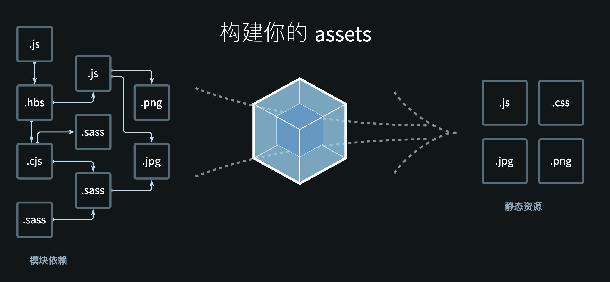

# Webpack4实战教程

尚硅谷新版Webpack4实战教程(从入门到精通)
https://www.bilibili.com/video/BV1e7411j7T5

尚硅谷前端Webpack4教程（高级进阶篇）
https://www.bilibili.com/video/BV1cv411C74F

笔记分享: https://lab.puji.design/webpack-getting-started-manual/

课件地址webpack从入门到精通

- 下载地址：https://pan.baidu.com/s/1JxvXF8EyG9TSNLqkc98YzQ  提取码：i5qc
- 备用地址：https://pan.baidu.com/s/1T2g37SpIQRjF6fjFDl_YwA  密码:uw5q

## 目录

1. 课程简介
2. Webpack简介
3. Webpack初体验
4. Webpack开发环境基本配置
5. Webpack生产环境基本配置
6. Webpack优化配置
7. Webpack原理分析
8. Webpack5介绍

## 1、课程简介

### 1.1、知识点

- webpack5
- dll
- production
- development
- eslint
- babel
- pwa
- optimization
- resolve
- HMR
- loader
- plugin
- devtool
- 性能优化
- tree shaking
- code split
- caching
- lazy loading
- library
- shimming

### 1.2、环境配置

```
Node.js >= 10
webpack >= 4.26
```

### 1.3、预备知识

- Node.js
- NPM
- ES6

## 2、webpack简介

### 2.1、webpack是什么

Webpack:

- 一种前端资源构建工具;
- 一个静态模块打包器（module bundler）.

在webpack看来，前端的所有资源文件（js/json/css/img/less/...）都会作为模块处理
它根据模块的依赖关系进行静态分析，打包生成对应的静态资源（bundle）




### 2.2、webpack五个核心概念

1. entry: 入口

2. output： 输出

3. loader：处理非js文件，翻译工作

4. plugins 插件，执行范围更广的任务，打包优化，压缩，定义环境中的变量等

5. mode 模式

- development
    - 本地调试
    - 会将process.env.NODE_ENV的值设置为development
    - 启用NamedChunksPlugin
    - 启用NamedModulesPlugin
- production
    - 上线运行
    - 会将process.env.NODE_ENV的值设置为production
    - 启用FlagDependencyUsagePlug
    - 启用FlagDependencyUsagePlugin
    - 启用FlagIncludedChunksPlugin
    - 启用ModuleConcatenationPlugin
    - 启用NoEmitOnErrorsPlugin
    - 启用TerserPlugin


## 3、webpack初体验

### 3.1、初始化项目

```bash
mkdir webpack-demo
cd webpack-demo

# 初始化项目目录
npm init -y

# 安装webpack
cnpm i webpack webpack-cli -D
```

项目目录
```bash
$ tree
.
├── package.json
└── src
    └── index.js
```

src/index.js
```js
function add(x, y){
    return x + y;
}

console.log(add(1, 2));
```

依赖 package.json
```json
{
    "devDependencies": {
    "webpack": "^5.72.1",
    "webpack-cli": "^4.9.2"
  }
}
```

打包

```bash
# 开发环境
$ npx webpack ./src/index.js -o ./dist --mode=development

asset main.js 1.25 KiB [emitted] (name: main)
./src/index.js 64 bytes [built] [code generated]
webpack 5.72.1 compiled successfully in 74 ms

# 生产环境
$ npx webpack ./src/index.js -o ./dist --mode=production

asset main.js 15 bytes [emitted] [minimized] (name: main)
./src/index.js 64 bytes [built] [code generated]
webpack 5.72.1 compiled successfully in 201 ms
```

### 3.2、导入json资源

```
src
├── data.json
└── index.js
```

data.json
```json
{
  "name": "Tom",
  "age": 23
}
```

index.js
```js
import data from './data.json';

function add(x, y){
    return x + y;
}

console.log(add(1, 2));
console.log(data);
```

运行打包后的代码
```bash
$ node dist/main.js
3
{ name: 'Tom', age: 23 }
```

### 3.3、结论

- webpack能处理js、json资源，不能处理css、img等其他资源
- 生产环境和开发环境将ES6模块化编译成浏览器能识别的模块化
- 生产环境比开发环境多了一部压缩js代码


### 3.4、webpack配置文件

构建工具基于node.js环境运行，模块化采用commonjs

一个基本的配置 

webpack.config.js
```js
// 用来处理路径
const path = require('path');

// webpack配置
module.exports = {
  // 入口文件
  entry: './src/index.js',

  // 输出
  output: {
    // 输出文件名
    filename: 'bundle.js',
    // 输出路径 __dirname node.js变量，当前文件的目录绝对路径
    path: path.resolve(__dirname, 'dist'),
  },

  // loader配置
  module: {
    rules: [],
  },

  // 插件配置
  plugins: [],

  // 模式
  mode: 'development',
// mode: 'production',
};

```

### 3.5、打包样式资源-css文件

安装处理css的loader

```bash
$ cnpm i style-loader css-loader -D
```

项目结构
```
$ tree -I "node_modules"
.
├── dist
│   ├── bundle.js
│   └── index.html
├── package.json
├── src
│   ├── index.css
│   └── index.js
└── webpack.config.js
```

src/index.js

```js
// 引入样式资源
import './index.css';

```

src/index.css

```css
html,
body {
  padding: 0;
  margin: 0;
  height: 100%;
  background-color: pink;
}

```

webpack.config.js

```js
// 用来处理路径
const path = require('path');

// webpack配置
module.exports = {
  // 入口文件
  entry: './src/index.js',

  // 输出
  output: {
    // 输出文件名
    filename: 'bundle.js',
    // 输出路径 __dirname node.js变量，当前文件的目录绝对路径
    path: path.resolve(__dirname, 'dist'),
  },

  // loader配置
  module: {
    rules: [
      {
        // 正则匹配文件名
        test: /\.css$/,
        // 处理文件的loader
        // 执行顺序：从右到左，从下到上
        use: [
          // 创建style标签，插入到head中
          'style-loader',
          // 加载css文件，变成commonjs模块，内容是样式字符串
          'css-loader',
        ],
      },
    ],
  },

  // 插件配置
  plugins: [],

  // 模式
  mode: 'development',
  // mode: 'production',
};

```

index.html

```html
<html lang="en">
<head>
    <meta charset="UTF-8">
    <meta http-equiv="X-UA-Compatible" content="IE=edge">
    <meta name="viewport" content="width=device-width, initial-scale=1.0">
    <title>Document</title>
</head>
<body>
    <script src="./bundle.js"></script>
</body>
</html>
```

执行打包命令

```bash
$ npx webpack
```

打开index.html 文件，可以看到css样式已经生效（右键->检查元素）

js动态生成了style标签

```html
<html lang="en"><head>
    <meta charset="UTF-8">
    <meta http-equiv="X-UA-Compatible" content="IE=edge">
    <meta name="viewport" content="width=device-width, initial-scale=1.0">
    <title>Document</title>
<style>html,
body {
  padding: 0;
  margin: 0;
  height: 100%;
  background-color: pink;
}
</style></head>
<body>
    <script src="./bundle.js"></script>
</body></html>
```

### 3.6、打包样式资源-less文件

```bash
$ cnpm i less less-loader -D
```

src/index.js
```js
// 引入less样式资源
import './index.less';

```

src/index.less
```css
html,
body {
  padding: 0;
  margin: 0;
  height: 100%;
  background-color: pink;
}

```


新增配置 webpack.config.js
```js
// webpack.config.js
// 用来处理路径
const path = require('path');

// webpack配置
module.exports = {
  // 入口文件
  entry: './src/index.js',

  // 输出
  output: {
    // 输出文件名
    filename: 'bundle.js',
    // 输出路径 __dirname node.js变量，当前文件的目录绝对路径
    path: path.resolve(__dirname, 'dist'),
  },

  // loader配置
  module: {
    rules: [
      // 处理less文件
      {
        test: /\.less$/,
        use: [
          'style-loader',
          'css-loader',
          // 将less编译成css
          'less-loader',
        ],
      },
    ],
  },

  // 插件配置
  plugins: [],

  // 模式
  mode: 'development',
  // mode: 'production',
};

```

执行打包命令

```bash
$ npx webpack
```

### 3.7、打包Html资源


- loader: 1. 下载； 2.使用（配置loader）
- plugins: 1. 下载； 2.引入；3.使用

```
cnpm i html-webpack-plugin -D
```

默认创建一个空的HTML文件，自动引入打包输出的所有资源（js/css）

默认输出的HTML

```html
<!DOCTYPE html>
<html>
  <head>
    <meta charset="utf-8">
    <title>Webpack App</title>
  <meta name="viewport" content="width=device-width, initial-scale=1"><script defer src="bundle.js"></script></head>
  <body>
  </body>
</html>
```

自定义HTML

```js
// webpack.config.js
const path = require('path');
const HtmlWebpackPlugin = require('html-webpack-plugin');

// webpack配置
module.exports = {
  // 入口文件
  entry: './src/index.js',

  // 输出
  output: {
    filename: 'bundle.js',
    path: path.resolve(__dirname, 'dist'),
  },

  // loader配置
  module: {},

  // 插件配置
  plugins: [
    // 复制一份HTML文件，并自动引入打包资源（js/css）
    new HtmlWebpackPlugin({
      template: './src/index.html',
    }),
  ],

  // 模式
  mode: 'development',
  // mode: 'production',
};

```

src/index.html
```html
<html lang="en">
<head>
    <meta charset="UTF-8">
    <meta http-equiv="X-UA-Compatible" content="IE=edge">
    <meta name="viewport" content="width=device-width, initial-scale=1.0">
    <title>Webpack</title>
</head>
<body>
    
</body>
</html>
```

执行打包命令之后输出

```html
<html lang="en">
<head>
    <meta charset="UTF-8">
    <meta http-equiv="X-UA-Compatible" content="IE=edge">
    <meta name="viewport" content="width=device-width, initial-scale=1.0">
    <title>Webpack</title>
<script defer src="bundle.js"></script></head>
<body>
    
</body>
</html>
```

### 3.8、打包图片资源

安装依赖
```
cnpm i html-loader -D
```

项目结构

```bash
$ tree -I node_modules
.
├── package.json
├── src
│   ├── index.html
│   ├── index.js
│   ├── index.less
│   └── weibo.png
└── webpack.config.js
```

src/index.js
```js
// 引入less样式资源
import './index.less';

// js引入图片资源
import weibo from './weibo.png';
console.log(weibo);
// http://127.0.0.1:5500/dist/images/7f1a8e356f.png

```

src/index.less

```less
html,
body {
  padding: 0;
  margin: 0;
  height: 100%;
  // background-color: pink;
}

.box {
  width: 100px;
  height: 100px;
  // css引入图片资源
  background-image: url('./weibo.png');
  // 替换为：background-image: url(/dist/images/7f1a8e356f.png);
  background-size: 100% 100%;
  background-repeat: no-repeat;
}
```

src/index.html
```html
<html lang="en">

<head>
    <meta charset="UTF-8">
    <meta http-equiv="X-UA-Compatible"
          content="IE=edge">
    <meta name="viewport"
          content="width=device-width, initial-scale=1.0">
    <title>Webpack</title>
</head>

<body>
    <div class="box"></div>

    <!-- html引入图片资源 -->
    
    <!-- 替换为： -->
</body>

</html>
```


配置文件 webpack.config.js

webpack5默认会处理图片资源，webpack4需要单独配置

|webpack5 | webpack4 | 说明
|-|-|-
asset/resource | file-loader | 发送一个单独的文件并导出 URL
asset/inline | url-loader | 导出一个资源的 data URI
asset/source | raw-loader | 导出资源的源代码
asset |  url-loader | 在导出一个 data URI 和发送一个单独的文件之间自动选择。


webpack4 配置
```js
{
    module: {
        rules: [
            // 默认无法处理HTML中的图片
            {
                test: /\.(png|svg|jpg|jpeg|gif)$/i,
                // 使用一个loader，如果使用多个loader用use
                loader: 'url-loader',
                options: {
                    // 图片大小小于8kb，就会被base64编码
                    // 优点：减少请求数量，减轻服务器压力
                    // 缺点：js体积会更大, 文件请求速度更慢
                    limit: 8 * 1024,
                    // 问题：url-loader默认使用es6模块解析，而html-loader引入图片是commonjs
                    // 解析时会出现[object Module]
                    // 解决：关闭url-loader的es6模块化，使用commonjs解析
                    esModule: false,
                    // 自定义命名 取hash前10位
                    name: '[hash:10].[ext]'
                }
            },
            
            // 处理html中的图片, 引入img，让后续loader解析
            {
                test: /\.html$/i,
                loader: 'html-loader',
            },
        ]
    }
}
```

package.json

```json
{
  "devDependencies": {
    "css-loader": "^6.7.1",
    "html-loader": "^3.1.0",
    "html-webpack-plugin": "^5.5.0",
    "less": "^4.1.2",
    "less-loader": "^11.0.0",
    "style-loader": "^3.3.1",
    "webpack": "^5.72.1",
    "webpack-cli": "^4.9.2"
  }
}

```
webpack5配置
```js
// webpack.config.js
const path = require('path');
const HtmlWebpackPlugin = require('html-webpack-plugin');

// webpack配置
module.exports = {
  // 入口文件
  entry: './src/index.js',

  // 输出
  output: {
    filename: 'bundle.js',
    path: path.resolve(__dirname, 'dist'),
    // 自定义资源文件名
    assetModuleFilename: 'images/[hash:10][ext][query]',
  },

  // loader配置
  module: {
    rules: [
      // 处理less文件
      {
        test: /\.less$/i,
        use: ['style-loader', 'css-loader', 'less-loader'],
      },
      // 处理资源文件
      {
        test: /\.(png|svg|jpg|jpeg|gif)$/i,
        // 默认: 小于 8kb 的文件，将会视为 inline 模块类型，否则会被视为 resource 模块类型。
        type: 'asset',
      },
      // 处理html中的图片
      {
        test: /\.html$/i,
        loader: 'html-loader',
      },
    ],
  },

  // 插件配置
  plugins: [
    // 复制一份HTML文件，并自动引入打包资源（js/css）
    new HtmlWebpackPlugin({
      template: './src/index.html',
    }),
  ],

  // 模式
  mode: 'development',
  // mode: 'production',
};

```

### 3.9、打包字体资源

可以从iconfont（[https://www.iconfont.cn/](https://www.iconfont.cn/)）网站下载字体文件

打包后的项目结构
```
$ tree -I node_modules
.
├── dist
│   ├── bundle.js
│   ├── images
│   │   ├── 5b0edd384b.ttf
│   │   ├── 969b5fedf8.woff
│   │   └── d79bd05095.woff2
│   └── index.html
├── package.json
├── src
│   ├── iconfont
│   │   ├── iconfont.css
│   │   ├── iconfont.js
│   │   ├── iconfont.json
│   │   ├── iconfont.ttf
│   │   ├── iconfont.woff
│   │   └── iconfont.woff2
│   ├── index.html
│   ├── index.js
└── webpack.config.js
```

src/index.js

```js
// 引入css样式资源
import './iconfont/iconfont.css';

```

src/index.html
```html
<html lang="en">

<head>
    <meta charset="UTF-8">
    <meta http-equiv="X-UA-Compatible"
          content="IE=edge">
    <meta name="viewport"
          content="width=device-width, initial-scale=1.0">
    <title>Webpack</title>
</head>

<body>
    <span class="iconfont icon-home"></span>   
</body>

</html>
```

webpack.config.js

webpack4

```js
{
    // 排除资源
    exclude: /\.(js|less|html)$/i,
    type: 'file-loader',
    options: {
        // 自定义命名 取hash前10位
        name: '[hash:10].[ext]'
    }
},
```

webpack5

```js
// webpack.config.js
const path = require('path');
const HtmlWebpackPlugin = require('html-webpack-plugin');

// webpack配置
module.exports = {
  // 入口文件
  entry: './src/index.js',

  // 输出
  output: {
    filename: 'bundle.js',
    path: path.resolve(__dirname, 'dist'),
    // 自定义资源文件名
    assetModuleFilename: 'images/[hash:10][ext][query]',
  },

  // loader配置
  module: {
    rules: [
      // 处理css文件
      {
        test: /\.css$/i,
        use: ['style-loader', 'css-loader'],
      },
      // 处理less文件
      {
        test: /\.less$/i,
        use: ['style-loader', 'css-loader', 'less-loader'],
      },
      // 处理资源文件
      {
        test: /\.(png|svg|jpg|jpeg|gif)$/i,
        type: 'asset',
      },
      // 处理html文件，加载其中的图片
      {
        test: /\.html$/i,
        loader: 'html-loader',
      },
      // 处理字体文件
      {
        test: /\.(woff|woff2|eot|ttf|otf)$/i,
        type: 'asset/resource',
      },
    ],
  },

  // 插件配置
  plugins: [
    // 复制一份HTML文件，并自动引入打包资源（js/css）
    new HtmlWebpackPlugin({
      template: './src/index.html',
    }),
  ],

  // 模式
  mode: 'development',
  // mode: 'production',
};

```

## 4、开发环境基本配置

### 4.1、devServer

开发服务器，自动化开发（自动编译，自动打开浏览器，自动刷新浏览器）

特点：只会在内存中编译打包，不会有任何输出

```bash
npm install webpack-dev-server --save-dev
```

webpack4配置

```js
module.exports = {
    devServer: {
        // 项目构建后路径
        contentBase: resolve(__dirname, 'dist'),
        // 启动gzip压缩
        compress: true,
        // 端口号
        port: 3000,
        // 自动打开浏览器
        open: true
    }
}
```

webpack5配置
```js
module.exports = {{
    // 开发服务器配置
  devServer: {
    // 从目录提供静态文件
    static: {
      directory: path.join(__dirname, "public"),
      publicPath: "/",
    },

    // 启动后打开浏览器
    open: true,

    // 监听请求的端口号
    port: 8080,
  },
}
```

为了方便启动，可以配置启动命令

package.json

```json
{
    "scripts": {
    "dev": "webpack serve",
    "build": "webpack"
  },
}
```

启动开发服务器
```
npm run dev
```

### 4.2、webpack开发环境

1. 提升开发效率
2. 处理js、css、less、图片、字体文件

webpack.config.js 完整配置

```js
// webpack.config.js
const path = require("path");
const HtmlWebpackPlugin = require("html-webpack-plugin");

// webpack配置
module.exports = {
  // 入口文件
  entry: "./src/index.js",

  // 输出
  output: {
    filename: "bundle.js",
    path: path.resolve(__dirname, "dist"),
    // 自定义资源文件名
    assetModuleFilename: "images/[hash:10][ext][query]",
  },

  // 开发服务器配置
  devServer: {
    // 从目录提供静态文件
    static: {
      directory: path.join(__dirname, "public"),
      publicPath: "/",
    },

    // 启动后打开浏览器
    open: true,

    // 监听请求的端口号
    port: 8080,
  },

  // loader配置
  module: {
    rules: [
      // 处理css文件
      {
        test: /\.css$/i,
        use: ["style-loader", "css-loader"],
      },
      // 处理less文件
      {
        test: /\.less$/i,
        use: ["style-loader", "css-loader", "less-loader"],
      },
      // 处理资源文件
      {
        test: /\.(png|svg|jpg|jpeg|gif)$/i,
        type: "asset",
      },
      // 处理html文件，加载其中的图片
      {
        test: /\.html$/i,
        loader: "html-loader",
      },
      // 处理字体文件
      {
        test: /\.(woff|woff2|eot|ttf|otf)$/i,
        type: "asset/resource",
      },
    ],
  },

  // 插件配置
  plugins: [
    // 复制一份HTML文件，并自动引入打包资源（js/css）
    new HtmlWebpackPlugin({
      template: "./src/index.html",
    }),
  ],

  // 模式
  mode: "development",
  // mode: 'production',
};

```

## 5、生产环境基本配置

目前存在的问题
1. css通过js动态生成，会出现闪屏现象
2. 代码没有压缩
3. 浏览器兼容性问题

### 5.1、提取css成单独的文件

```bash
npm i  mini-css-extract-plugin -D
```

完整配置

```js
// webpack.config.js
const path = require("path");
const HtmlWebpackPlugin = require("html-webpack-plugin");
const MiniCssExtractPlugin = require("mini-css-extract-plugin");

// webpack配置
module.exports = {
  // 入口文件
  entry: "./src/index.js",

  // 输出
  output: {
    filename: "[name].js",
    path: path.resolve(__dirname, "dist"),
    // 自定义资源文件名
    assetModuleFilename: "images/[hash:10][ext][query]",
    // 在生成文件之前清空 output 目录
    clean: true,
  },

  // 开发服务器配置
  devServer: {
    // 从目录提供静态文件
    static: {
      directory: path.join(__dirname, "public"),
      publicPath: "/",
    },

    // 启动后打开浏览器
    open: true,

    // 监听请求的端口号
    port: 8080,
  },

  // loader配置
  module: {
    rules: [
      // 处理css文件
      {
        test: /\.css$/i,
        use: [
          // 创建style标签，将样式放入style标签中
          // "style-loader",
          // 提取js中的css成单独文件
          MiniCssExtractPlugin.loader,
          // 将css文件整合到js文件中
          "css-loader",
        ],
      },
      // 处理less文件
      {
        test: /\.less$/i,
        use: [
          // "style-loader",
          MiniCssExtractPlugin.loader,
          "css-loader",
          "less-loader",
        ],
      },
      // 处理资源文件
      {
        test: /\.(png|svg|jpg|jpeg|gif)$/i,
        type: "asset",
      },
      // 处理html文件，加载其中的图片
      {
        test: /\.html$/i,
        loader: "html-loader",
      },
      // 处理字体文件
      {
        test: /\.(woff|woff2|eot|ttf|otf)$/i,
        type: "asset/resource",
      },
    ],
  },

  // 插件配置
  plugins: [
    // 复制一份HTML文件，并自动引入打包资源（js/css）
    new HtmlWebpackPlugin({
      template: "./src/index.html",
    }),
    new MiniCssExtractPlugin({
      filename: "[name].css",
    }),
  ],

  // 模式
  mode: "development",
  // mode: 'production',
};

```

### 5.2、css兼容性处理

```
npm i postcss postcss-loader postcss-preset-env -D
```

browserslist: [https://github.com/browserslist/browserslist](https://github.com/browserslist/browserslist)

通过 NODE_ENV 判断环境, 默认生产环境

package.json

```json
{
  "browserslist": {
      "development": [
          "last 1 version"
      ],
      "production": [
        "last 1 version",
        "> 1%",
        "ie 10"
      ]
  }
}
```


webpack4

```js
// webpack配置
module.exports = {
  // loader配置
  module: {
    rules: [
      // 处理css文件
      {
        test: /\.css$/i,
        use: [
          // 创建style标签，将样式放入style标签中
          // "style-loader",
          // 提取js中的css成单独文件
          MiniCssExtractPlugin.loader,
          // 将css文件整合到js文件中
          "css-loader",
          // 需要配置 browserlist，配合NODE_ENV使用
          {
            loader: "postcss-loader",
            options: {
                ident: 'postcss',
                plugins: ()=>[
                    require('postcss-preset-env')()
                ]
              },
            },
          }, 
        ],
      },
    ],
  },
};
```

webpack5完整配置

```js
// webpack.config.js
const path = require("path");
const HtmlWebpackPlugin = require("html-webpack-plugin");
const MiniCssExtractPlugin = require("mini-css-extract-plugin");

// webpack配置
module.exports = {
  // 入口文件
  entry: "./src/index.js",

  // 输出
  output: {
    filename: "[name].js",
    path: path.resolve(__dirname, "dist"),
    // 自定义资源文件名
    assetModuleFilename: "images/[hash:10][ext][query]",
    // 在生成文件之前清空 output 目录
    clean: true,
  },

  // 开发服务器配置
  devServer: {
    // 从目录提供静态文件
    static: {
      directory: path.join(__dirname, "public"),
      publicPath: "/",
    },

    // 启动后打开浏览器
    open: true,

    // 监听请求的端口号
    port: 8080,
  },

  // loader配置
  module: {
    rules: [
      // 处理css文件
      {
        test: /\.css$/i,
        use: [
          // 创建style标签，将样式放入style标签中
          // "style-loader",
          // 提取js中的css成单独文件
          MiniCssExtractPlugin.loader,
          // 将css文件整合到js文件中
          "css-loader",
          {
            loader: "postcss-loader",
            options: {
              postcssOptions: {
                plugins: [
                  [
                    // postcss-preset-env 帮助postcss找到package.json中`browserslist`里边的配置
                    "postcss-preset-env",
                  ],
                ],
              },
            },
          }, 
        ],
      },
      // 处理less文件
      {
        test: /\.less$/i,
        use: [
          // "style-loader",
          MiniCssExtractPlugin.loader,
          "css-loader",
          {
            loader: "postcss-loader",
            options: {
              postcssOptions: {
                plugins: [
                  [
                    "postcss-preset-env",
                  ],
                ],
              },
            },
          }, 
          "less-loader",
        ],
      },
      // 处理资源文件
      {
        test: /\.(png|svg|jpg|jpeg|gif)$/i,
        type: "asset",
      },
      // 处理html文件，加载其中的图片
      {
        test: /\.html$/i,
        loader: "html-loader",
      },
      // 处理字体文件
      {
        test: /\.(woff|woff2|eot|ttf|otf)$/i,
        type: "asset/resource",
      },
    ],
  },

  // 插件配置
  plugins: [
    // 复制一份HTML文件，并自动引入打包资源（js/css）
    new HtmlWebpackPlugin({
      template: "./src/index.html",
    }),
    new MiniCssExtractPlugin({
      filename: "[name].css",
    }),
  ],

  // 模式
  mode: "development",
  // mode: 'production',
};

```

### 5.3、css压缩

webpack4使用 optimize-css-assets-webpack-plugin: [https://github.com/NMFR/optimize-css-assets-webpack-plugin](https://github.com/NMFR/optimize-css-assets-webpack-plugin)

webpack5使用 css-minimizer-webpack-plugin: [https://webpack.docschina.org/plugins/css-minimizer-webpack-plugin/](https://webpack.docschina.org/plugins/css-minimizer-webpack-plugin/)

```
npm install css-minimizer-webpack-plugin --save-dev
```

完整配置
```js
// webpack.config.js
const path = require("path");
const HtmlWebpackPlugin = require("html-webpack-plugin");
const MiniCssExtractPlugin = require("mini-css-extract-plugin");
const CssMinimizerPlugin = require("css-minimizer-webpack-plugin");

// webpack配置
module.exports = {
  // 入口文件
  entry: "./src/index.js",

  // 输出
  output: {
    filename: "[name].js",
    path: path.resolve(__dirname, "dist"),
    // 自定义资源文件名
    assetModuleFilename: "images/[hash:10][ext][query]",
    // 在生成文件之前清空 output 目录
    clean: true,
  },

  // 开发服务器配置
  devServer: {
    // 从目录提供静态文件
    static: {
      directory: path.join(__dirname, "public"),
      publicPath: "/",
    },

    // 启动后打开浏览器
    open: true,

    // 监听请求的端口号
    port: 8080,
  },

  // loader配置
  module: {
    rules: [
      // 处理css文件
      {
        test: /\.css$/i,
        use: [
          // 创建style标签，将样式放入style标签中
          // "style-loader",
          // 提取js中的css成单独文件
          MiniCssExtractPlugin.loader,
          // 将css文件整合到js文件中
          "css-loader",
          {
            loader: "postcss-loader",
            options: {
              postcssOptions: {
                plugins: [["postcss-preset-env"]],
              },
            },
          },
        ],
      },
      // 处理less文件
      {
        test: /\.less$/i,
        use: [
          // "style-loader",
          MiniCssExtractPlugin.loader,
          "css-loader",
          {
            loader: "postcss-loader",
            options: {
              postcssOptions: {
                plugins: [["postcss-preset-env"]],
              },
            },
          },
          "less-loader",
        ],
      },
      // 处理资源文件
      {
        test: /\.(png|svg|jpg|jpeg|gif)$/i,
        type: "asset",
      },
      // 处理html文件，加载其中的图片
      {
        test: /\.html$/i,
        loader: "html-loader",
      },
      // 处理字体文件
      {
        test: /\.(woff|woff2|eot|ttf|otf)$/i,
        type: "asset/resource",
      },
    ],
  },

  // 插件配置
  plugins: [
    // 复制一份HTML文件，并自动引入打包资源（js/css）
    new HtmlWebpackPlugin({
      template: "./src/index.html",
    }),
    new MiniCssExtractPlugin({
      filename: "[name].css",
    }),
  ],

  optimization: {
    // 开发环境下启用 CSS 优化
    minimize: true,
    minimizer: [
      // 使用 cssnano 优化和压缩 CSS
      new CssMinimizerPlugin(),
    ],
  },

  // 模式
  mode: "development",
  // mode: 'production',
};

```


### 5.4、js语法检查eslint

ESLint: 
- [https://eslint.org/](https://eslint.org/)
- [https://github.com/eslint/eslint](https://github.com/eslint/eslint)

Airbnb: 
- [https://github.com/airbnb/javascript](https://github.com/airbnb/javascript)
- Airbnb中文版：[https://github.com/lin-123/javascript](https://github.com/lin-123/javascript)

- [https://www.npmjs.com/package/eslint-config-airbnb-base](https://www.npmjs.com/package/eslint-config-airbnb-base)


```
npm i eslint eslint-config-airbnb-base eslint-plugin-import -D
```


设置检查规则

package.json

```json
{
    "eslintConfig": {
        "extends": "airbnb-base"
    }
}
```

webpack4

```
cnpm i eslint eslint-loader -D
```

```js
// webpack.config.js
// webpack配置
module.exports = {
  // loader配置
  module: {
    rules: [
        {
            test: /\.js$/,
            // 注意：只检查自己写的代码，不检查第三方库
            exlude: /node_modules/,
            loader: 'eslint-loader',
            options: {
                // 自动修复
                fix: true
            }
        }
    ]
  },

};


```

webpack5

```bash
npm install eslint eslint-webpack-plugin --save-dev
```

eslint-webpack-plugin: 

- 中文文档：[https://webpack.docschina.org/plugins/eslint-webpack-plugin/](https://webpack.docschina.org/plugins/eslint-webpack-plugin/)
- github： [https://github.com/webpack-contrib/eslint-webpack-plugin](https://github.com/webpack-contrib/eslint-webpack-plugin)

```js
// webpack.config.js
const ESLintPlugin = require("eslint-webpack-plugin");

// webpack配置
module.exports = {

  // 插件配置
  plugins: [
    // 使用eslint对代码检查
    new ESLintPlugin({
      fix: true,
    }),
  ],
};

```

```js
// 下一行不进行eslint规则检查
// eslint-disable-next-line
console.log('hi');
```

### 5.5、js兼容性处理

处理方案：

- 1、`@babel/preset-env` 基本js兼容性处理
    - 问题：只能转换基本js语法。如，不能转换高级语法Promise（IE不支持）
- 2、`@babel/polyfill` 全部js兼容性处理
    - 问题：将所有兼容性代码全部引入，体积太大
- 3、`core-js` 按需加载：只加载需要处理兼容性的语法


方案一：

```
npm i babel-loader @babel/core @babel/preset-env -D
```

```js
// webpack.config.js

module.exports = {
    module: {
      rules: [
          {
            // js兼容性处理
            test: /\.js$/,
            exclude: /node_modules/,
            loader: 'babel-loader',
            options: {
                // 预设，提示babel怎么样做兼容性处理
                // 基本的兼容性处理，
                presets: ['@babel/preset-env']
            }
        }
    ]
  }
}

```

方案二:

```
npm i @babel/polyfill -S
```

使用方式

```js
// 直接引入即可
import '@babel/polyfill';
```

方案三：

```
npm i core-js -D
```

```js
// webpack.config.js

module.exports = {
    module: {
      rules: [
          {
            // js兼容性处理
            test: /\.js$/,
            exclude: /node_modules/,
            loader: 'babel-loader',
            options: {
                // 预设，提示babel怎么样做兼容性处理
                // 基本的兼容性处理，
                presets: [[
                '@babel/preset-env',
                {
                // 按需加载
                useBuiltIns: 'usage',
                // 指定core-js版本
                corejs: {
                    version: 3
                },
                // 指定兼容性到哪个版本浏览器
                targets: {
                    chrome: '60',
                    firefox: '60',
                    ie: '9',
                    safari: '10',
                    edge: '17'
                 }

                }
              ]]
            }
        }
    ]
  }
}

```

### 5.6、压缩html和js

```js
// 生产环境下会自动压缩js代码
mode: 'production'

// 生产环境默认压缩html
new HtmlWebpackPlugin({
    template: "./src/index.html",
    minify: {
        // 移除空格
        collapseWhitespace: true,
        // 移除注释
        removeComments: true,
    }
}),
```

webpack5压缩js

```bash
$ npm install terser-webpack-plugin --save-dev
```

```js
const TerserPlugin = require("terser-webpack-plugin");

module.exports = {
  optimization: {
    minimize: true,
    minimizer: [
      // 使用 terser 优化和压缩 JS
      new TerserPlugin()
    ],
  },
};
```

### 5.7、webpack生产环境

需要处理的资源
- css/less 兼容性处理 单文件提取 压缩优化
- js 兼容性处理 压缩优化
- html 压缩优化
- 图片
- 字体


正常来讲，一个文件只能被一个loader处理

当一个文件要被多个loader处理，一定要指定loader执行的先后顺序

```js
// 优先执行
enforce: 'pre'
```

完整配置
```js
// webpack.config.js
const path = require("path");
const HtmlWebpackPlugin = require("html-webpack-plugin");
const MiniCssExtractPlugin = require("mini-css-extract-plugin");
const CssMinimizerPlugin = require("css-minimizer-webpack-plugin");
const TerserPlugin = require("terser-webpack-plugin");
const ESLintPlugin = require("eslint-webpack-plugin");

// css 公共loader
const commonCssLoaders = [
  // "style-loader",
  MiniCssExtractPlugin.loader,
  "css-loader",
  {
    loader: "postcss-loader",
    options: {
      postcssOptions: {
        plugins: [
          [
            // 配合package.json browserlist使用
            "postcss-preset-env",
          ],
        ],
      },
    },
  },
];

// webpack配置
module.exports = {
  // 入口文件
  entry: "./src/index.js",

  // 输出
  output: {
    filename: "[name].js",
    path: path.resolve(__dirname, "dist"),
    // 自定义资源文件名
    assetModuleFilename: "images/[hash:10][ext][query]",
    // 在生成文件之前清空 output 目录
    clean: true,
  },

  // 开发服务器配置
  devServer: {
    // 从目录提供静态文件
    static: {
      directory: path.join(__dirname, "public"),
      publicPath: "/",
    },

    // 启动后打开浏览器
    open: true,

    // 监听请求的端口号
    port: 8080,
  },

  // loader配置
  module: {
    rules: [
      // 处理css文件
      {
        test: /\.css$/i,
        use: commonCssLoaders,
      },
      // 处理less文件
      {
        test: /\.less$/i,
        use: [...commonCssLoaders, "less-loader"],
      },
      // 处理资源文件
      {
        test: /\.(png|svg|jpg|jpeg|gif)$/i,
        type: "asset",
      },
      // 处理html文件，加载其中的图片
      {
        test: /\.html$/i,
        loader: "html-loader",
      },
      // 处理字体文件
      {
        test: /\.(woff|woff2|eot|ttf|otf)$/i,
        type: "asset/resource",
      },
      // js兼容性处理
      {
        test: /\.js$/,
        exclude: /node_modules/,
        use: {
          loader: "babel-loader",
          options: {
            // 预设，提示babel怎么样做兼容性处理
            // 基本的兼容性处理，
            presets: [
              [
                "@babel/preset-env",
                {
                  // 按需加载
                  useBuiltIns: "usage",
                  // 指定core-js版本
                  corejs: {
                    version: 3,
                  },
                  // 指定兼容性到哪个版本浏览器
                  targets: {
                    chrome: "60",
                    firefox: "60",
                    ie: "9",
                    safari: "10",
                    edge: "17",
                  },
                },
              ],
            ],
          },
        },
      },
    ],
  },

  // 插件配置
  plugins: [
    // 复制一份HTML文件，并自动引入打包资源（js/css）
    new HtmlWebpackPlugin({
      template: "./src/index.html",
    }),
    // 提取css文件
    new MiniCssExtractPlugin({
      filename: "[name].css",
    }),
    // 使用eslint对代码检查 
    // package.json eslintConfig airbnb
    new ESLintPlugin({
      fix: true,
    }),
  ],

  optimization: {
    // 开发环境下启用 CSS 优化
    minimize: true,
    minimizer: [
      // 使用 cssnano 优化和压缩 CSS
      new CssMinimizerPlugin(),

      // 使用 terser 优化和压缩 JS
      new TerserPlugin(),
    ],
  },

  // 模式
  // mode: "development",
  mode: "production",
};

```

package.json

```json
{
  "scripts": {
    "dev": "webpack serve",
    "build": "webpack"
  },
  "devDependencies": {
    "@babel/core": "^7.18.0",
    "@babel/preset-env": "^7.18.0",
    "babel-loader": "^8.2.5",
    "core-js": "^3.22.5",
    "css-loader": "^6.7.1",
    "css-minimizer-webpack-plugin": "^4.0.0",
    "eslint": "^8.15.0",
    "eslint-config-airbnb-base": "^15.0.0",
    "eslint-plugin-import": "^2.26.0",
    "eslint-webpack-plugin": "^3.1.1",
    "html-loader": "^3.1.0",
    "html-webpack-plugin": "^5.5.0",
    "less": "^4.1.2",
    "less-loader": "^11.0.0",
    "mini-css-extract-plugin": "^2.6.0",
    "postcss": "^8.4.14",
    "postcss-loader": "^7.0.0",
    "postcss-preset-env": "^7.6.0",
    "style-loader": "^3.3.1",
    "terser-webpack-plugin": "^5.3.1",
    "webpack": "^5.72.1",
    "webpack-cli": "^4.9.2",
    "webpack-dev-server": "^4.9.0"
  },
  "dependencies": {
    "@babel/polyfill": "^7.12.1"
  },
  "browserslist": {
    "development": [
      "last 1 version"
    ],
    "production": [
      "last 1 version",
      "> 1%",
      "ie 10"
    ]
  },
  "eslintConfig": {
    "extends": "airbnb-base"
  }
}
```

## 6、性能优化

- 开发环境性能优化
    - 优化打包构建速度
    - 优化代码调试

- 生产环境性能优化
    - 优化打包构建速度
    - 优化代码运行的性能

### 6.1、HMR 模块热替换

HMR hot module replacement

作用：一个模块发生变化，只会重新打包这一个模块（而不是打包所有模块），提升构建速度

- 样式文件：可以使用HMR功能，style-loader内部实现
- js文件：默认没有HMR
    - 注意：只能对非入口文件做HMR
- html文件：默认没有HMR
    - 解决：将html文件加入entry入口

```js
devServer: {
    // 热模块替换是默认开启的
    // 开启HMR功能，修改配置之后需要重启webpack
    hot: true,
}
```

### 6.2、source map 源码映射

一种提供源代码到构建后代码映射技术

如果构建后的代码出错，可以通过映射关系追踪到源代码出错位置

```js
devtool: 'source-map'
```

模式

```js
[inline- | hidden- | eval- ][nosources-][cheap-[module-]]source-map
```

组合值

|值 | 说明 | 错误提示
| - | -  | -
source-map | 外部 | 错误代码的准确信息，源代码的错位位置
inline-source-map | 内联 只生成一个内联source-map | 错误代码的准确信息，源代码的错位位置
hidden-source-map |  外部 | 错误代码的原因，没有源代码错误位置，只有构建后代码位置
eval-source-map |  内联 每个文件都生成对应的source-map，都在eval里 | 错误代码的准确信息，源代码的错位位置
nosources-source-map | 外部  | 有错误代码准确信息，没有源代码位置
cheap-source-map | 外部 | 有错误代码准确信息，有源代码信息，只能精确到行
cheap-module-source-map | 外部  | 错误代码的准确信息，源代码的错位位置

内联和外部

- 内联：构建速度快
- 外部：生成单独文件，内联没有

1、开发环境

- 速度快，调试更友好


速度快：
```
eval > inline > cheap > 
eval-cheap-source-map
eval-source-map
```

调试更友好
```
source-map
cheap-module-source-map
cheap-source-map

module会将loader的source map加入
```

eval-source-map / eval-cheap-module-source-map


2、生产环境

- 源代码要不要隐藏，调试要不要更友好

内联会让代码体积变大，所以生产环境不使用内联

```
nosources-source-map 全部隐藏
hidden-source-map 只会隐藏源代码，会提示构建后代码错误
```

source-map / cheap-module-source-map

### 6.3、oneOf

当规则匹配时，只使用第一个匹配规则。

```js
module.exports = {
  //...
  module: {
    rules: [
      {
        test: /\.css$/,
        oneOf: [
          {
            resourceQuery: /inline/, // foo.css?inline
            use: 'url-loader',
          },
          {
            resourceQuery: /external/, // foo.css?external
            use: 'file-loader',
          },
        ],
      },
    ],
  },
};
```

### 6.4、babel-loader缓存

第二次打包构建速度更快

```js
module.exports = {
  //...
  module: {
    rules: [
      {
        test: /\.js$/,
        exclude: /node_modules/,
        use: {
          loader: "babel-loader",
          options: {
            // 预设，提示babel怎么样做兼容性处理
            // 基本的兼容性处理，
            presets: [
              [
                "@babel/preset-env",
                {
                  // 按需加载
                  useBuiltIns: "usage",
                  // 指定core-js版本
                  corejs: {
                    version: 3,
                  },
                  // 指定兼容性到哪个版本浏览器
                  targets: {
                    chrome: "60",
                    firefox: "60",
                    ie: "9",
                    safari: "10",
                    edge: "17",
                  },
                },
              ],
            ],
            // 开启编译缓存
            cacheDirectory: true
          },
        },
      },
    ],
  },
};

```

### 6.5、文件资源缓存

线上代码缓存优化

1、hash: 每次webpack构建打包，都会生成唯一hash

问题：

因为js和css使用同一个hash值

如果重新打包，会导致所有缓存失效，虽然只改动一个文件

2、chunkhash: 根据chunk生成hash值，如果打包来源于同一个chunk，那么hash值就一样

js和css还是使用同一个hash值

因为css是在js中被引入的，所以属于同一个chunk

3、contenthash: 根据文件的内容生成hash值，不同文件hash值不一样

静态资源服务器

```js
// server.js
// npm i express nodemon -S
// node server.js 或者 nodemon server.js
const express = require("express");

const app = express();

app.use(express.static("dist", { maxAge: 1000 * 3600 }));

app.listen(8002);

```

完整配置
```js
// webpack.config.js
const path = require("path");
const HtmlWebpackPlugin = require("html-webpack-plugin");
const MiniCssExtractPlugin = require("mini-css-extract-plugin");
const CssMinimizerPlugin = require("css-minimizer-webpack-plugin");
const TerserPlugin = require("terser-webpack-plugin");
const ESLintPlugin = require("eslint-webpack-plugin");

// css 公共loader
const commonCssLoaders = [
  // "style-loader",
  MiniCssExtractPlugin.loader,
  "css-loader",
  {
    loader: "postcss-loader",
    options: {
      postcssOptions: {
        plugins: [
          [
            // 配合package.json browserlist使用
            "postcss-preset-env",
          ],
        ],
      },
    },
  },
];


// webpack配置
module.exports = {
  // 入口文件
  entry: "./src/index.js",

  // 输出
  output: {
    filename: "[name].[contenthash:10].js",
    path: path.resolve(__dirname, "dist"),
    // 自定义资源文件名
    assetModuleFilename: "images/[hash:10][ext][query]",
    // 在生成文件之前清空 output 目录
    clean: true,
  },

  // 开发服务器配置
  devServer: {
    // 从目录提供静态文件
    static: {
      directory: path.join(__dirname, "public"),
      publicPath: "/",
    },

    // 启动后打开浏览器
    open: true,

    // 监听请求的端口号
    port: 8080,
  },

  // loader配置
  module: {
    rules: [
      // 处理css文件
      {
        test: /\.css$/i,
        use: commonCssLoaders,
      },
      // 处理less文件
      {
        test: /\.less$/i,
        use: [...commonCssLoaders, "less-loader"],
      },
      // 处理资源文件
      {
        test: /\.(png|svg|jpg|jpeg|gif)$/i,
        type: "asset",
      },
      // 处理html文件，加载其中的图片
      {
        test: /\.html$/i,
        loader: "html-loader",
      },
      // 处理字体文件
      {
        test: /\.(woff|woff2|eot|ttf|otf)$/i,
        type: "asset/resource",
      },
      // js兼容性处理
      {
        test: /\.js$/,
        exclude: /node_modules/,
        use: {
          loader: "babel-loader",
          options: {
            // 预设，提示babel怎么样做兼容性处理
            // 基本的兼容性处理，
            presets: [
              [
                "@babel/preset-env",
                {
                  // 按需加载
                  useBuiltIns: "usage",
                  // 指定core-js版本
                  corejs: {
                    version: 3,
                  },
                  // 指定兼容性到哪个版本浏览器
                  targets: {
                    chrome: "60",
                    firefox: "60",
                    ie: "9",
                    safari: "10",
                    edge: "17",
                  },
                },
              ],
            ],
            // 开启编译缓存
            cacheDirectory: true
          },
        },
      },
    ],
  },

  // 插件配置
  plugins: [
    // 复制一份HTML文件，并自动引入打包资源（js/css）
    new HtmlWebpackPlugin({
      template: "./src/index.html",
    }),
    // 提取css文件
    new MiniCssExtractPlugin({
      filename: "[name].[contenthash:10].css",
    }),
    // 使用eslint对代码检查
    // package.json eslintConfig airbnb
    // new ESLintPlugin({
    //   fix: true,
    // }),
  ],

  optimization: {
    // 开发环境下启用 CSS 优化
    minimize: true,
    minimizer: [
      // 使用 cssnano 优化和压缩 CSS
      new CssMinimizerPlugin(),

      // 使用 terser 优化和压缩 JS
      new TerserPlugin(),
    ],
  },

  // development
  // devtool: "eval-source-map",

  // production
  devtool: false,

  // 模式
  mode: "development",
  // mode: "production",
};
```

### 6.6、tree shaking 树摇

去除无用代码，减少代码体积

前提：

1. 必须使用ES6模块化
2. 开启production环境

pagekage.json配置
```js
// 所有代码都没有副作用（都可以运行）
sideEffects: false
```

可能会把css / @babel/polyfill文件干掉

处理方式

```js
// 要保留的文件
sideEffects: ["*.css"]
```

### 6.7、code split 代码分割

方式一：入口起点

指定不同的入口

```js
module.exports = {
  entry: {
    // 多入口
    index: './index.js',
    home: './home.js',
   },
   output: {
     filename: '[name].[contenthash:4].js'
   }
}
```

方式二 防止重复

作用

1. 将node_modules中的代码单独打包一个chunk最终输出

2. 自动分析多入口chunk中，如果有公共的问题件，会打包成单独一个chunk

```js
module.exports = {
  optimization: {
    splitChunks: {
        chunks: 'all'
    }
  }
}
```

方式三 动态导入

import动态引入语法，能将文件单独打包

```js
import(/* webpackChunkName: 'test' */ './test.js').then(()=>{
    // 加载成功
}).catch(()=>{
    // 加载失败
})
```

### 6.8、懒加载和预加载

1、懒加载

当文件需要时才加载

index.html
```html
<button id="btn">点击加载代码</button>
```

index.js
```js
document.querySelector("#btn").addEventListener("click", function () {
  import(/* webpackChunkName: 'print' */ "./print.js")
    .then(() => {
      // 加载成功
    })
    .catch(() => {
      // 加载失败
    });
});

```

print.js

```js
console.log("print load");
```

2、预加载

prefetch 会在使用前，提前加载js文件

正常加载可以认为是并行加载（同一时间加载多个文件）
预加载 prefetch：等其他资源加载完毕，浏览器空闲了，再偷偷加载资源


```js
document.querySelector("#btn").addEventListener("click", function () {
  import(/* webpackChunkName: 'print', webpackPrefetch: true */ "./print.js")
    .then(() => {
      // 加载成功
    })
    .catch(() => {
      // 加载失败
    });
});

```

- prefetch(预获取)：将来某些导航下可能需要的资源
- preload(预加载)：当前导航下可能需要资源

```js
import(/* webpackChunkName: 'print', webpackPrefetch: true */ "./print.js")

import(/* webpackChunkName: 'print', webpackPreload: true */ "./print.js")
```

### 6.9、PWA 离线可访问

progressive web application 渐进式网络开发应用程序（离线可访问）

添加 workbox-webpack-plugin 插件

```bash
npm install workbox-webpack-plugin --save-dev
```

webpack.config.js

```js
 
const WorkboxPlugin = require('workbox-webpack-plugin');

module.exports = {
    plugins: [
     new WorkboxPlugin.GenerateSW({
       // 这些选项帮助快速启用 ServiceWorkers
       // 不允许遗留任何“旧的” ServiceWorkers
       clientsClaim: true,
       skipWaiting: true,
     }),
    ]
};

```

注册 Service Worker

index.js

```js
// 处理兼容性
if ('serviceWorker' in navigator) {
    window.addEventListener('load', () => {
     navigator.serviceWorker.register('/service-worker.js').then(registration => {
       console.log('SW registered: ', registration);
     }).catch(registrationError => {
       console.log('SW registration failed: ', registrationError);
     });
    });
}
```

修改 package.json ESLint配置

让其支持浏览器变量（window、navigator等全局变量）

```json
{
  "eslintConfig": {
    "extends": "airbnb-base",
    "env": {
        "browser": true
    }
  }
}
```

快速启动一个本地服务器
```bash
npm install http-server --save-dev
$ npx http-server dist

# 或者
npm i serve
$ npx serve dist
```

### 6.10、多进程打包

```bash
npm install --save-dev thread-loader
```

webpack.config.js

```js
module.exports = {
  module: {
    rules: [
      {
        test: /\.js$/,
        include: path.resolve('src'),
        use: [
          "thread-loader",
          // 耗时的 loader （例如 babel-loader）
        ],
      },
    ],
  },
};
```

### 6.11、外部扩展(Externals)

从 CDN 引入 jQuery，而不是把它打包

index.html
```html
<script src="https://code.jquery.com/jquery-3.1.0.js"></script>
```

webpack.config.js

```js
module.exports = {
  //...
  externals: {
    jquery: 'jQuery',
  },
};
```

index.js

```js
import $ from 'jquery';

$('.my-element').animate(/* ... */);
```

### 6.12、dll

1、将第三方库打包到dll文件

```js
// webpack.dll.config.js
/**
 * 使用dll技术，对某些库（第三方库：jQuery,vue, react...）进行单独打包
 */

const path = require("path");
const webpack = require("webpack");

// webpack配置
module.exports = {
  // 入口文件
  entry: {
    vendors: ["jquery"],
  },

  // 输出
  output: {
    filename: "[name].dll.js",
    path: path.resolve(__dirname, "dll"),
    // 打包库对外暴露的名字
    library: "[name]_[fullhash:10]",
    clean: true,
  },

  // 插件配置
  plugins: [
    // 提供映射表
    new webpack.DllPlugin({
      name: "[name]_[fullhash:10]",
      path: path.resolve(__dirname, "[name].manifest.json"),
    }),
  ],

  // 模式
  mode: "production",
};

```

```bash
$ npx webpack --config webpack.dll.config.js
```

2、将dll文件引入到html中

```bash
$ npm i add-asset-html-webpack-plugin -D
```

add-asset-html-webpack-plugin: 添加js或css资源到html中
[https://github.com/SimenB/add-asset-html-webpack-plugin](https://github.com/SimenB/add-asset-html-webpack-plugin)

```js
// webpack.config.js
const path = require("path");
const webpack = require("webpack");
const HtmlWebpackPlugin = require("html-webpack-plugin");
const AddAssetHtmlPlugin = require('add-asset-html-webpack-plugin');

// webpack配置
module.exports = {
  // 入口文件
  entry: "./src/index.js",

  // 输出
  output: {
    filename: "[name].[contenthash:10].js",
    path: path.resolve(__dirname, "dist"),
    publicPath: "/dist/",
    // 在生成文件之前清空 output 目录
    clean: true,
  },

  // 插件配置
  plugins: [
    // 复制一份HTML文件，并自动引入打包资源（js/css）
    new HtmlWebpackPlugin({
      template: "./src/index.html",
    }),

    // 告诉webpack 哪些库不参与打包
    new webpack.DllReferencePlugin({
      context: path.join(__dirname),
      manifest: path.resolve(__dirname, "vendors.manifest.json"),
    }),

    // 将某个文件打包输出，并在HTML文件中引入
    new AddAssetHtmlPlugin({
      filepath: path.resolve(__dirname, "dll/vendors.dll.js"),
    }),
  ],

  // 模式
  // mode: "development",
  mode: "production",
};

```

src/index.js

```js
import $ from 'jquery';
console.log($);
```
```bash
$ npx webpack --config webpack.config.js
```

### 6.13、性能优化总结

- 开发环境性能优化

    - 优化打包构建速度
        - HMR 模块热替换

    - 优化代码调试
        - source-map

- 生产环境性能优化

    - 优化打包构建速度
        - oneOf
        - babel缓存
        - 多进程打包

    - 优化代码运行的性能
        - 缓存（hash chunkhash contenthash）
        - tree shaking
        - code split
            - 多入口
            - 单入口
                - chunk拆分
                - 动态import
        - 懒加载/预加载
        - pwa
        - externals cdn引入
        - dll

https://webpack.docschina.org/

## 7、详细配置

### 7.1、entry

基本的配置

```js
const path = require('path');
const HtmlWebpackPlugin = require('html-webpack-plugin');

module.exports = {
    entry: './src/index.js',

    output: {
        filename: 'build.js',
        path: path.resolve(__dirname, 'dist')
    },

    plugins: [
        new HtmlWebpackPlugin()
    ],

    mode: 'development'
}
```

entry

- string  单入口 输出一个文件，打包chunk默认名：main

```js
entry: './src/index.js'
```

- array  多入口，最终行成一个chunk, 使用场景：html热更新

```js
entry: ['./src/index.js', './src/add.js']
```

- object 多入口，有几个入口文件就输出几个chunk，chunk名称是key

```js
entry: {
    index: './src/index.js', 
    add: './src/add.js'
}
```


```js
entry: {
    // 多个入口最终生成一个chunk
    index: ['./src/index.js', './src/count.js']
    // 生成一个chunk
    add: './src/add.js'
}
```

### 7.2、output

```js
output: {
    // 文件名称（目录 + 名称）
    filename: 'js/[name].js',
    // 所有资源输出的公共目录
    path: path.resolve(__dirname, 'dist'),

    // 所有输出资源引入公共路径前缀
    publicPath: '/'
    // 非入口chunk的名称
    chunkFilename: [name]_chunk.js,
    // 整个库对外暴露的变量名
    library: '[name]',
     // 变量名添加到哪个变量上 window(browser), global(node)
    libraryTarget: 'window', // 'global'、'commonjs'

},
```

### 7.3、module

```js
module: {
    rules: [
        // loader配置
        {
            test: /\.css$/,
            // 多个loader用use
            use: [
                'style-loader',
                'css-loader'
            ]
        },

         {
            test: /\.js$/,
            // 排除node_modules文件夹下文件
            exclude: /node_modules/,
            // 只检查src下的js文件
            include: path.resolve(__dirname, 'src'),
            // 单个loader用loader
            loader: 'babel-loader',
            // 优先执行
            exforce: 'pre',
            // 延后执行
            // exforce: 'post',  
            // 参数配置
            options: {}
        },

        // 以下配置只会生效一个
        oneOf: []

    ]
}
```

### 7.4、resolve

```js
// 解析模块的规则
resolve: {
    // 配置解析模块路径别名，
    // 优点：编码时简写路径
    // 缺点：没有路径提示
    alias: {
        '@': path.resolve(__dirname, 'src')
    },

    // 配置省略文件路径的后缀
    extensions: ['.js', '.json', '.css'],

    // 告诉webpack解析模块去哪个目录找
    modules: ['node_modules']
}
```

### 7.5、devServer

```js
devServer: {
    // 运行代码的目录
    contentBase: resolve(__dirname, 'dist'),
    // 监视contentBase目录下文件，一旦变化就reload
    watchContentBase: true,
    watchOptions: {
        // 忽略文件
        ignored: /node_modules/
    },

    // 启动gzip压缩
    compress: true,
    // 端口号
    port: 5000,
    // 域名
    host: 'localhost',
    // 自动打开浏览器
    open: true,
    // 开启HMR
    hot: true,
    // 不要显示启动服务器日志信息
    clientLogLevel: 'none'
    // 除了一些基本启动信息外，其他内容都不要显示
    quiet: true,
    // 如果出错，不要全屏提示
    overlay: false,
    // 服务器代理，解决开发环境跨域问题
    proxy: {
        // 一旦接收 /api 开头的请求，就会把请求转发到另一个服务器
        '/api': {
            target: 'http://localhost:3000',
            // 发送请求时，请求路径重写, 去掉 /api
            pathRewrite: {
                '^/api': ''
            }
        }
    }
}
```

### 7.6、optimization

```js
output: {
    chunkFilename: 'js/[name].[contenthash:10]_chunk.js'
}
optimization: {
    // 提取公共代码
    splitChunks: {
        chunks: 'all',
        // 一下均为默认值，可以不写
        // 分割的chunk最小为30kb
        minSize: 30  * 1024, 
        // 最大没有限制
        maxSize: 0, 
        // 要提取的chunk最少被引用1次
        minChunks: 1
        // 按需加载时并行加载文件的最大数量
        maxAsyncRequests: 5,
        // 入口文件最大并行请求数量
        maxInitialRequests: 3,
        // 名称连接符
        automaticNameDelimiter: '~'
        // 可以使用命名规则
        name: true,
        // 分割chunk的组
        cacheGroups: {
            // node_modules 文件会被打爆到vendors组的chunk中：verdors~xxx.js
            // 满足上面的公共规则，如：大小超过30kb，至少被引用1次
            verdors: {
                test: /[\\/]node_modules[\\/]/,
                // 优先级
                priority: -10
            },
            default: {
                // 至少被引用2次
                minChunks: 2,
                // 优先级
                priority: -20,
                // 如果当前要打包的模块，和之前已经被提取的模块是同一个，就会复用，而不是重新打包模块
                reuseExistingChunk: true
            }
        }
    },
    // 将当前模块的记录其他模块的hash单独打包为一个文件 runtime
    // 解决：修改a文件，导致b文件的contenthash变化，导致缓存失效
    runtimeChunk: {
        name: entrypoint => `runtime-${entrypoint.name}`
    },

    // 配置生产环境的压缩方案：js和css
    minimizer: [
        new TerserWebpackPlugin({
            // 开启缓存
            cache: true,
            // 开启多进程打包
            parallel: true,
            // 启动source-map
            sourceMap: true
        })
    ]
}
```

math.js

```js
export function add(x, y){
    return x + y;
}
```

index.js
```js
import('./math.js').then(({add})=>{
    console.log(add(1, 2));
});
```

## 8、webpack5 vs webpack4

`@next` 未来发布版

- 自动删除Node.js Polyfill: V5不自动加载node.js模块
- chunk和模块ID 添加了新的算法
- chunkID 命名规则优化
- Tree Shaking 能够处理嵌套模块、多模块关系、commonjs
- output V4只输出ES5,V5支持ES5
- SplitChunk js和css大小单独划分
- Caching 磁盘存储
- 监视输出文件 看是否变化再决定要不要输出全部文件
- 添加了默认值

## 9、总结

五个核心概念

- entry
- output
- loader
- plugins
- mode

开发环境

- 样式 css-loader style-loader less-loader
- HTML html-loader
- 图片 
- 其他资源
- devServer

生产环境
- 提取css成单独文件 
- css兼容性处理 postcss
- 压缩css 
- js语法检查 eslint
- js兼容性处理 babel
- js压缩


优化配置
- HMR
- source-map
 - 开发环境：eval-source-map / eval-cheap-module-source-map
 - 生产环境：source-map / cheap-module-source-map
- oneOf
- 缓存 hash chunkhash contenthash
- tree shaking
- code split 
    - 多入口
    - 单入口
    - import
- lazy loading （import）
- pwa workbox
- 多进程打包 thread-loader
- externals cdn
- dll 

详细配置

- entry
- output
- module
- resolve
- devServer porxy
- optimization splitChunks、runtimeChunk、minimizer

2022.05.24 完成学习