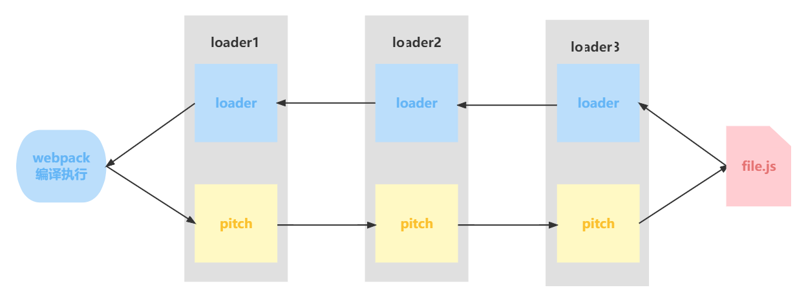
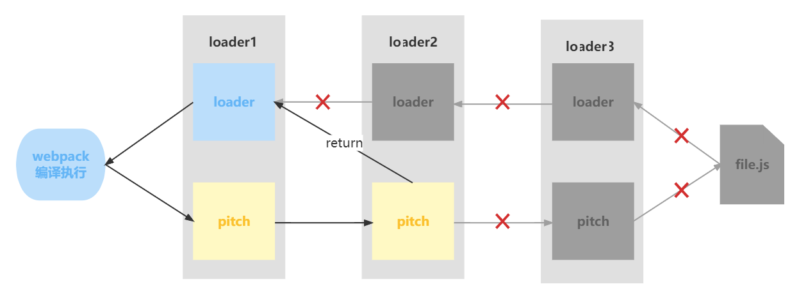

# Webpack loader

文档：[https://webpack.docschina.org/api/loaders](https://webpack.docschina.org/api/loaders)

loader 将不同类型的文件转换为 webpack 可识别的模块

示例代码：[https://github.com/mouday/webpack-loader-plugins](https://github.com/mouday/webpack-loader-plugins)

## loader 使用方式

1. 配置方式： pre、normal、post (推荐使用)
2. 内联方式： inline

### 配置方式

```js
module: {
  rules: [
    {
      test: /\.js$/,
      loader: "babel-loader",
    },
  ]
}
```

### 内联方式

使用 `!` 将资源中的 loader 分开

```js
import style from "style-loader!css-loader?modules!./style.css";
```

内联方式跳过配置方式的 loader

```js
// !  跳过 normal loader。
import style from "!style-loader!css-loader?modules!./style.css";

// -! 跳过 pre 和 normal loader。
import style from "-!style-loader!css-loader?modules!./style.css";

// !! 跳过 pre、 normal 和 post loader。
import style from "!!style-loader!css-loader?modules!./style.css";
```

## loader 执行优先级

### 默认优先级

```bash
pre：    前置 loader
normal： 普通 loader
inline： 内联 loader
post：   后置 loader
```

### 相同优先级

从右到左，从下到上

```js
// 此时loader执行顺序：loader3 - loader2 - loader1
module: {
  rules: [
    {
      test: /\.js$/,
      loader: "loader1",
    },
    {
      test: /\.js$/,
      loader: "loader2",
    },
    {
      test: /\.js$/,
      loader: "loader3",
    },
  ],
},
```

### 指定优先级

```js
// 此时loader执行顺序：loader1 - loader2 - loader3
module: {
  rules: [
    {
      enforce: "pre",
      test: /\.js$/,
      loader: "loader1",
    },
    {
      // 没有enforce就是normal
      test: /\.js$/,
      loader: "loader2",
    },
    {
      enforce: "post",
      test: /\.js$/,
      loader: "loader3",
    },
  ],
}

```

## 开发一个 loader

项目结构

```bash
$ tree
.
├── loaders
│   └── test-laoder.js
├── package.json
├── pnpm-lock.yaml
├── src
│   └── index.js
└── webpack.config.js
```

项目文件

```js
// loaders/test-laoder.js
/**
 *
 * @param {*} content 源文件的内容
 * @param {*} map SourceMap 数据
 * @param {*} meta 数据，可以是任何内容
 * @returns
 */
module.exports = function loader(content, map, meta) {
  console.log("hello loader");
  return content;
};
```

package.json

```json
{
  "dependencies": {
    "webpack": "^5.72.1",
    "webpack-cli": "^4.9.2"
  }
}
```

```js
// webpack.config.js
const path = require("path");

module.exports = {
  entry: "./src/index.js",

  output: {
    path: path.resolve(__dirname, "dist"),
    filename: "bundle.js",
    clean: true,
  },

  module: {
    rules: [
      {
        test: /\.js$/,
        loader: "./loaders/test-laoder.js",
      },
    ],
  },

  plugins: [],

  mode: "development",
};
```

```js
// src/index.js
console.log("Hello World");
```

编译打包

```bash
# 安装依赖
$ pnpm add webpack webpack-cli

# 运行打包
$ npx webpack --config webpack.config.js
hello loader
```


## loader 分类

### 同步 loader

```js
module.exports = function (content, map, meta) {
  return content;
};
```

callback方式

```js
module.exports = function (content, map, meta) {
  // 第一个参数：err 错误
  this.callback(null, content, map, meta);
};
```

### 异步 loader

```js
module.exports = function (content, map, meta) {
  const callback = this.async();
  
  // 进行异步操作
  setTimeout(() => {
    callback(null, content, map, meta);
  }, 1000);
};
```

### Raw Loader

通常用于处理图片资源

```js
module.exports = function (content) {
  // content是一个Buffer数据
  return content;
};

// 开启 Raw Loader
module.exports.raw = true; 
```

### Pitching Loader

```js
module.exports = function (content) {
  return content;
};

module.exports.pitch = function (remainingRequest, precedingRequest, data) {
  console.log("do somethings");
};
```

webpack完整的loader执行顺序



loader提前返回



## loader API

|方法名	| 含义	| 用法
|- | - | - 
this.async|	异步回调 loader。返回 this.callback |	const callback = this.async()
this.callback	|可以同步或者异步调用的并返回多个结果的函数	|this.callback(err, content, sourceMap?, meta?)
this.getOptions(schema)	|获取 loader 的 options	|this.getOptions(schema)
this.emitFile	|产生一个文件	|this.emitFile(name, content, sourceMap)
this.utils.contextify	|返回一个相对路径	|this.utils.contextify(context, request)
this.utils.absolutify	|返回一个绝对路径	|this.utils.absolutify(context, request)

文档：[https://webpack.docschina.org/api/loaders/](https://webpack.docschina.org/api/loaders/)

## 手写示例

### clean-log-loader

去除`console.log` 语句

```js
// console-log-laoder.js
module.exports = function (content, map, meta) {
  return content.replace(/console\.log\(.*\);?/g, '');
};
```
使用

```js
// webpack.config.js

module.exports = {
  module: {
    rules: [
      {
        test: /\.js$/,
        loader: "./loaders/console-log-laoder.js",
      },
    ],
  },
};

```

### banner-loader

给内容中增加一个作者信息

```js
// banner-loader/index.js
const schema = require("./schema.json");

module.exports = function (content, map, meta) {
  // schema对options进行规则校验
  const options = this.getOptions(schema);
  
  const prefix = `
       /**
       * Author: ${options.author}
       **/
    `;
  return prefix + content;
};

```

参数验证规则 banner-loader/schema.json

```json
{
  "type": "object",
  "properties": {
    "author": {
      "type": "string"
    }
  },
  "additionalProperties": false
}
```

说明：
```json
// 是否允许额外的属性
"additionalProperties": false
```

使用

```js
// webpack.config.js

module.exports = {
  module: {
    rules: [
      {
        test: /\.js$/,
        loader: "./loaders/banner-loader/index.js",
        options: {
          author: "曹操"
        },
      },
    ],
  },
};

```

### babel-loader

自定义babel-loader,转换ES6语法

```bash
npm i -D @babel/preset-env @babel/core
```

```js
// babel-loader/index.js
const babel = require("@babel/core");

const schema = require("./schema.json");

// https://www.babeljs.cn/docs/babel-core

module.exports = function (content, map, meta) {
  // 异步loader
  const callback = this.async();

  // schema对options进行规则校验
  const options = this.getOptions(schema);

  // 使用babel 对代码进行编译
  babel.transform(content, options, function (err, result) {
    if (err) {
      callback(err);
    } else {
      callback(null, result.code);
    }
  });
};

```

参数校验规则 babel-loader/schema.json
```json
{
  "type": "object",
  "properties": {
    "presets": {
      "type": "array"
    }
  },
  "additionalProperties": true
}

```

入口文件

```js
// src/index.js

function sum(...args) {
  return args.reduce((x, y) => x + y, 0);
}

```

使用

```js
// webpack.config.js

module.exports = {
  module: {
    rules: [
      {
        test: /\.js$/,
        loader: "./loaders/babel-loader/index.js",
        options: {
          presets: [
            '@babel/preset-env'
          ],
        },
      },
    ],
  }
};

```


### file-loader

使用webpack提供的loader工具

```
$ pnpm i -D loader-utils
```

```js
// file-loader.js

// https://github.com/webpack/loader-utils
const loaderUtils = require("loader-utils");

module.exports = function (content) {

  // 1、根据文件内容生成带hash的文件名
  const interpolatedName = loaderUtils.interpolateName(
    this,
    "[hash].[ext][query]",
    { content }
  );

  // 2、将文件输出
  this.emitFile(interpolatedName, content)

  // 3、返回文件名
  return `module.exports = "${interpolatedName}"`;
};

// raw loader 处理图片资源，content输入为Buffer类型
module.exports.raw = true;
```


使用

```js
// src/index.js

import './style.css';

```

```css
/* style.css */
.box {
  width: 200px;
  height: 200px;
  /* css 文件中使用图片资源 */
  background-image: url("./girl.png");
}

```

```js
// webpack.config.js
module.exports = {
  module: {
    rules: [
      // 处理图片资源
      {
        test: /\.(png|jpe?g|gif)$/,
        loader: "./loaders/file-loader/index.js",
        // 不使用 asset 模块处理，避免生成重复资源
        type: 'javascript/auto'
      },
      // 处理css资源
      {
        test: /\.css$/,
        use: [
          'style-loader',
          'css-loader',
        ]
      },
    ],
  },
};

```

css代码替换如下
```css
.box {
    width: 200px;
    height: 200px;
    background-image: url(/39e33252eac24cf9.png);
}
```

### style-loader

在file-loader 的基础上继续

定义loader, 将css插入到body中

```js
// style-loader.js

module.exports = function () {};

module.exports.pitch = function (remainingRequest) {
  // remainingRequest 剩余的还要处理的loader

  //   console.log(remainingRequest);
  //   _modules/css-loader/dist/cjs.js!/root/webpack-loader/src/style.css

  // 将绝对路径转换为相对路径
  const relativePath = remainingRequest
    .split("!")
    .map((absolutePath) => {
      return this.utils.contextify(this.context, absolutePath);
    })
    .join("!");

  console.log(relativePath);

  // 引入css-loader处理后的资源
  // 创建style标签，将内容插入到页面中
  const script = `
        import style from '!!${relativePath}';

        const styleElement = document.createElement('style');
        styleElement.innerHTML = style;
        document.head.appendChild(styleElement); 
    `;

  // 终止后面的loader执行
  return script;
};

```

使用

```js
// webpack.config.js
const path = require("path");
const HtmlWebpackPlugin = require('html-webpack-plugin');

module.exports = {
  entry: "./src/index.js",

  output: {
    path: path.resolve(__dirname, "dist"),
    filename: "bundle.js",
    clean: true,
  },

  module: {
    rules: [
      {
        test: /\.(png|jpe?g|gif)$/,
        loader: "./loaders/file-loader/index.js",
        // 不使用 asset 模块处理，避免生成重复资源
        type: 'javascript/auto'
      },
      {
        test: /\.css$/,
        use: [
          './loaders/style-loader/index.js',
          'css-loader',
        ]
      },
    ],
  },

  plugins: [
    new HtmlWebpackPlugin({
      template: './src/index.html',
    }),
  ],

  mode: "development",
};

```
