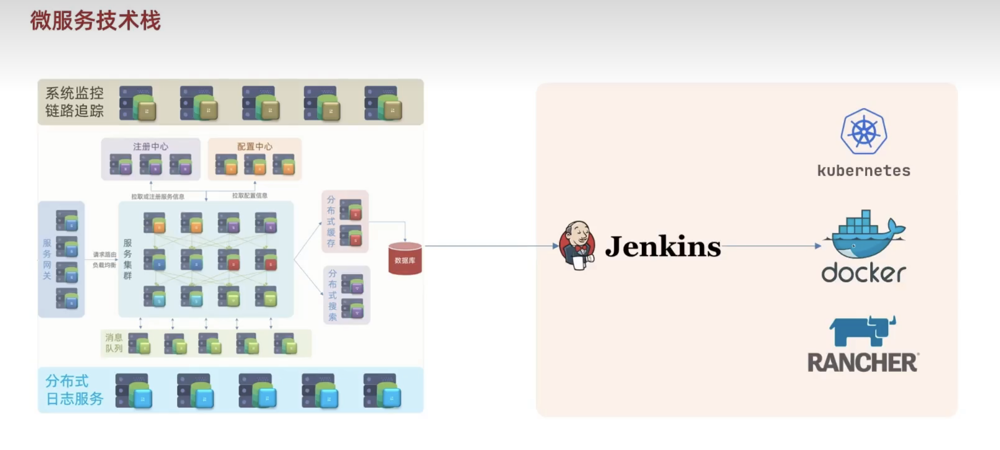
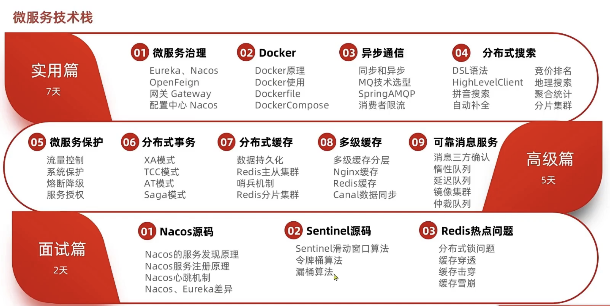

[返回目录](/blog/microservices/index)

# 认识微服务

## 微服务演变

### 单体架构 

所有的业务功能集中在一个项目中开发，打成一个包部署

优点
- 架构简单
- 部署成本低

缺点
- 耦合度高

### 分布式架构

按照业务功能对系统进行拆分，每个业务模块作为独立项目开发，称为一个服务

优点
- 降低服务耦合
- 有利于服务升级拓展

## 服务治理

- 服务拆分粒度
- 服务集群地址维护
- 服务之间实现远程调用
- 服务健康状态感知

## 微服务

一种经过良好架构设计的分布式架构方案

特征
- 单一职责 唯一的业务
- 面向服务 对外暴露业务接口
- 自治 团队独立，技术独立，数据独立，部署独立
- 隔离性强：容错、降级、避免级联问题

## 微服务结构

SpringCloud、阿里巴巴Dubbo

- 服务网关
- 服务集群
- 注册中心
- 配置中心

## 微服务技术对比

| - | Dubbo | SpringCloud | SpringCloudAlibaba |
| - | - | - | - | 
| 注册中心  | zookeeper、Redis | Eureka、Consul | Nacos、Eureka
| 服务远程调用 | Dubbo协议 | Feign（http协议） | Dubbo、Feign
| 配置中心 | 无 | SpringCloudConfig | SpringCloudConfig、Nacos
| 服务网关 | 无 | SpringCloudGateway、Zuul | SpringCloudGateway、Zuul
| 服务监控和保护 | dubbo-admin | Hystrix | Sentinel

## 企业需求

- SpringCloud + Feign
- SpringCloudAlibaba + Feign
- SpringCloudAlibaba + Dubbo
- Dubbo原始模式

## SpringCloud

SpringCloud 和 SpringBoot版本兼容

