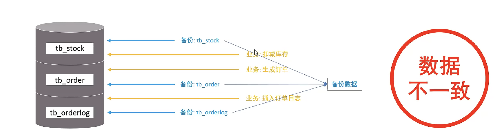
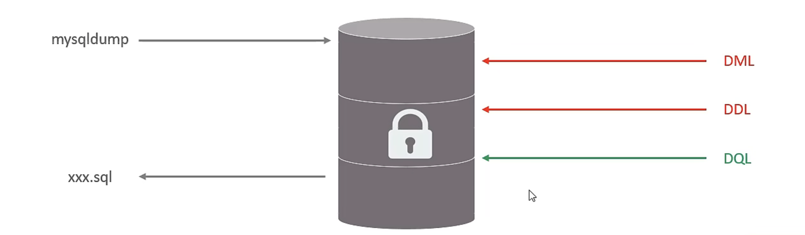

# 锁

1. 概述
2. 全局锁
3. 表级锁
4. 行级锁

## 1、概述

锁是计算机协调多个进程或线程并发访问某一资源的机制。

### 1.1、分类：

MySQL 按照锁的粒度分：

1. 全局锁：锁定数据库中的所有表
2. 表级锁：每次操作锁住整张表
3. 行级锁：每次操作锁住对应的行数据

## 2、全局锁

全局锁就是对整个数据库实例加锁，加锁后整个实例就处于`只读`状态，后续的DML的写语句，DDL语句，以及更新操作的事务提交语句都将被阻塞

其典型的使用场景是做全库的逻辑备份，对所有的表进行锁定，从而获取一致性视图，保证数据的完整性

不加锁操作数据



加锁操作数据



语法

```sql
-- 增加全局锁
flush tables with read lock;

-- 备份数据
mysqldump -uroot -p123456 <database> > database.sql 

-- 解锁
unlock tables;
```

特点：

数据库中加全局锁，是一个比较重的操作，存在以下问题

1. 如果在主库上备份，那么在备份期间都不能执行更新，业务基本上就得停摆
2. 如果在从库上备份，那么在备份期间从库不能执行主库同步过来的二进制日志（binlog）,会导致主从延迟

在InnoDB引擎中，我们可以在备份时加上参数 `--single-transaction` 来完成不加锁的一致性数据备份

语法

```bash
mysqldump --single-transaction -uroot -p123456 database > database.sql
```

## 3、表级锁

- 表级锁，每次操作锁住整张表。

- 锁定粒度大，发生锁冲突的概率最高，并发度最低。

- 应用在MyISAM、InnoDB、BDB等存储引擎中


对于表级锁，主要分为以下三类

1. 表锁
2. 元数据锁（meta data lock, MDL）
3. 意向锁

### 3.1、表锁

对于表锁，分为以下两类

|锁分类 | 当前客户端 | 其他客户端
| - | - | - 
|表共享读锁（read lock）| 可以读取，不能写入 | 可以读取，阻塞写入
|表独占写锁（write lock）| 可以读取，可以写入 | 阻塞读取，阻塞写入

语法
```sql
-- 1. 加锁
lock tables 表名... read/write;

-- 2. 释放锁
unlock tables / 客户端断开连接
```


## 4、行级锁

