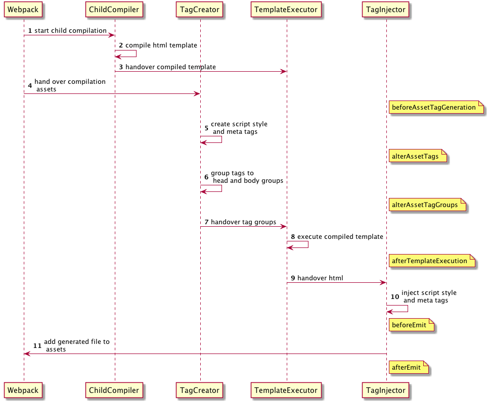

# webpack-plugin

插件作用: 扩展 webpack

文档：[https://webpack.docschina.org/api/plugins](https://webpack.docschina.org/api/plugins)

示例代码：[https://github.com/mouday/webpack-loader-plugins](https://github.com/mouday/webpack-loader-plugins)

### 钩子

钩子的本质就是：事件

### Tapable 

Tapable 为 webpack 提供了统一的插件接口（钩子）类型定义

统一暴露了三个方法给插件，用于注入不同类型的自定义构建行为：

- tap：可以注册同步钩子和异步钩子。
- tapAsync：回调方式注册异步钩子。
- tapPromise：Promise 方式注册异步钩子。


### compiler 

compiler 对象中保存着完整的 Webpack 环境配置，每次启动 webpack 构建时它都是一个独一无二，仅仅会创建一次的对象。

主要属性：

- compiler.options 可以访问本次启动 webpack 时候所有的配置文件，包括但不限于 loaders 、 entry 、 output 、 plugin 等等完整配置信息。
- compiler.inputFileSystem 和 compiler.outputFileSystem 可以进行文件操作，相当于 Nodejs 中 fs。
- compiler.hooks 可以注册 tapable 的不同种类 Hook，从而可以在 compiler 生命周期中植入不同的逻辑。

### Compilation

compilation 对象代表一次资源的构建，compilation 实例能够访问所有的模块和它们的依赖。

主要属性：

- compilation.modules 可以访问所有模块，打包的每一个文件都是一个模块。
- compilation.chunks chunk 即是多个 modules 组成而来的一个代码块。入口文件引入的资源组成一个 chunk，通过代码分割的模块又是另外的 chunk。
- compilation.assets 可以访问本次打包生成所有文件的结果。
- compilation.hooks 可以注册 tapable 的不同种类 Hook，用于在 compilation 编译模块阶段进行逻辑添加以及修改。

### 生命周期简图


## 第一个插件

执行流程：

1. webpack 加载 webpack.config.js 中的所有配置，此时就会`new TestPlugin()`，执行插件的`constructor`
2. webpack 创建 compiler 对象
3. 遍历所有 plugins 中的插件，调用插件的 apply 方法
4. 执行剩下的编译流程，触发各个 hooks 时间

```js
// plugins/test-plugin.js
class TestPlugin {
  constructor() {
    console.log("TestPlugin constructor");
  }

  apply(compiler) {
    console.log("TestPlugin apply");
  }
}

module.exports = TestPlugin;
```

使用插件

```js
// webpack.config.js
const path = require("path");
const TestPlugin = require("./plugins/test-plugin.js");

module.exports = {
  entry: "./src/index.js",

  output: {
    path: path.resolve(__dirname, "dist"),
    filename: "bundle.js",
    clean: true,
  },

  module: {},

  plugins: [new TestPlugin()],

  mode: "development",
};
```

compiler 钩子： [https://webpack.docschina.org/api/compiler-hooks/](https://webpack.docschina.org/api/compiler-hooks/)

注册钩子

```js
// plugins/test-plugin.js
class TestPlugin {
  constructor() {
    console.log("TestPlugin constructor");
  }

  apply(compiler) {
    console.log("TestPlugin apply");

    // 从文档可知, environment hook 是 SyncHook,
    // 也就是同步钩子, 只能用tap注册
    compiler.hooks.environment.tap("TestPlugin", (compilationParams) => {
      console.log("compiler.environment()");
    });

    // 从文档可知, emit 是 AsyncSeriesHook,
    // 也就是异步串行钩子，特点就是异步任务顺序执行
    compiler.hooks.emit.tap("TestPlugin", (compilation) => {
      console.log("compiler.emit() 111");
    });

    compiler.hooks.emit.tapAsync("TestPlugin", (compilation, callback) => {
      setTimeout(() => {
        console.log("compiler.emit() 222");
        callback();
      }, 2000);
    });

    compiler.hooks.emit.tapPromise("TestPlugin", (compilation) => {
      return new Promise((resolve) => {
        setTimeout(() => {
          console.log("compiler.emit() 333");
          resolve();
        }, 1000);
      });
    });

    // 从文档可知, make 是 AsyncParallelHook,
    // 也就是异步并行钩子, 特点就是异步任务同时执行
    // 可以使用 tap、tapAsync、tapPromise 注册。
    // 如果使用tap注册的话，进行异步操作是不会等待异步操作执行完成的。
    compiler.hooks.make.tap("TestPlugin", (compilation) => {
      setTimeout(() => {
        console.log("compiler.make() 111");
      }, 2000);
    });

    // 使用tapAsync、tapPromise注册，进行异步操作会等异步操作做完再继续往下执行
    compiler.hooks.make.tapAsync("TestPlugin", (compilation, callback) => {
      setTimeout(() => {
        console.log("compiler.make() 222");
        // 必须调用
        callback();
      }, 1000);
    });

    compiler.hooks.make.tapPromise("TestPlugin", (compilation) => {
      // 必须返回promise
      return new Promise((resolve) => {
        setTimeout(() => {
          console.log("compiler.make() 333");
          resolve();
        }, 1000);
      });
    });
  }
}

module.exports = TestPlugin;
```

## Node.js 调试 debugger

package.json

```json
{
  "scripts": {
    "debug": "node --inspect-brk ./node_modules/webpack-cli/bin/cli.js"
  }
}
```

参数说明

```
--inspect-brk 启动调试，首行打断点
```

运行指令

```bash
npm run debug
```

打开 Chrome 浏览器任意页面，打开调试面板,找到 Node 的绿色图标

可以在代码任意位置打断点

```js
debugger;
```

## BannerWebpackPlugin

给打包输出文件添加注释

```js
// plugins/banner-webpack-plugin.js
class BannerWebpackPlugin {
  constructor(options = {}) {
    this.options = options;
  }

  apply(compiler) {
    // 需要处理文件
    const extensions = ["js", "css"];

    // 前缀注释
    const prefix = `/*
* Author: ${this.options.author}
*/\n`;

    // emit是异步串行钩子
    compiler.hooks.emit.tapAsync(
      "BannerWebpackPlugin",
      (compilation, callback) => {
        // compilation.assets包含所有即将输出的资源
        // 通过过滤只保留需要处理的文件
        const assetPaths = Object.keys(compilation.assets).filter(
          (assetPath) => {
            const splitted = assetPath.split(".");
            return extensions.includes(splitted[splitted.length - 1]);
          }
        );

        // 遍历需要处理的资源，添加注释
        assetPaths.forEach((assetPath) => {
          // 获取文件内容
          const source = compilation.assets[assetPath].source();

          // 添加注释
          const content = prefix + source;

          // 覆盖资源
          compilation.assets[assetPath] = {
            // 资源内容
            source() {
              return content;
            },
            // 资源大小
            size() {
              return content.length;
            },
          };
        });

        callback();
      }
    );
  }
}

module.exports = BannerWebpackPlugin;
```

使用

```js
// webpack.config.js
const path = require("path");
const BannerWebpackPlugin = require("./plugins/banner-webpack-plugin.js");

module.exports = {
  entry: "./src/index.js",

  output: {
    path: path.resolve(__dirname, "dist"),
    filename: "bundle.js",
    clean: true,
  },

  module: {},

  plugins: [
    new BannerWebpackPlugin({
      author: "老王",
    }),
  ],

  // mode: "development",
  mode: "production",
};
```

## CleanWebpackPlugin

在 webpack 打包输出前将上次打包内容清空。

```js
// plugins/clean-webpack-plugin.js
class CleanWebpackPlugin {
  apply(compiler) {
    // 获取操作文件的对象
    const fs = compiler.outputFileSystem;
    // emit是异步串行钩子
    compiler.hooks.emit.tapAsync(
      "CleanWebpackPlugin",
      (compilation, callback) => {
        // 获取输出文件目录
        const outputPath = compiler.options.output.path;
        // 删除目录所有文件
        const err = this.removeFiles(fs, outputPath);
        // 执行成功err为undefined，执行失败err就是错误原因
        callback(err);
      }
    );
  }

  removeFiles(fs, path) {
    try {
      // 读取当前目录下所有文件
      const files = fs.readdirSync(path);

      // 遍历文件，删除
      files.forEach((file) => {
        // 获取文件完整路径
        const filePath = `${path}/${file}`;
        // 分析文件
        const fileStat = fs.statSync(filePath);
        // 判断是否是文件夹
        if (fileStat.isDirectory()) {
          // 是文件夹需要递归遍历删除下面所有文件
          this.removeFiles(fs, filePath);
        } else {
          // 不是文件夹就是文件，直接删除
          fs.unlinkSync(filePath);
        }
      });

      // 最后删除当前目录
      fs.rmdirSync(path);
    } catch (e) {
      // 将产生的错误返回出去
      return e;
    }
  }
}

module.exports = CleanWebpackPlugin;
```

使用

```js
// webpack.config.js
const path = require("path");

const CleanWebpackPlugin = require("./plugins/clean-webpack-plugin.js");

module.exports = {
  entry: "./src/index.js",

  output: {
    path: path.resolve(__dirname, "dist"),
    filename: "bundle.js",
    clean: true,
  },

  module: {},

  plugins: [new CleanWebpackPlugin()],

  // mode: "development",
  mode: "production",
};
```

## AnalyzeWebpackPlugin

分析 webpack 打包资源大小，并输出分析文件。

```js
// plugins/analyze-webpack-plugin.js

class AnalyzeWebpackPlugin {
  apply(compiler) {
    // emit是异步串行钩子
    compiler.hooks.emit.tap("AnalyzeWebpackPlugin", (compilation) => {
      // Object.entries将对象变成二维数组。二维数组中第一项值是key，第二项值是value

      let list = ["# 分析打包资源大小", "", "| 名称 | 大小 |", "| --- | --- |"];

      for (let [filename, file] of Object.entries(compilation.assets)) {
        list.push(`| ${filename} | ${Math.ceil(file.size() / 1024)}KB |`);
      }

      let source = list.join("\n");

      // 生成一个md文件
      compilation.assets["analyze.md"] = {
        source() {
          return source;
        },
        size() {
          return source.length;
        },
      };
    });
  }
}

module.exports = AnalyzeWebpackPlugin;
```

使用

```js
// webpack.config.js
const path = require("path");

const AnalyzeWebpackPlugin = require("./plugins/analyze-webpack-plugin.js");

module.exports = {
  entry: "./src/index.js",

  output: {
    path: path.resolve(__dirname, "dist"),
    filename: "bundle.js",
    clean: true,
  },

  module: {},

  plugins: [new AnalyzeWebpackPlugin()],

  // mode: "development",
  mode: "production",
};
```

## InlineChunkWebpackPlugin

webpack 打包生成的 runtime 文件太小了，额外发送请求性能不好，所以需要将其内联到 js 中，从而减少请求数量。

html-webpack-plugin 执行流程



```
pnpm i safe-require -D
```

```js
// plugins/inline-chunk-webpack-plugin.js
const HtmlWebpackPlugin = require("safe-require")("html-webpack-plugin");

class InlineChunkWebpackPlugin {
  constructor(tests) {
    this.tests = tests;
  }

  apply(compiler) {
    compiler.hooks.compilation.tap(
      "InlineChunkWebpackPlugin",
      (compilation) => {
        // 获取html-webpack-plugin插件实例
        const hooks = HtmlWebpackPlugin.getHooks(compilation);

        // 注册一个钩子，在html-webpack-plugin插件生成html文件时调用
        hooks.alterAssetTagGroups.tap("InlineChunkWebpackPlugin", (assets) => {
          assets.headTags = this.getInlineTag(
            assets.headTags,
            compilation.assets
          );
          assets.bodyTags = this.getInlineTag(
            assets.bodyTags,
            compilation.assets
          );
        });

        // 删除runtime文件
        hooks.afterEmit.tap("InlineChunkHtmlPlugin", () => {
          Object.keys(compilation.assets).forEach((assetName) => {
            if (this.tests.some((test) => assetName.match(test))) {
              delete compilation.assets[assetName];
            }
          });
        });
      }
    );
  }

  // 将html-webpack-plugin生成的html文件中的link和script标签提取出来
  getInlineTag(tags, assets) {
    /**
     * 
     * 输入
     * [
        {
            tagName: 'script',
            voidTag: false,
            meta: { plugin: 'html-webpack-plugin' },
            attributes: { defer: true, type: undefined, src: 'runtime-main.js' }
        }
      ]

      输出：
      [
        {
            tagName: 'script',
            innerHTML: 'runtime的文件内容',
            closeTag: true,
        }
      ]
     */
    return tags.map((tag) => {
      if (tag.tagName !== "script") return tag;

      // 文件路径
      const scriptName = tag.attributes.src;

      if (!this.tests.some((test) => scriptName.match(test))) return tag;

      return {
        tagName: "script",
        innerHTML: assets[scriptName].source(),
        closeTag: true,
      };
    });
  }
}

module.exports = InlineChunkWebpackPlugin;

```

使用
```js
// webpack.config.js
const path = require("path");
const HtmlWebpackPlugin = require("html-webpack-plugin");

const InlineChunkWebpackPlugin = require("./plugins/inline-chunk-webpack-plugin.js");

module.exports = {
  entry: "./src/index.js",

  output: {
    path: path.resolve(__dirname, "dist"),
    filename: "[name].js",
    clean: true,
  },

  module: {
   
  },

  optimization: {
    splitChunks: {
      chunks: "all",
    },
    runtimeChunk: {
      name: (entrypoint) => `runtime-${entrypoint.name}`,
    },
  },

  plugins: [
    new HtmlWebpackPlugin({
      template: "./src/index.html",
    }),
    new InlineChunkWebpackPlugin([/runtime(.*)\.js$/g]),
  ],

  // mode: "development",
  mode: "production",
};

```
https://www.bilibili.com/video/BV14T4y1z7sw?p=84&spm_id_from=pageDriver
