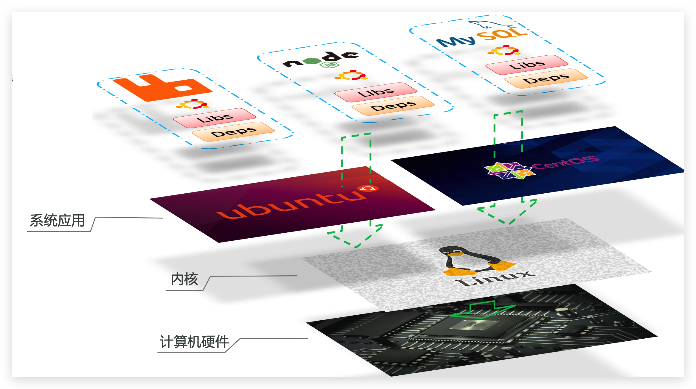

[返回目录](/blog/docker/index)

# 一、初识Docker

## 1、什么是Docker

- Docker允许开发中将应用、Deps依赖、Libs函数库、配置一起`打包`，形成可移植`镜像`
- Docker应用运行在`容器`中，使用沙箱机制，相互`隔离`

## 2、Docker和虚拟机的区别

Docker和虚拟机的差异：

- docker是一个系统进程；虚拟机是在操作系统中的操作系统
- docker体积小、启动速度快、性能好；虚拟机体积大、启动速度慢、性能一般

## 3、Docker架构

镜像（Image）：Docker将应用程序及其所需的依赖、函数库、环境、配置等文件打包在一起

容器（Container）：镜像中的应用程序运行后形成的进程就是容器，只是Docker会给容器进程做隔离，对外不可见。

Docker Registry

 - DockerHub：DockerHub是一个官方的Docker镜像的托管平台。
 - 公开云，比如 [网易云镜像服务](https://c.163yun.com/hub)、[阿里云镜像库](https://cr.console.aliyun.com/)等。
 - 私有云

Docker是一个CS架构的程序：

- 服务端(server)：Docker守护进程，负责处理Docker指令，管理镜像、容器等
- 客户端(client)：通过命令或RestAPI向Docker服务端发送指令。可以在本地或远程向服务端发送指令。

