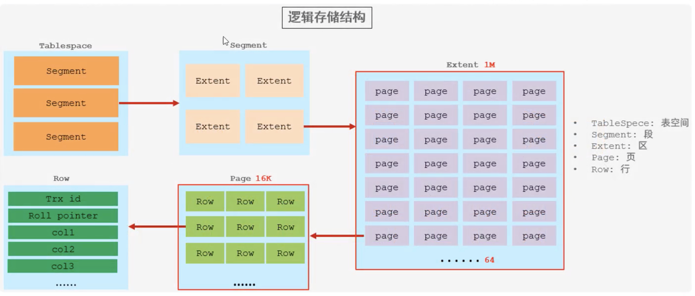
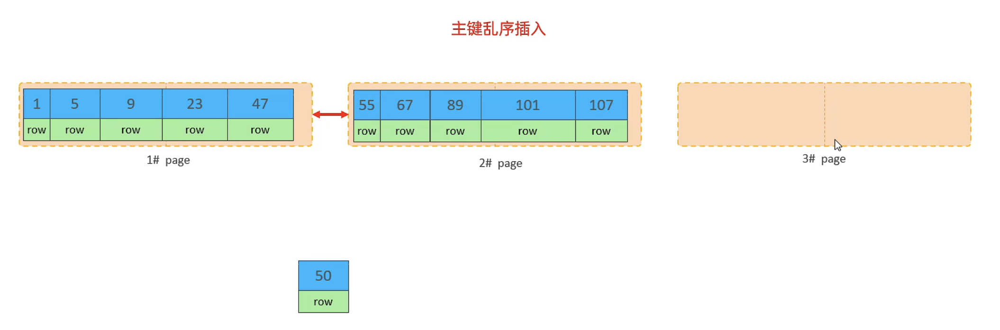
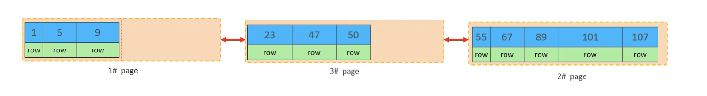
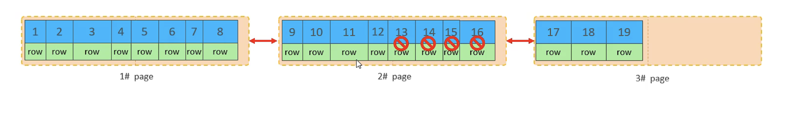

# SQL优化

1. 插入数据
2. 主键优化
3. order by 优化
4. group by 优化
5. limit 优化
6. count 优化
7. update 优化

## 1、插入数据

逐条插入数据，性能较低，耗时较长

```sql
insert into tb_user (name, age) values ('Tom', 23);
insert into tb_user (name, age) values ('Jack', 24);
insert into tb_user (name, age) values ('Steve', 25);
insert into tb_user (name, age) values ('Alice', 23);
...
```

### 1.1、批量插入 

将多条insert语句合并为一条insert语句，批量提交数据

每次插入数据量建议：500-1000

```sql
insert into tb_user (name, age) values 
('Tom', 23), ('Jack', 24), ('Steve', 25) ('Alice', 23);
```

### 1.2、手动事务提交

减少事务开启关闭的次数

```sql
start transaction;
insert into tb_user (name, age) values ('Tom', 23), ('Jack', 24);
insert into tb_user (name, age) values ('Steve', 25) ('Alice', 23);
commit;
```

### 1.3、主键顺序插入

主键顺序插入的性能高于乱序插入

```
主键乱序插入 8 1 9 21 88 2 4 15 89 5 7 3
主键顺序插入 1 2 3 4 5 6 7 8 9 10 88 99
```

### 1.4、大批量插入数据

如果一次性需要插入大批量数据，使用insert语句插入性能较低

可以使用MySQL数据库提供的`load` 指令进行数据插入


```sql
# 客户端连接服务端时，加上参数 `--local-infile`
mysql --local-infile -uroot -p

# 设置全局参数local_infile，开启从本地加载文件导入数据的关
set global local_infile = 1;

# 执行load指令将准备好的数据，加载到表结构中
load data local infile '/root/data.csv' 
into table `tb_user` 
fields terminated by ',' 
lines terminated by '\n';
```

示例

利用Python脚本生成测试数据
```python
# Python >= 3.7.0
# 安装依赖 pip install faker pandas
from faker import Faker
import pandas as pd

# 简体中文：zh_CN
faker = Faker(locale="zh_CN")
# 指定随机种子，确保每次生成的数据都是一致的
faker.seed(1)


def get_row(index=0):
    return {
        'id': index + 1,
        'username': faker.phone_number(),
        'passowrd': faker.password(),
        'name': faker.name(),
        'birthday': faker.date_time().strftime("%Y-%m-%d"),
        'sex': faker.random_int(0, 2),
    }


def main():
    # 100万条数据
    data = [ get_row(i) for i in range(100 * 10000)]
    
    # 将数据导出为csv文件, 不需要表头和序号
    df = pd.DataFrame(data)
    df.to_csv('./data_user.csv',
              header=False,
              index=False)


if __name__ == '__main__':
    main()

```

查看数据

```bash
# 查看要导入的测试数据
$ wc -l data_user.csv 
 1000000 data_user.csv

$ head data_user.csv
1,13891417776,$h!PMHaS1#,魏玉珍,2021-12-20,1
2,18883533740,BP3UqgUd&8,正红梅,2020-08-11,1
3,18225851781,#$mMRcl98H,殳桂芝,1988-04-28,2
4,13190682883,ywDqePXl&0,仰俊,2007-06-25,2
5,13918401107,2!WP4H8it9,农琳,1993-05-13,1
6,13334148396,3%8AqgmG!j,宗涛,2020-03-08,1
7,13830411442,@&%9yI9r%e,荣建平,1977-02-08,2
8,15948705964,y2VGFM0k!W,齐英,1981-07-19,0
9,18983459845,I^5w1D^e)j,安凤英,2008-07-07,0
10,15154981741,@!4A^CIt82,乜峰,2007-06-11,1

```

创建测试表

```sql
# 开启外部数据加载
$ mysql --local-infile -uroot -p

> select @@local_infile;

> set global local_infile = 1;

# 创建一个新的数据库和新的表来存放数据
> show databases;

> create database data_temp;

> user data_temp;

> create table tb_user(
    id int primary key auto_increment,
    username varchar(50) not null,
    passowrd varchar(50) not null,
    name varchar(20) not null,
    birthday date default null,
    sex tinyint default 0,
    unique key uk_user_username (`username`)
) engine=innodb default charset=utf8;
```

导入数据

```sql
> load data local infile '/data/data_user.csv' 
into table `tb_user` 
fields terminated by ',' 
lines terminated by '\n';

Query OK, 999830 rows affected, 170 warnings (17.68 sec)
Records: 1000000  Deleted: 0  Skipped: 170  Warnings: 170
```

查看导入的数据

```sql
mysql> select * from tb_user limit 10;
+----+-------------+------------+-----------+------------+------+
| id | username    | passowrd   | name      | birthday   | sex  |
+----+-------------+------------+-----------+------------+------+
|  1 | 13891417776 | $h!PMHaS1# | 魏玉珍    | 2021-12-20 | 1    |
|  2 | 18883533740 | BP3UqgUd&8 | 正红梅    | 2020-08-11 | 1    |
|  3 | 18225851781 | #$mMRcl98H | 殳桂芝    | 1988-04-28 | 2    |
|  4 | 13190682883 | ywDqePXl&0 | 仰俊      | 2007-06-25 | 2    |
|  5 | 13918401107 | 2!WP4H8it9 | 农琳      | 1993-05-13 | 1    |
|  6 | 13334148396 | 3%8AqgmG!j | 宗涛      | 2020-03-08 | 1    |
|  7 | 13830411442 | @&%9yI9r%e | 荣建平    | 1977-02-08 | 2    |
|  8 | 15948705964 | y2VGFM0k!W | 齐英      | 1981-07-19 | 0    |
|  9 | 18983459845 | I^5w1D^e)j | 安凤英    | 2008-07-07 | 0    |
| 10 | 15154981741 | @!4A^CIt82 | 乜峰      | 2007-06-11 | 1    |
+----+-------------+------------+-----------+------------+------+
10 rows in set (0.00 sec)

mysql> select count(*) from tb_user;
+----------+
| count(*) |
+----------+
|   999830 |
+----------+
1 row in set (0.14 sec)

```

## 2、主键优化

### 2.1、数据组织方式

在InnoDB存储引擎中，表数据都是根据主键顺序组织存放的，

这种存储方式的表称为`索引组织表`（index organized table IOT）





### 2.2、页分裂

页可以为空，也可以填充一半，也可以填充100%。

每个页包含了2-N行数据（如果一行数据太大，会行溢出），根据主键排列

如果插入的数据主键不是顺序的，有可能发生页分裂





### 2.3、页合并

当删除一行记录的时候，实际上记录并没有被物理删除，只是记录被标记（flaged）为删除。

并且它的空间变得允许被其他记录声明使用。

当页中删除的记录达到 MERGE_THRESHOLD (默认为页的50%)，

InnoDB会开始寻找最靠近的页（前或后）看看是否可以将两个页合并优化空间使用。

MERGE_THRESHOLD ： 合并也的阈值，可以自己设置，在创建表或者创建索引时指定




### 2.4、主键设计原则

1. 满足业务需求的情况下，尽量降低主键的长度（二级索引叶子节点存放主键，主键过长会占用大量磁盘空间）

2. 插入数据时，尽量选择顺序插入，选择使用 `auto_increment` 自增主键（不是顺序插入，会造成页分裂）

3. 尽量不要使用UUID做主键或者是其他自然主键，如身份证号（长度较长，耗费磁盘io）

4. 业务操作时，避免对主键的修改


## 3、order by 优化

- using filesort：通过表的索引或全表扫描，读取满足条件的数据行，然后在`排序缓冲区sort buffer`中完成排序操作，所有不是通过索引直接返回排序结果的排序都叫FileSort排序

- using index: 通过有序索引顺序扫描直接返回有序数据，这种情况即为using index,不需要额外排序，操作效率高


测试数据

```sql
-- 查看表数据
mysql> select * from tb_user limit 3;
+----+-----------+-------------+---------------------+------+--------+----------------+
| id | name      | phone       | profession          | age  | status | email          |
+----+-----------+-------------+---------------------+------+--------+----------------+
|  1 | 费阳      | 13777763170 | 法务经理            |   27 |      1 | wyao@gmail.com |
|  2 | 祁海燕    | 13400806360 | 日式厨师            |   23 |      0 | jwan@jin.cn    |
|  3 | 姬秀英    | 18281241586 | 食品/饮料研发       |   29 |      0 | li97@wang.cn   |
+----+-----------+-------------+---------------------+------+--------+----------------+
3 rows in set (0.01 sec)

-- 查看索引
mysql> show index from tb_user;
+---------+------------+--------------------------------+--------------+-------------+-----------+-------------+----------+--------+------+------------+---------+---------------+---------+------------+
| Table   | Non_unique | Key_name                       | Seq_in_index | Column_name | Collation | Cardinality | Sub_part | Packed | Null | Index_type | Comment | Index_comment | Visible | Expression |
+---------+------------+--------------------------------+--------------+-------------+-----------+-------------+----------+--------+------+------------+---------+---------------+---------+------------+
| tb_user |          0 | PRIMARY                        |            1 | id          | A         |        9804 |     NULL |   NULL |      | BTREE      |         |               | YES     | NULL       |
| tb_user |          0 | idx_user_phone                 |            1 | phone       | A         |        9804 |     NULL |   NULL | YES  | BTREE      |         |               | YES     | NULL       |
| tb_user |          0 | idx_user_phone_name            |            1 | phone       | A         |        9804 |     NULL |   NULL | YES  | BTREE      |         |               | YES     | NULL       |
| tb_user |          0 | idx_user_phone_name            |            2 | name        | A         |        9804 |     NULL |   NULL | YES  | BTREE      |         |               | YES     | NULL       |
| tb_user |          1 | idx_user_name                  |            1 | name        | A         |        9130 |     NULL |   NULL | YES  | BTREE      |         |               | YES     | NULL       |
| tb_user |          1 | idx_user_profession_age_status |            1 | profession  | A         |         948 |     NULL |   NULL | YES  | BTREE      |         |               | YES     | NULL       |
| tb_user |          1 | idx_user_profession_age_status |            2 | age         | A         |        6232 |     NULL |   NULL | YES  | BTREE      |         |               | YES     | NULL       |
| tb_user |          1 | idx_user_profession_age_status |            3 | status      | A         |        7596 |     NULL |   NULL | YES  | BTREE      |         |               | YES     | NULL       |
| tb_user |          1 | idx_email_5                    |            1 | email       | A         |        3955 |        5 |   NULL | YES  | BTREE      |         |               | YES     | NULL       |
+---------+------------+--------------------------------+--------------+-------------+-----------+-------------+----------+--------+------+------------+---------+---------------+---------+------------+
9 rows in set (0.03 sec)

-- 删除索引
drop index idx_user_phone on tb_user;

drop index idx_user_phone_name on tb_user;

drop index idx_user_name on tb_user;

show index from tb_user;
+---------+------------+--------------------------------+--------------+-------------+-----------+-------------+----------+--------+------+------------+---------+---------------+---------+------------+
| Table   | Non_unique | Key_name                       | Seq_in_index | Column_name | Collation | Cardinality | Sub_part | Packed | Null | Index_type | Comment | Index_comment | Visible | Expression |
+---------+------------+--------------------------------+--------------+-------------+-----------+-------------+----------+--------+------+------------+---------+---------------+---------+------------+
| tb_user |          0 | PRIMARY                        |            1 | id          | A         |        9804 |     NULL |   NULL |      | BTREE      |         |               | YES     | NULL       |
| tb_user |          1 | idx_user_profession_age_status |            1 | profession  | A         |         948 |     NULL |   NULL | YES  | BTREE      |         |               | YES     | NULL       |
| tb_user |          1 | idx_user_profession_age_status |            2 | age         | A         |        6232 |     NULL |   NULL | YES  | BTREE      |         |               | YES     | NULL       |
| tb_user |          1 | idx_user_profession_age_status |            3 | status      | A         |        7596 |     NULL |   NULL | YES  | BTREE      |         |               | YES     | NULL       |
| tb_user |          1 | idx_email_5                    |            1 | email       | A         |        3955 |        5 |   NULL | YES  | BTREE      |         |               | YES     | NULL       |
+---------+------------+--------------------------------+--------------+-------------+-----------+-------------+----------+--------+------+------------+---------+---------------+---------+------------+
5 rows in set (0.00 sec)
```

索引测试

```sql
-- 没有创建索引时，根据age, phone进行排序 Using filesort 
mysql> explain select id, age, phone from tb_user order by age, phone;
+----+-------------+---------+------------+------+---------------+------+---------+------+------+----------+----------------+
| id | select_type | table   | partitions | type | possible_keys | key  | key_len | ref  | rows | filtered | Extra          |
+----+-------------+---------+------------+------+---------------+------+---------+------+------+----------+----------------+
|  1 | SIMPLE      | tb_user | NULL       | ALL  | NULL          | NULL | NULL    | NULL | 9804 |   100.00 | Using filesort |
+----+-------------+---------+------------+------+---------------+------+---------+------+------+----------+----------------+
1 row in set, 1 warning (0.00 sec)

-- 创建索引
create index idx_user_age_phone on tb_user(age, phone);

-- 创建索引后，根据age进行升序排序
mysql> explain select id, age, phone from tb_user order by age;
+----+-------------+---------+------------+-------+---------------+--------------------+---------+------+------+----------+-------------+
| id | select_type | table   | partitions | type  | possible_keys | key                | key_len | ref  | rows | filtered | Extra       |
+----+-------------+---------+------------+-------+---------------+--------------------+---------+------+------+----------+-------------+
|  1 | SIMPLE      | tb_user | NULL       | index | NULL          | idx_user_age_phone | 52      | NULL | 9804 |   100.00 | Using index |
+----+-------------+---------+------------+-------+---------------+--------------------+---------+------+------+----------+-------------+
1 row in set, 1 warning (0.00 sec)

-- 创建索引后，根据age, phone进行升序排序
mysql> explain select id, age, phone from tb_user order by age, phone;
+----+-------------+---------+------------+-------+---------------+--------------------+---------+------+------+----------+-------------+
| id | select_type | table   | partitions | type  | possible_keys | key                | key_len | ref  | rows | filtered | Extra       |
+----+-------------+---------+------------+-------+---------------+--------------------+---------+------+------+----------+-------------+
|  1 | SIMPLE      | tb_user | NULL       | index | NULL          | idx_user_age_phone | 52      | NULL | 9804 |   100.00 | Using index |
+----+-------------+---------+------------+-------+---------------+--------------------+---------+------+------+----------+-------------+
1 row in set, 1 warning (0.01 sec)

-- 创建索引后，根据age, phone进行降序排序
mysql> explain select id, age, phone from tb_user order by age desc, phone desc;
+----+-------------+---------+------------+-------+---------------+--------------------+---------+------+------+----------+----------------------------------+
| id | select_type | table   | partitions | type  | possible_keys | key                | key_len | ref  | rows | filtered | Extra                            |
+----+-------------+---------+------------+-------+---------------+--------------------+---------+------+------+----------+----------------------------------+
|  1 | SIMPLE      | tb_user | NULL       | index | NULL          | idx_user_age_phone | 52      | NULL | 9804 |   100.00 | Backward index scan; Using index |
+----+-------------+---------+------------+-------+---------------+--------------------+---------+------+------+----------+----------------------------------+
1 row in set, 1 warning (0.00 sec)

-- 交换age，phone的先后位置 出现Using filesort
mysql> explain select id, age, phone from tb_user order by phone, age;
+----+-------------+---------+------------+-------+---------------+--------------------+---------+------+------+----------+-----------------------------+
| id | select_type | table   | partitions | type  | possible_keys | key                | key_len | ref  | rows | filtered | Extra                       |
+----+-------------+---------+------------+-------+---------------+--------------------+---------+------+------+----------+-----------------------------+
|  1 | SIMPLE      | tb_user | NULL       | index | NULL          | idx_user_age_phone | 52      | NULL | 9804 |   100.00 | Using index; Using filesort |
+----+-------------+---------+------------+-------+---------------+--------------------+---------+------+------+----------+-----------------------------+
1 row in set, 1 warning (0.01 sec)

-- age升序排列，phone降序排列，出现Using filesort
mysql> explain select id, age, phone from tb_user order by age asc, phone desc;
+----+-------------+---------+------------+-------+---------------+--------------------+---------+------+------+----------+-----------------------------+
| id | select_type | table   | partitions | type  | possible_keys | key                | key_len | ref  | rows | filtered | Extra                       |
+----+-------------+---------+------------+-------+---------------+--------------------+---------+------+------+----------+-----------------------------+
|  1 | SIMPLE      | tb_user | NULL       | index | NULL          | idx_user_age_phone | 52      | NULL | 9804 |   100.00 | Using index; Using filesort |
+----+-------------+---------+------------+-------+---------------+--------------------+---------+------+------+----------+-----------------------------+
1 row in set, 1 warning (0.00 sec)

-- 创建age升序，phone降序的索引
create index idx_user_age_phone_ad on tb_user(age asc, phone desc);

-- 查看索引 （Collation： A=asc, D=desc）
mysql> show index from tb_user;
+---------+------------+--------------------------------+--------------+-------------+-----------+-------------+----------+--------+------+------------+---------+---------------+---------+------------+
| Table   | Non_unique | Key_name                       | Seq_in_index | Column_name | Collation | Cardinality | Sub_part | Packed | Null | Index_type | Comment | Index_comment | Visible | Expression |
+---------+------------+--------------------------------+--------------+-------------+-----------+-------------+----------+--------+------+------------+---------+---------------+---------+------------+
| tb_user |          0 | PRIMARY                        |            1 | id          | A         |        9804 |     NULL |   NULL |      | BTREE      |         |               | YES     | NULL       |
| tb_user |          1 | idx_user_profession_age_status |            1 | profession  | A         |         948 |     NULL |   NULL | YES  | BTREE      |         |               | YES     | NULL       |
| tb_user |          1 | idx_user_profession_age_status |            2 | age         | A         |        6232 |     NULL |   NULL | YES  | BTREE      |         |               | YES     | NULL       |
| tb_user |          1 | idx_user_profession_age_status |            3 | status      | A         |        7596 |     NULL |   NULL | YES  | BTREE      |         |               | YES     | NULL       |
| tb_user |          1 | idx_email_5                    |            1 | email       | A         |        3955 |        5 |   NULL | YES  | BTREE      |         |               | YES     | NULL       |
| tb_user |          1 | idx_user_age_phone             |            1 | age         | A         |          11 |     NULL |   NULL | YES  | BTREE      |         |               | YES     | NULL       |
| tb_user |          1 | idx_user_age_phone             |            2 | phone       | A         |        9804 |     NULL |   NULL | YES  | BTREE      |         |               | YES     | NULL       |
| tb_user |          1 | idx_user_age_phone_ad          |            1 | age         | A         |          11 |     NULL |   NULL | YES  | BTREE      |         |               | YES     | NULL       |
| tb_user |          1 | idx_user_age_phone_ad          |            2 | phone       | D         |        9804 |     NULL |   NULL | YES  | BTREE      |         |               | YES     | NULL       |
+---------+------------+--------------------------------+--------------+-------------+-----------+-------------+----------+--------+------+------------+---------+---------------+---------+------------+
9 rows in set (0.02 sec)

-- 创建索引后，age升序排列，phone降序排列
mysql> explain select id, age, phone from tb_user order by age asc, phone desc;
+----+-------------+---------+------------+-------+---------------+-----------------------+---------+------+------+----------+-------------+
| id | select_type | table   | partitions | type  | possible_keys | key                   | key_len | ref  | rows | filtered | Extra       |
+----+-------------+---------+------------+-------+---------------+-----------------------+---------+------+------+----------+-------------+
|  1 | SIMPLE      | tb_user | NULL       | index | NULL          | idx_user_age_phone_ad | 52      | NULL | 9804 |   100.00 | Using index |
+----+-------------+---------+------------+-------+---------------+-----------------------+---------+------+------+----------+-------------+
1 row in set, 1 warning (0.00 sec)


-- 如果没有用到覆盖索引，会出现：Using filesort
mysql> explain select * from tb_user order by age asc, phone desc;
+----+-------------+---------+------------+------+---------------+------+---------+------+------+----------+----------------+
| id | select_type | table   | partitions | type | possible_keys | key  | key_len | ref  | rows | filtered | Extra          |
+----+-------------+---------+------------+------+---------------+------+---------+------+------+----------+----------------+
|  1 | SIMPLE      | tb_user | NULL       | ALL  | NULL          | NULL | NULL    | NULL | 9804 |   100.00 | Using filesort |
+----+-------------+---------+------------+------+---------------+------+---------+------+------+----------+----------------+
1 row in set, 1 warning (0.00 sec)
```

### 3.1、优化原则

1. 根据排序字段建立合适的索引，多字段排序时，也遵循最左前缀法则

2. 尽量使用覆盖索引

3. 多字段排序，一个升序一个降序，此时需要注意联合索引在创建时的规则（asc/desc）

4. 如果不可避免的出现filesort, 大数据量排序时，可以适当增大排序缓冲区的大小 sort_buffer_size(默认值256k)

```sql
mysql> show variables like 'sort_buffer_size';
+------------------+--------+
| Variable_name    | Value  |
+------------------+--------+
| sort_buffer_size | 262144 |
+------------------+--------+
1 row in set (0.03 sec)
```

## 4、group by优化

1. 分组操作时，可以通过索引来提高效率

2. 分组操作时，索引的使用也是满足`最左前缀法则`的

示例

```sql
-- 查看索引
show index from tb_user;
+---------+------------+--------------------------------+--------------+-------------+-----------+-------------+----------+--------+------+------------+---------+---------------+---------+------------+
| Table   | Non_unique | Key_name                       | Seq_in_index | Column_name | Collation | Cardinality | Sub_part | Packed | Null | Index_type | Comment | Index_comment | Visible | Expression |
+---------+------------+--------------------------------+--------------+-------------+-----------+-------------+----------+--------+------+------------+---------+---------------+---------+------------+
| tb_user |          0 | PRIMARY                        |            1 | id          | A         |        9804 |     NULL |   NULL |      | BTREE      |         |               | YES     | NULL       |
| tb_user |          1 | idx_user_profession_age_status |            1 | profession  | A         |         948 |     NULL |   NULL | YES  | BTREE      |         |               | YES     | NULL       |
| tb_user |          1 | idx_user_profession_age_status |            2 | age         | A         |        6232 |     NULL |   NULL | YES  | BTREE      |         |               | YES     | NULL       |
| tb_user |          1 | idx_user_profession_age_status |            3 | status      | A         |        7596 |     NULL |   NULL | YES  | BTREE      |         |               | YES     | NULL       |
| tb_user |          1 | idx_email_5                    |            1 | email       | A         |        3955 |        5 |   NULL | YES  | BTREE      |         |               | YES     | NULL       |
| tb_user |          1 | idx_user_age_phone             |            1 | age         | A         |          11 |     NULL |   NULL | YES  | BTREE      |         |               | YES     | NULL       |
| tb_user |          1 | idx_user_age_phone             |            2 | phone       | A         |        9804 |     NULL |   NULL | YES  | BTREE      |         |               | YES     | NULL       |
| tb_user |          1 | idx_user_age_phone_ad          |            1 | age         | A         |          11 |     NULL |   NULL | YES  | BTREE      |         |               | YES     | NULL       |
| tb_user |          1 | idx_user_age_phone_ad          |            2 | phone       | D         |        9804 |     NULL |   NULL | YES  | BTREE      |         |               | YES     | NULL       |
+---------+------------+--------------------------------+--------------+-------------+-----------+-------------+----------+--------+------+------------+---------+---------------+---------+------------+
9 rows in set (0.06 sec)

-- 删除索引
drop index idx_user_profession_age_status on tb_user;

drop index idx_email_5 on tb_user;

drop index idx_user_age_phone on tb_user;

drop index idx_user_age_phone_ad on tb_user;

-- 查看索引
show index from tb_user;
+---------+------------+----------+--------------+-------------+-----------+-------------+----------+--------+------+------------+---------+---------------+---------+------------+
| Table   | Non_unique | Key_name | Seq_in_index | Column_name | Collation | Cardinality | Sub_part | Packed | Null | Index_type | Comment | Index_comment | Visible | Expression |
+---------+------------+----------+--------------+-------------+-----------+-------------+----------+--------+------+------------+---------+---------------+---------+------------+
| tb_user |          0 | PRIMARY  |            1 | id          | A         |        9804 |     NULL |   NULL |      | BTREE      |         |               | YES     | NULL       |
+---------+------------+----------+--------------+-------------+-----------+-------------+----------+--------+------+------------+---------+---------------+---------+------------+
1 row in set (0.01 sec)

-- 执行分组操作，根据profession字段分组
select profession, count(*) from tb_user group by profession;
+---------------------------------------------------+----------+
| profession                                        | count(*) |
+---------------------------------------------------+----------+
| 法务经理                                          |       12 |
| 日式厨师                                          |        7 |
| 食品/饮料研发                                     |        7 |
| 前台接待/总机/接待生                              |       10 |
| 酒店前台                                          |        8 |
| 药品市场推广主管/专员                             |        5 |
| 机场代表                                          |       10 |
+---------------------------------------------------+----------+
948 rows in set (0.02 sec)

-- 查看执行计划 Using temporary
explain select profession, count(*) from tb_user group by profession;
+----+-------------+---------+------------+------+---------------+------+---------+------+------+----------+-----------------+
| id | select_type | table   | partitions | type | possible_keys | key  | key_len | ref  | rows | filtered | Extra           |
+----+-------------+---------+------------+------+---------------+------+---------+------+------+----------+-----------------+
|  1 | SIMPLE      | tb_user | NULL       | ALL  | NULL          | NULL | NULL    | NULL | 9804 |   100.00 | Using temporary |
+----+-------------+---------+------------+------+---------------+------+---------+------+------+----------+-----------------+
1 row in set, 1 warning (0.01 sec)

-- 创建索引
create index idx_user_profession_age_status on tb_user(profession, age, status);

-- 执行分组操作，根据profession字段分组 Using index
explain select profession, count(*) from tb_user group by profession;
+----+-------------+---------+------------+-------+--------------------------------+--------------------------------+---------+------+------+----------+-------------+
| id | select_type | table   | partitions | type  | possible_keys                  | key                            | key_len | ref  | rows | filtered | Extra       |
+----+-------------+---------+------------+-------+--------------------------------+--------------------------------+---------+------+------+----------+-------------+
|  1 | SIMPLE      | tb_user | NULL       | index | idx_user_profession_age_status | idx_user_profession_age_status | 213     | NULL | 9804 |   100.00 | Using index |
+----+-------------+---------+------------+-------+--------------------------------+--------------------------------+---------+------+------+----------+-------------+
1 row in set, 1 warning (0.01 sec)

-- 执行分组操作，根据age字段分组 Using index; Using temporary(临时表，性能较低)
explain select age, count(*) from tb_user group by age;
+----+-------------+---------+------------+-------+--------------------------------+--------------------------------+---------+------+------+----------+------------------------------+
| id | select_type | table   | partitions | type  | possible_keys                  | key                            | key_len | ref  | rows | filtered | Extra                        |
+----+-------------+---------+------------+-------+--------------------------------+--------------------------------+---------+------+------+----------+------------------------------+
|  1 | SIMPLE      | tb_user | NULL       | index | idx_user_profession_age_status | idx_user_profession_age_status | 213     | NULL | 9804 |   100.00 | Using index; Using temporary |
+----+-------------+---------+------------+-------+--------------------------------+--------------------------------+---------+------+------+----------+------------------------------+
1 row in set, 1 warning (0.00 sec)

-- 执行分组操作，根据profession, age字段分组,满足最左前缀法则
explain select profession, age, count(*) from tb_user group by profession, age;
+----+-------------+---------+------------+-------+--------------------------------+--------------------------------+---------+------+------+----------+-------------+
| id | select_type | table   | partitions | type  | possible_keys                  | key                            | key_len | ref  | rows | filtered | Extra       |
+----+-------------+---------+------------+-------+--------------------------------+--------------------------------+---------+------+------+----------+-------------+
|  1 | SIMPLE      | tb_user | NULL       | index | idx_user_profession_age_status | idx_user_profession_age_status | 213     | NULL | 9804 |   100.00 | Using index |
+----+-------------+---------+------------+-------+--------------------------------+--------------------------------+---------+------+------+----------+-------------+
1 row in set, 1 warning (0.01 sec)

-- 增加过滤条件，再根据age字段分组 Using index，满足最左前缀法则
explain select age, count(*) from tb_user where profession = '项目经理' group by age;
+----+-------------+---------+------------+------+--------------------------------+--------------------------------+---------+-------+------+----------+-------------+
| id | select_type | table   | partitions | type | possible_keys                  | key                            | key_len | ref   | rows | filtered | Extra       |
+----+-------------+---------+------------+------+--------------------------------+--------------------------------+---------+-------+------+----------+-------------+
|  1 | SIMPLE      | tb_user | NULL       | ref  | idx_user_profession_age_status | idx_user_profession_age_status | 203     | const |   12 |   100.00 | Using index |
+----+-------------+---------+------------+------+--------------------------------+--------------------------------+---------+-------+------+----------+-------------+
1 row in set, 1 warning (0.00 sec)

```

## 5、limit 优化

当MySQL需要取前2000000条记录时，仅仅返回`2000000- 2000010`的记录，其他记录丢弃，查询排序的代价非常大

优化思路：

一般分页查询时，通过创建`覆盖索引`能够比较好的提高性能，可以通过覆盖索引加子查询形式进行优化


示例

```sql
-- 查看数据总数 1000W条数据
mysql> select count(*) from tb_sku;
+----------+
| count(*) |
+----------+
| 10000000 |
+----------+
1 row in set (3.94 sec)

-- 取第一页数据
mysql> select * from tb_sku limit 0, 10;
+---------+--------------------------------------+
| id      | uuid                                 |
+---------+--------------------------------------+
| 6162096 | 0000012f-4a44-4b8b-93e4-4dcd99ecff22 |
|  112574 | 00000274-d865-40f9-b799-4c0fbdd8a21d |
| 9618175 | 000004a3-3f93-4a7b-8a98-f17468445e3a |
| 3774310 | 000004ea-9025-4ba4-89eb-d30e7e14185e |
| 9781779 | 000007e3-7e71-4e90-b681-fca25137fe08 |
| 4457266 | 0000081b-aa05-4194-af4e-6ad0a750b0ab |
| 3950776 | 00000a39-428c-4cca-aaf7-f9e63889272f |
| 7617466 | 00000c69-b2c5-4f4a-b829-54b208bdce90 |
|  969786 | 00000df2-c3ff-478b-bd6c-a5ebcf94ad11 |
| 9704958 | 00000ec4-2716-4ee4-9165-ba84ecd05050 |
+---------+--------------------------------------+
10 rows in set (0.00 sec)

-- 取第二页数据
mysql> select * from tb_sku limit 10, 10;
+---------+--------------------------------------+
| id      | uuid                                 |
+---------+--------------------------------------+
| 9563294 | 000010f8-f717-44d9-9f7e-acefd48d26b8 |
| 5652396 | 0000112c-0f25-47d3-839b-3b929d0d7adb |
| 1290981 | 0000121a-01ba-47aa-bfa3-e97693a92ad7 |
| 8107372 | 000012c1-6a61-42e6-8769-0bb3dcd61097 |
| 7842196 | 00001375-b43d-407a-9163-ce633ed64592 |
| 2206208 | 00001448-58e8-478b-92a2-c74de197b659 |
| 9808308 | 00001542-00b6-4207-8c67-34ed296996d6 |
| 3282004 | 00001853-abb3-4fb6-ae18-122dc5658fd2 |
|  957944 | 00001a00-c8cd-4492-b919-127345271172 |
| 7964789 | 00001cfe-679d-43f0-bbaa-d21676f45b70 |
+---------+--------------------------------------+
10 rows in set (0.00 sec)

-- 增加分页
mysql> select * from tb_sku limit 9000000, 10;
+---------+--------------------------------------+
| id      | uuid                                 |
+---------+--------------------------------------+
| 7919352 | e65fe47c-c7a7-4440-929d-87d64234b785 |
| 5709825 | e65fe68a-b28e-4a8d-bab8-64c03ed00f37 |
| 4319305 | e65fe6df-1299-4960-9450-515369725171 |
| 1116567 | e65fe75a-3579-49e1-838d-3ce3c5c754f9 |
| 3200374 | e65fe89f-2d5b-4928-8c96-89aeee890418 |
| 8207624 | e65fe9ae-17f4-4383-84a8-6c4913ad81f9 |
|  152637 | e65fee7f-25ce-4169-8d39-6dd4e6a3db57 |
| 8533603 | e65ff27a-fcbf-4d51-b85a-db6322e7b425 |
| 3249838 | e65ff2e4-b442-4f7c-b11c-422832afdef5 |
| 2665508 | e65ff482-664b-49e9-ab8c-017499fd70df |
+---------+--------------------------------------+
10 rows in set (1.87 sec)

mysql> select id from tb_sku order by id limit 9000000, 10;
+---------+
| id      |
+---------+
| 9000001 |
| 9000002 |
| 9000003 |
| 9000004 |
| 9000005 |
| 9000006 |
| 9000007 |
| 9000008 |
| 9000009 |
| 9000010 |
+---------+
10 rows in set (1.65 sec)

-- 不支持分页子查询
mysql> select * from tb_sku where id in (select id from tb_sku order by id limit 9000000, 10);
ERROR 1235 (42000): This version of MySQL doesn't yet support 'LIMIT & IN/ALL/ANY/SOME subquery'

-- 正确的查询方式
mysql> select s.* from tb_sku s, (select id from tb_sku order by id limit 9000000, 10) a where s.id = a.id;
+---------+--------------------------------------+
| id      | uuid                                 |
+---------+--------------------------------------+
| 9000001 | f7b44618-8bd2-4a5f-9cf9-ba6734966905 |
| 9000002 | 86863769-ead4-4e8a-ab81-4c32429dddcf |
| 9000003 | 4471b035-cb9b-4958-ab61-4159ff24df48 |
| 9000004 | a11746eb-482f-4d8d-90fb-32a7e156c34a |
| 9000005 | c5ded2ef-8995-43fb-9332-62c1dd1922bc |
| 9000006 | 4d02f0f5-5e71-4f5c-8006-369ef1dcd6d6 |
| 9000007 | efe87680-b59b-4999-89b7-de4d07704527 |
| 9000008 | 27b2f930-fbb5-476f-a470-1a42bb4e4d2e |
| 9000009 | 7c54b9b0-e41e-439e-b907-8c25ba364e7f |
| 9000010 | 3d576629-d70f-470c-bef3-d3a3c815f0cc |
+---------+--------------------------------------+
10 rows in set (1.59 sec)
```

## 6、count 优化

```sql
select count(*) from tb_user;
```

- MyISAM引擎，把一个表的总行数存在了磁盘上，因此执行`count(*)`的时候会直接返回这个数，效率很高
- InnoDB引擎，执行`count(*)` 的时候，需要把数据一行一行地从引擎里读取出来，让后累计计数

### 6.1、优化思路

自己计数

例如：借助redis，添加数据`+1`, 删除数据`-1`

### 6.2、count的几种用法

`count()` 是一个聚合函数，对于返回的结果集，一行行的判断，如果count函数的参数不是null, 累计值就+1，否则不加，最后返回累计值

用法：

1. `count(*)`
    - InnoDB引擎并不会把全部字段取出来，而是专门做了优化，不取值，服务层直接按行进行累加

2. `count(主键)`
    - InnoDB引擎会遍历整张表，把每一行的主键id值取出来，返回给服务层。服务层拿到主键后，直接按行进行累加
    - 主键不可能为null

3. `count(字段)`
    - 没有`not null`约束: InnoDB引擎会遍历整张表，把每一行的字段值都取出来，返回给服务层，服务层判断是否为null，不为null,计数累加
    - 有`not null`约束: InnoDB引擎会遍历整张表，把每一行的字段值都取出来，返回给服务层，直接按行进行累加

4. `count(1)`
    - InnoDB引擎会遍历整张表，但是不取值。服务层对于返回的每一行，放一个数字`1`进去，直接按行进行累加

效率排序：

```sql
count(字段) < count(主键id) < count(1) ≈ count(*)
```

所以尽量使用: `count(*)`

示例

```sql
mysql> select * from tb_user limit 3;
+----+-----------+-------------+---------------------+------+--------+----------------+
| id | name      | phone       | profession          | age  | status | email          |
+----+-----------+-------------+---------------------+------+--------+----------------+
|  1 | 费阳      | 13777763170 | 法务经理            |   27 |      1 | wyao@gmail.com |
|  2 | 祁海燕    | 13400806360 | 日式厨师            |   23 |      0 | jwan@jin.cn    |
|  3 | 姬秀英    | 18281241586 | 食品/饮料研发       |   29 |      0 | li97@wang.cn   |
+----+-----------+-------------+---------------------+------+--------+----------------+
3 rows in set (0.01 sec)

-- 修改其中一个值为null
update tb_user set profession = null where id = 1;

mysql> select * from tb_user limit 3;
+----+-----------+-------------+---------------------+------+--------+----------------+
| id | name      | phone       | profession          | age  | status | email          |
+----+-----------+-------------+---------------------+------+--------+----------------+
|  1 | 费阳      | 13777763170 | NULL                |   27 |      1 | wyao@gmail.com |
|  2 | 祁海燕    | 13400806360 | 日式厨师            |   23 |      0 | jwan@jin.cn    |
|  3 | 姬秀英    | 18281241586 | 食品/饮料研发       |   29 |      0 | li97@wang.cn   |
+----+-----------+-------------+---------------------+------+--------+----------------+
3 rows in set (0.01 sec)

mysql> select count(*) from tb_user;
+----------+
| count(*) |
+----------+
|    10000 |
+----------+
1 row in set (0.01 sec)

mysql> select count(id) from tb_user;
+-----------+
| count(id) |
+-----------+
|     10000 |
+-----------+
1 row in set (0.00 sec)

mysql> select count(profession) from tb_user;
+-------------------+
| count(profession) |
+-------------------+
|              9999 |
+-------------------+
1 row in set (0.00 sec)

mysql> select count(null) from tb_user;
+-------------+
| count(null) |
+-------------+
|           0 |
+-------------+
1 row in set (0.00 sec)

-- 传递一个数，可以是任何数
mysql> select count(1) from tb_user;
+----------+
| count(1) |
+----------+
|    10000 |
+----------+
1 row in set (0.01 sec)


```


## 7、update 优化

InnoDB的行锁是针对索引加的锁，不是针对记录加的锁，并且该索引不能失效，否则会从行锁升级为表锁。


1、主键作为查询条件更新数据

```sql
select * from tb_course;
+----+--------+
| id | name   |
+----+--------+
|  1 | 语文   |
|  2 | 数学   |
|  3 | 英语   |
|  4 | 历史   |
|  5 | 化学   |
+----+--------+
5 rows in set (0.02 sec)


-- 开启事务1
begin;
update tb_course set name = '语文A' where id = 1;
-- 此时id=1这一行被锁住，添加行锁

-- 新窗口开启事务2
begin;
update tb_course set name = '历史A' where id = 4;

-- 事务1提交
commit;

-- 事务2提交
commit;

select * from tb_course;
+----+---------+
| id | name    |
+----+---------+
|  1 | 语文A   |
|  2 | 数学    |
|  3 | 英语    |
|  4 | 历史A   |
|  5 | 化学    |
+----+---------+
5 rows in set (0.00 sec)
```

2、普通字段作为查询条件更新数据

```sql
-- 开启事务1
begin;
update tb_course set name = '语文B' where name = '语文A';
-- 由于name字段没有索引，添加表锁

-- 新窗口开启事务2
begin;
update tb_course set name = '历史B' where name = '历史A';
-- 此时SQL语句会卡主，不再执行

-- 事务1提交
commit;
-- 此时事务2SQL语句会继续执行

-- 事务2提交
commit;

select * from tb_course;
+----+---------+
| id | name    |
+----+---------+
|  1 | 语文B   |
|  2 | 数学    |
|  3 | 英语    |
|  4 | 历史B   |
|  5 | 化学    |
+----+---------+
5 rows in set (0.00 sec)
```

3、索引字段作为查询条件更新数据
```sql
-- 创建索引
create index idx_course_name on tb_course(name);

-- 开启事务1
begin;
update tb_course set name = '语文C' where name = '语文B';
-- 由于name字段有索引，添加行锁

-- 新窗口开启事务2
begin;
update tb_course set name = '历史C' where name = '历史B';
-- 此时SQL语句没有卡主，执行完成

-- 事务1提交
commit;

-- 事务2提交
commit;

select * from tb_course;
+----+---------+
| id | name    |
+----+---------+
|  5 | 化学    |
|  4 | 历史C   |
|  2 | 数学    |
|  3 | 英语    |
|  1 | 语文C   |
+----+---------+
5 rows in set (0.01 sec)
```

## 8、总结

1、插入数据

- insert 批量插入、手动控制事务、主键顺序插入
- 大批量数据插入：`load data local infile`

2、主键优化

- InnoDB引擎数据组织方式：基于索引
- 页分裂：插入数据(主键乱序插入)
- 页合并：删除数据
- 主键长度尽可能短，顺序插入
- 推荐auto_increment, 避免uuid

3、order by 优化

- using index：直接通过索引返回数据，性能高
- using filesort：需要将返回的结果在排序缓冲区排序,甚至可能用到磁盘文件

- 尽量使用覆盖索引
- 尽量对排序字段建立索引

- 同为升序或同为降序可以用到索引
- 创建索引时注意其排序方式asc/desc

4、group by 优化

- 索引、多字段分组满足最左前缀法则

5、limit 优化

- 覆盖索引 + 子查询 

6、count 优化

- 推荐使用`count(*)`
- 自己计数

7、update 优化

- 根据索引（id）字段更新，避免行锁升级为表锁，降低数据库并发访问性

