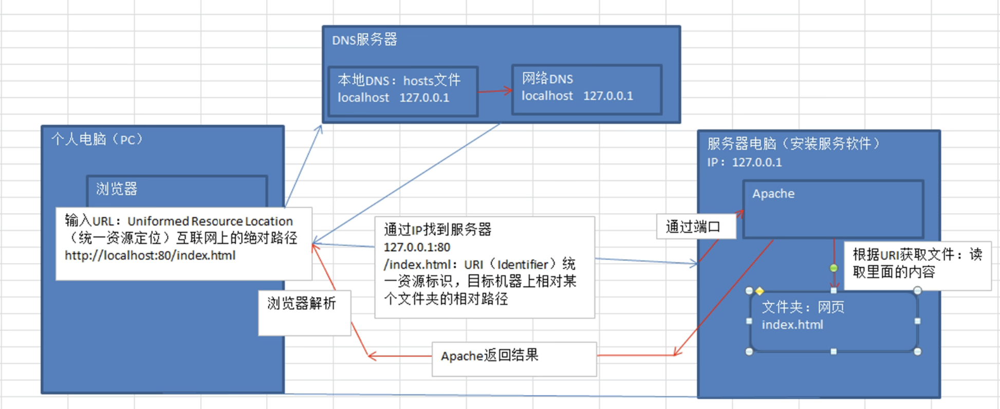
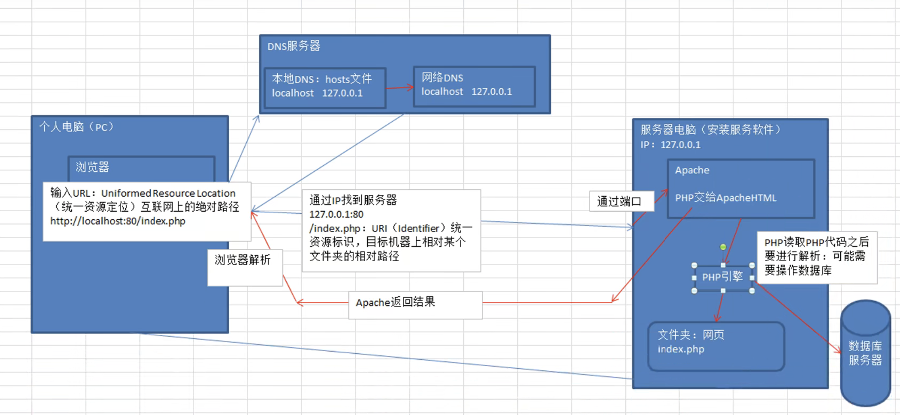

# PHP 基础

1、简介

- PHP: 服务器端脚本编程语言，书写动态网页
- PHP: Personal HomePage 个人主页，使用 Perl 语言
- PHP: PHP Hypertext Preprosessor 超文本预处理器，底层使用 C 语言

2、发展历史

- 1994 1.0 perl
- 1996 2.0 C 语言
- 1998 3.0 zendEngine
- 2000 4.0 session
- 2004 5.0 zend2 代，面向对象，命名空间，异常
- 2015 7.0 新版 zendEngine

3、生态

- 平台支持 : Windows Linux Unix
- 数据库支持 : SQLServer MySQL Oracle Access

4、静态网站和动态网站

- 静态网站 web1.0 每个网页都是单独的一个文件
- 动态网站 web2.0

# 网站基本概念

1. 服务器: server, 伺服器，能够提供服务的机器

2. Web 服务器: 安装 web 服务软件，Apache, tomcat, iis

3. IP: Internet Protocol 网络协议 计算机网络互相连接进行通信的协议

4. 域名：Domain Name

   - 特殊：127.0.0.1 localhost 代表本机

5. DNS Domain Name System 域名系统，域名和 IP 地址相互映射关系数据库

6. 端口 Port

   - 虚拟端口：计算机内容或交换机路由器内的端口，不可见端口
   - 物理端口：又称接口，可见端口

7. URL: Uniformed Resource Location 统一资源定位
8. URI: Uniformed Resource Identifier 统一资源标识符，目标机器上相对某个文件夹的相对路径

## Web 程序访问流程

1、静态网站访问

```
浏览器发起访问URL(http://localhost:80/index.html)

->DNS域名解析
    - 本地DNS hosts文件(localhost => 127.0.0.1)
    - 网络DNS

-> IP查找服务器 (http://127.0.0.1:80/index.html)

-> 通过端口80，找到服务器软件

-> 通过URI:(index.html)找到文件，读取内容

-> 返回给浏览器渲染
```



2、动态网站访问

多了数据库交互和服务端渲染的过程



## 虚拟主机 Virtual Machine

实现同一台服务器部署多个网站

虚拟主机分类

1. 基于 IP 的虚拟主机，配置多个网卡绑定多个 IP
2. 基于域名的虚拟主机
